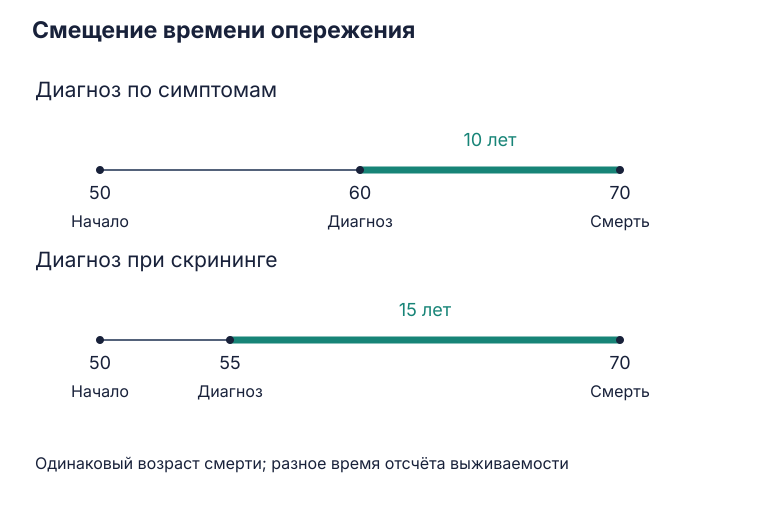
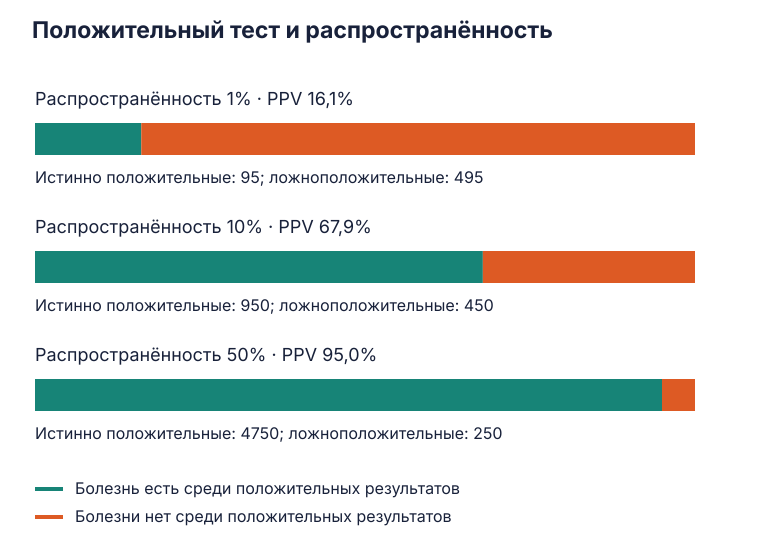
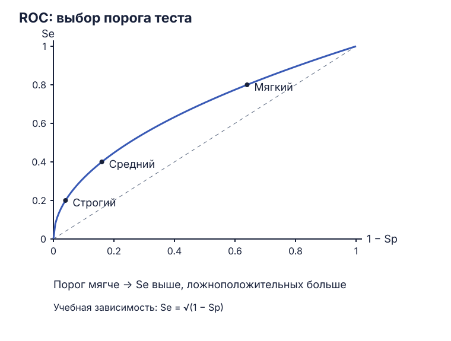

Управление и экономика здравоохранения · 30 сентября

# Диагностические тесты и скрининг

После введения скрининга люди могут годами жить с диагнозом, который раньше ставили за несколько месяцев до смерти. Такая статистика выглядит убедительно. Чтобы понять, помогла ли программа, нужно сравнить возраст смерти, тяжесть болезни и последствия лечения — срок после постановки диагноза зависит ещё и от того, когда начали искать болезнь.

## Ранний диагноз и реальная польза

Скрининг — обследование людей без симптомов для выявления болезни или её предшественников. У программы есть целая цепочка: приглашение, тест, уточнение результата, лечение, наблюдение. Эффект оценивают по работе всей цепочки, включая осложнения обследований и избыточное лечение.

Представим учебный пример: болезнь начинается в 50 лет, скрининг обнаруживает её в 55, симптомы приводят к диагнозу в 60. В обоих случаях человек умирает в 70. После скринингового диагноза он прожил 15 лет, после диагноза по симптомам — 10. Эти дополнительные пять лет появились в показателе выживаемости благодаря более раннему отсчёту. Это *lead-time bias*, смещение времени опережения.

*Учебный пример: возраст смерти — 70 лет в обеих группах; выживаемость после диагноза различается на пять лет.*

В исследованиях онкологического скрининга обычно оценивают смертность от конкретного рака. Общая смертность помогает увидеть суммарный результат, однако для обнаружения небольшого изменения нужны особенно большие выборки: смерти от изучаемого рака составляют лишь часть всех смертей. Поэтому результат по общей смертности рассматривают вместе с другими исходами и точностью их оценок. Одновременное статистически значимое снижение обоих показателей — слишком жёсткое универсальное требование. При сравнении выживаемости учитывают также *length bias*: медленно растущие образования дольше находятся в бессимптомной стадии и чаще попадают в скрининг. [Разбор методов оценки скрининга, NCI](https://www.cancer.gov/about-cancer/screening/hp-screening-overview-pdq).

### Шейка матки: найти предшественник и выбрать вмешательство

Цитологическое исследование и ВПЧ-тестирование позволяют выявлять риск и предраковые изменения до развития инвазивного рака. Польза возникает благодаря последующим решениям: кого обследовать подробнее, кого наблюдать, кому проводить лечение. Вероятность регрессии зависит от типа и степени поражения; одинаковая тактика для всех атипичных клеток привела бы к избыточным вмешательствам. В рекомендациях ВОЗ эта последовательность описана как скрининг, уточнение риска и лечение с учётом результата. [Руководство ВОЗ по профилактике рака шейки матки](https://www.who.int/publications/i/item/9789240030824).

### Колоректальный рак: какой именно метод исследовали

Анализ кала на скрытую кровь, сигмоидоскопия и колоноскопия — разные методы с разной нагрузкой на пациента. Сигмоидоскопия исследует дистальный отдел толстой кишки, колоноскопия — всю толстую кишку. Результаты программы с одним методом нельзя автоматически переносить на другой.

В NordICC 84 583 человека в возрасте 55–64 лет распределили между приглашением на однократную колоноскопию и обычным наблюдением. Через 13 лет риск колоректального рака составил 1,46% и 1,80% соответственно: RR = 0,81, 95% ДИ 0,71–0,90. Смертность от этого рака — 0,41% и 0,47%: RR = 0,88, 95% ДИ 0,68–1,08. Снижение заболеваемости обнаружили; интервал оценки смертности допускает пользу, отсутствие эффекта и небольшое увеличение риска. Это результат **приглашения на программу**: часть приглашённых обследование пропустила. [NordICC, 13-летнее наблюдение, The Lancet, 2026](https://pubmed.ncbi.nlm.nih.gov/42102826/).

В более раннем, 10-летнем отчёте общая смертность составляла 11,03% против 11,04%. Похожая общая смертность сама по себе не объясняет причину результата: для вывода о «замещении» одних причин смерти другими нужны отдельные данные. Два отчёта NordICC описывают одну когорту в разные сроки. [NordICC, NEJM, 2022](https://pubmed.ncbi.nlm.nih.gov/36214590/).

## Гипердиагностика и случайные находки

При ложноположительном результате тест сообщил о болезни, которой нет. При гипердиагностике болезнь или патологическое изменение действительно есть, но за оставшуюся жизнь человека оно не успело бы вызвать симптомы либо смерть. Обнаружение может привести к операции, лекарственной терапии и их осложнениям — так возникает гиперлечение.

Исторические аутопсии показывают, насколько результат зависит от тщательности поиска. В исследовании Harach и соавторов 1985 года щитовидные железы 101 умершего в Финляндии исследовали срезами через 2–3 мм; скрытый папиллярный рак нашли в 35,6% случаев. Результат описывает обнаружение микроскопических очагов при такой методике. Для оценки частоты клинически значимого рака среди живого населения нужны данные о течении заболевания. [Первичная публикация, Cancer](https://pubmed.ncbi.nlm.nih.gov/2408737/).

На занятии рядом обсуждались скрытые изменения молочной железы и аутопсии солдат Корейской войны. Известная работа Enos 1953 года о молодых погибших военнослужащих посвящена коронарному атеросклерозу. Её пример тоже показывает расхождение между найденной патологией и прижизненными проявлениями; микрокарциномы щитовидной и молочной железы относятся к другой исследовательской истории. [Enos и соавторы, JAMA](https://pubmed.ncbi.nlm.nih.gov/13052433/).

**Инциденталома** — образование, случайно найденное при обследовании по другому поводу. На КТ или МРТ могут обнаружить узел в щитовидной железе, надпочечнике или другом органе, хотя исходный вопрос исследования касался иной проблемы. Следом иногда начинается каскад повторных снимков, консультаций и биопсий, с расходами, тревогой и риском осложнений.

Организационное решение — ясно сформулированный вопрос исследования и согласованный маршрут значимых случайных находок. Рентгенолог описывает результат, а дальнейшие действия зависят от признаков образования, прежних исследований и риска пациента. Профессиональные алгоритмы помогают отделить находки, которым требуется обследование, от тех, для которых достаточно наблюдения или завершения диагностического поиска. [Рекомендации ACR по случайным находкам](https://www.acr.org/Clinical-Resources/Clinical-Tools-and-Reference/Incidental-Findings).

## Как устроена таблица диагностического теста

Результат теста сопоставляют с наличием болезни, установленным принятым референсным методом. Получаются четыре группы:

| Результат | Болезнь есть | Болезни нет |
|---|---|---|
| Положительный | TP — истинноположительный | FP — ложноположительный |
| Отрицательный | FN — ложноотрицательный | TN — истинноотрицательный |

Чувствительность показывает, какую долю больных обнаружил тест:

$$
Se = \frac{TP}{TP+FN}.
$$

Специфичность показывает, какую долю людей без болезни тест верно отнёс к отрицательным:

$$
Sp = \frac{TN}{TN+FP}.
$$

Например, Se = 95% означает, что среди 100 больных тест обнаружит в среднем 95. Sp = 95% означает, что среди 100 людей без болезни в среднем пять получат ложную тревогу. Эти величины считаются в разных группах. Положительный результат конкретного человека требует другого знаменателя — **всех положительных результатов**, включая ложные.

### Задача: тест с чувствительностью и специфичностью 95%

Обследуем 10 000 человек; распространённость болезни — 1%. В этой учебной модели Se и Sp одинаковы во всех рассматриваемых группах.

1. Болезнь есть у `10 000 × 0,01 = 100` человек; у остальных 9 900 её нет.
2. Среди больных получим `100 × 0,95 = 95` положительных результатов и пять отрицательных.
3. Среди людей без болезни получим `9 900 × 0,05 = 495` ложноположительных результатов и 9 405 верных отрицательных.

| Результат | Болезнь есть | Болезни нет | Всего |
|---|---:|---:|---:|
| Положительный | 95 | 495 | 590 |
| Отрицательный | 5 | 9 405 | 9 410 |
| Всего | 100 | 9 900 | 10 000 |

Среди 590 положительных результатов болезнь подтверждается у 95 человек:

$$
PPV = P(D+\mid T+) = \frac{TP}{TP+FP} = \frac{95}{590} \approx 16{,}1\%.
$$

PPV — положительная прогностическая ценность. Остальные 83,9% положительных результатов в этой модели — ложные. Их много потому, что людей без болезни изначально в 99 раз больше.

Отрицательная прогностическая ценность считается аналогично:

$$
NPV = P(D-\mid T-) = \frac{TN}{TN+FN} = \frac{9405}{9410} \approx 99{,}95\%.
$$

Вероятность болезни после отрицательного результата составляет около 0,05%. Положительный и отрицательный результаты одного теста здесь имеют очень разную прогностическую ценность.

### Тот же тест в группах с разным риском

**Распространённость** (*prevalence*) — доля людей с болезнью в определённой популяции в определённый момент или период. **Заболеваемость** (*incidence*) описывает новые случаи за время наблюдения; её выражают как риск за период либо как частоту на человеко-время. Это разные характеристики.

При прежних Se = Sp = 95% и размере каждой группы 10 000 человек:

| Распространённость | TP | FP | FN | TN | PPV | NPV |
|---|---:|---:|---:|---:|---:|---:|
| 1% | 95 | 495 | 5 | 9 405 | 16,1% | 99,95% |
| 10% | 950 | 450 | 50 | 8 550 | 67,9% | 99,42% |
| 50% | 4 750 | 250 | 250 | 4 750 | 95,0% | 95,0% |

*Учебная модель: в каждой группе 10 000 человек, Se = Sp = 95%. Доля истинных результатов среди положительных растёт с исходной вероятностью болезни.*

В группе с распространённостью 10% получаем 950 истинных положительных и 450 ложных: `950 / (950 + 450) = 67,9%`. При 50% — 4 750 и 250: `4 750 / 5 000 = 95%`. В формуле Байеса это записывается так, где `p` — исходная вероятность болезни:

$$
PPV = \frac{Se\,p}{Se\,p+(1-Sp)(1-p)},
\qquad
NPV = \frac{Sp(1-p)}{(1-Se)p+Sp(1-p)}.
$$

У конкретного пациента исходная, или *дотестовая*, вероятность складывается из симптомов, анамнеза и условий отбора на обследование. Распространённость среди всех жителей города может сильно отличаться от вероятности болезни у человека, направленного к специалисту. История поездок, например, меняет оценку вероятности малярии даже в регионе, где местная передача редка.

Высокая исходная вероятность тоже требует расчёта. При `p = 90%` и прежнем тесте после положительного результата она достигает 99,4%, а после отрицательного остаётся 32,1%. Поэтому значение результата определяется сочетанием исходного риска и свойств теста. В реальных исследованиях Se и Sp могут меняться из-за спектра тяжести болезни, сопутствующих состояний и выбранного референсного метода.

### Отношение правдоподобия: пересчёт через шансы

Отношение правдоподобия показывает, во сколько раз данный результат более вероятен у больного, чем у человека без болезни. Для положительного и отрицательного результатов:

$$
LR+ = \frac{Se}{1-Sp}, \qquad LR- = \frac{1-Se}{Sp}.
$$

Для нашего теста `LR+ = 0,95 / 0,05 = 19`, `LR− = 0,05 / 0,95 ≈ 0,0526`. Пересчёт проходит через шансы:

$$
\text{дотестовые шансы} = \frac{p}{1-p},\qquad
\text{послетестовые шансы} = \text{дотестовые шансы}\times LR.
$$

При исходных 1% шансы равны `1 / 99`. После положительного результата — `19 / 99`. Возвращаемся к вероятности: `19 / (19 + 99) = 16,1%`. Получили тот же ответ, что и в таблице 2×2.

## Порог теста и ROC-кривая

Теория обнаружения сигнала развивалась в радиолокации: оператору требовалось отличить сигнал от шума. Для диагностики та же задача возникает, когда значения показателя у больных и людей без болезни перекрываются.

Если положительным считается **значение выше порога**, понижение порога увеличивает чувствительность и число ложноположительных результатов. Повышение порога увеличивает специфичность, одновременно пропуская больше больных. Направление изменений зависит от того, как задан положительный результат; для теста с правилом «ниже порога» оно будет обратным.

На ROC-кривой по горизонтали откладывают `1 − Sp`, долю ложноположительных результатов, по вертикали — `Se`, долю истинноположительных. Каждая точка соответствует одному порогу.

*Учебная кривая `Se = √(1 − Sp)`: три точки иллюстрируют изменение чувствительности и специфичности при выборе порога.*

Для показанных точек получаются следующие характеристики:

| Порог | Доля ложноположительных `1 − Sp` | Специфичность | Чувствительность |
|---|---:|---:|---:|
| Более строгий | 4% | 96% | 20% |
| Промежуточный | 16% | 84% | 40% |
| Более мягкий | 64% | 36% | 80% |

Первая точка даёт мало ложных тревог, но обнаруживает только пятую часть больных. Последняя обнаруживает четыре пятых, ценой большого числа ложных тревог. Порог выбирают под задачу: последствия пропуска болезни, последствия лишнего обследования, доступность уточняющего теста и исходный риск.

Суммарные показатели допустимы, если понятен их смысл. Индекс Юдена `J = Se + Sp − 1` используется для сравнения порогов при равном весе двух типов ошибок. Общая точность `(TP + TN) / N` — доля верных результатов во всей выборке. При распространённости 1% алгоритм «у всех болезни нет» даёт точность 99% и чувствительность 0%; потому одной точности для оценки такого теста мало.

### Насколько совпадают заключения специалистов

В исследовании Balabanova и соавторов в Самаре участвовал 101 врач: рентгенологи общего профиля, специалисты по заболеваниям органов дыхания и рентгенологи противотуберкулёзной службы. Они оценивали 50 цифровых рентгенограмм, включая десять пар повторённых изображений **в одной сессии**. Для выявления туберкулёза межэкспертное согласие составило κ = 0,387, внутриэкспертное — κ = 0,493. [Исследование, BMJ, 2005](https://pmc.ncbi.nlm.nih.gov/articles/PMC1184248/).

κ оценивает согласие с поправкой на ожидаемые случайные совпадения; значение 1 означает полное согласие. В исследовании заключения зависели от специалиста и иногда менялись при повторном предъявлении того же снимка. Независимого эталонного диагноза для всех изображений не было: при ROC-анализе использовали согласованное мнение специализированных рентгенологов. Поэтому эти данные прежде всего характеризуют воспроизводимость интерпретации; объяснение расхождений профессиональной установкой «не пропустить туберкулёз» остаётся гипотезой.

## Как объединяют результаты исследований

Систематический обзор начинается с клинического вопроса, критериев включения, поиска исследований и оценки риска систематической ошибки. Уже затем решают, можно ли объединить результаты статистически.

Подсчёт публикаций «эффект значим» и «эффект незначим» теряет размер эффекта и его точность. Большое исследование и серия малых исследований получают по одному голосу, а сходные оценки могут оказаться по разные стороны порога `p < 0,05` из-за различий мощности. Кокрановское руководство отдельно предостерегает от такого голосования по статистической значимости. Когда метаанализ невозможен, существуют другие способы синтеза, включая ограниченные подходы по направлению эффекта. [Cochrane Handbook, глава 12](https://www.cochrane.org/authors/handbooks-and-manuals/handbook/current/chapter-12).

### Вес исследования и лесной график

Метаанализ объединяет оценки, отвечающие на сопоставимый вопрос: участники, вмешательства, сравнение, исходы и сроки должны позволять осмысленную общую интерпретацию. Исследования могут различаться; эти различия оценивают, выбирают модель и проверяют устойчивость результата.

В распространённой модели обратной дисперсии вес исследования с фиксированным эффектом равен `1 / SE²`, где `SE` — стандартная ошибка оценки. Чем точнее оценка, тем больше её вес. В модели случайных эффектов учитывают и межисследовательскую вариабельность: `1 / (SE² + τ²)`. Размер выборки влияет на точность, но два исследования с одинаковым числом участников могут иметь разный вес. [Cochrane Handbook, глава 10](https://www.cochrane.org/authors/handbooks-and-manuals/handbook/current/chapter-10).

| Элемент forest plot | Как читать |
|---|---|
| Квадрат или другая метка | Точечная оценка одного исследования; размер метки часто отражает вес |
| Горизонтальный отрезок | Доверительный интервал оценки |
| Вертикальная линия | Отсутствие эффекта: 1 для RR/OR, 0 для разности средних или рисков |
| Ромб внизу | Объединённая оценка; его ширина показывает доверительный интервал |

Сначала смотрят на направление и величину эффекта, затем на интервалы и согласованность исследований. Пересечение линии отсутствия эффекта говорит о неопределённости оценки; уверенное «равноценны» потребовало бы отдельной проверки эквивалентности с заранее заданной границей.

### Пример: интервалы изменения положения тела

Обзор Cochrane, обновлённый в июне 2026 года, включил 11 РКИ с 4 462 участниками по профилактике повреждений кожи от давления. Для сравнения интервалов в два и четыре часа RR составил 1,05, 95% ДИ 0,79–1,39; эти данные дали четыре исследования с 1 104 участниками. Уверенность в оценке — очень низкая. [Обзор Cochrane, 2026](https://pubmed.ncbi.nlm.nih.gov/42240176/).

Здесь есть рандомизированные исследования, но их результатов пока недостаточно для уверенного выбора лучшего интервала. Из отсутствия выявленного преимущества двухчасового режима нельзя получить ни доказанную равноценность интервалов, ни вывод о бесполезности профилактики. Для организатора это вопрос обоснования протокола и качества доказательств под конкретное решение.

### Почему опубликованный результат может оказаться ложным

Статья Джона Иоаннидиса 2005 года *Why Most Published Research Findings Are False* разбирает условия, при которых положительный исследовательский результат с большой вероятностью окажется ложным: низкая исходная правдоподобность гипотезы, малая мощность, множество проверок, выборочная публикация и смещения, в том числе связанные с интересами исследователей. Автор строит математическую модель: вероятность достоверного результата зависит от этих предпосылок и исследовательской практики. [Оригинальная статья, PLOS Medicine](https://journals.plos.org/plosmedicine/article?id=10.1371%2Fjournal.pmed.0020124).

Отдельная убедительная публикация приобретает вес, когда результат воспроизводится, согласуется с другими данными и выдерживает проверку методов. Для оценки вмешательств к этому добавляются абсолютная польза, вред и исходы, важные пациенту: [клинические испытания и оценка вмешательств](vlasov-clinical-trials-evidence.md).

Правовая часть занятия: [ответственность, решения и документация в здравоохранении](healthcare-law-and-clinical-decisions.md).
