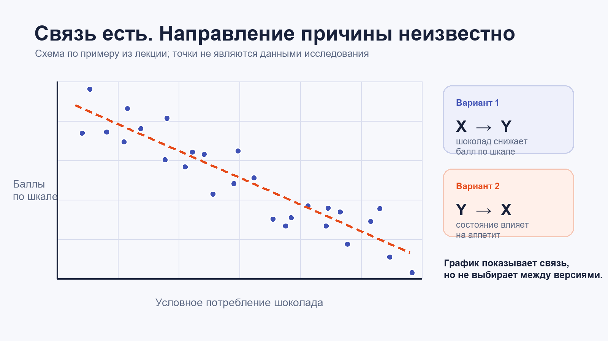
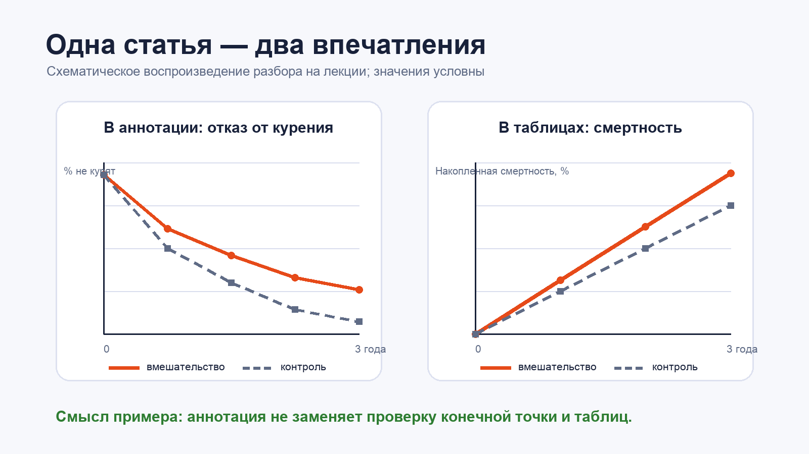

1 курс · обязательная дисциплина

# Вводный день: как мы узнаём правду в медицине

| | |
| :--- | :--- |
| **Предмет** | Организация и экономика здравоохранения |
| **Лектор эпидемиологического блока** | Власов Василий Викторович |
| **Формат** | Вводная лекция |
| **Дата** | Не указана в студенческих записях |

!!! abstract "Коротко"
    - Отдельный удачный случай не доказывает пользу лечения. Нужны сравнение и заранее выбранный дизайн исследования.
    - Поперечное исследование оценивает распространённость и связи, но не показывает, что было причиной.
    - Корреляция симметрична, регрессия — нет. Модель `Y от X` нельзя без пересчёта использовать как модель `X от Y`.
    - Аннотации статьи недостаточно: основной исход и неудобные результаты могут оказаться только в таблицах.

## Эпидемиология и доказательная медицина

### 1. Почему личный опыт обманчив

Фраза «у меня был больной, мы так сделали — и всё прошло» описывает отдельное наблюдение. Оно не позволяет исключить **систематическую ошибку (*bias*)** и не отвечает на вопрос, что случилось бы без вмешательства.

На лекции это разбирали на простых несоответствиях. Лекарство могут изучать полгода, а затем назначать пожизненно. Кава-фильтры десятилетиями применяли шире, чем позволяют позднейшие данные. Даже устройство системы здравоохранения остаётся предметом спора: бюджетно-страховая модель действует с 1993 года, но одной общепринятой оценки у неё нет.

В этом контексте **клиническая эпидемиология** — набор методов, которыми проверяют медицинские решения. Речь не об инфекционном контроле, а о дизайне исследований, сравнении групп и работе со смещениями.

!!! warning "Чего нельзя вывести из одного наблюдения"
    Если пациенту стало лучше после вмешательства, это ещё не значит, что улучшение вызвало именно вмешательство.

### 2. Поперечные исследования

**Поперечное, или одномоментное, исследование** — срез популяции за выбранный период. Его можно провести сравнительно быстро и недорого, оценить распространённость признака и найти связь, которую затем стоит проверить другим дизайном.

Основные ограничения:

1. **Выборка по удобству (*convenience sample*).** Результат опроса своих студентов или коллег нельзя автоматически переносить на всех людей. Студенты, военнослужащие и заключённые могут зависеть от исследователя, поэтому добровольное согласие требует особого внимания.
2. **Плохая группа сравнения.** Сравнение пожилых пациентов с перемежающейся хромотой и здоровых молодых студентов смешивает влияние заболевания и возраста. Контрольная группа должна быть сопоставима хотя бы по возрасту и полу.
3. **Неизвестная последовательность событий.** В одном срезе мы не видим, что появилось раньше. Поэтому статистическая связь ещё не задаёт направление причины.

### 3. Корреляция не равна причинности

В примере с шоколадом потребление оценивали по ответам участников, а депрессию — по короткой шкале. Оба измерения неточны. Даже если точки образуют заметную линию, поперечный срез допускает противоположные объяснения: шоколад влияет на результат шкалы или состояние человека влияет на аппетит.

<figure class="lecture-figure" markdown>

<figcaption>Рис. 1. Одна связь допускает разные причинные версии. Точки и линия условны и не воспроизводят данные исследования.</figcaption>
</figure>

Есть и третья возможность: на оба показателя влияет другой фактор. По словам лектора, при последующем наблюдении студентов регулярную связь между шоколадом и депрессией воспроизвести не удалось.

### 4. Корреляция и регрессия отвечают на разные вопросы

| | Корреляция | Регрессия |
| :--- | :--- | :--- |
| **Что описывает** | Насколько два признака меняются вместе | Как выбранный результат `Y` меняется или предсказывается по `X` |
| **Симметрия** | `r(X, Y) = r(Y, X)` | Модель `Y от X` не равна модели `X от Y` |
| **Причинность** | Сама по себе не доказывает | Без подходящего дизайна тоже не доказывает |

!!! example "Кейс ФМБА и Чернобыля"
    В примере лектора дозиметр выдавали один на отделение из 12 человек, поэтому индивидуальные дозы многих участников были неизвестны. Исследователи построили регрессию хромосомных изменений по измеренной дозе, а затем попытались той же формулой восстановить дозу по хромосомам. Это уже обратная задача, для неё нужна другая модель.

### 5. Эксперимент: что осталось за пределами аннотации

Некоторые вопросы нельзя проверить прямым экспериментом. Нельзя случайно назначить людям годами курить или запретить им есть определённый продукт. Исследовать можно, например, помощь в отказе от курения.

Лектор разобрал исследование мужчин старше 50 лет после среднего или тяжёлого инфаркта. Все участники курили и согласились бросить. Одной группе три года регулярно помогала медсестра, контрольная группа получила памятку о вреде курения. Основным исходом была смерть от любых причин.

В аннотации акцент сделали на том, что участники вмешательства реже возвращались к курению. В таблицах по годам при этом была выше накопленная смертность. Без исходной статьи, размера выборки и доверительных интервалов нельзя объяснить различие — но уже видно, почему одного реферата мало.

<figure class="lecture-figure" markdown>

<figcaption>Рис. 2. Схема разбора на лекции. Значения условны; это не график результатов исходной публикации.</figcaption>
</figure>

!!! tip "Что проверять в статье"
    Сопоставьте аннотацию с заранее выбранной конечной точкой, таблицами результатов и блок-схемой отбора участников. Для численного эффекта ищите размер выборки и доверительный интервал.

### 6. Финансирование и конфликты интересов

Лектор привёл исторические примеры того, как спонсорство влияло на постановку вопроса и подачу результатов: сахарная промышленность поддерживала исследования роли жиров, а табачные компании — работы о городском загрязнении воздуха. Сам источник финансирования не опровергает результат, но его нужно учитывать вместе с методами и полнотой отчёта.

### 7. Стимулы при диспансеризации

Плановые показатели и подушевое финансирование могут подталкивать поликлиники к фиктивным записям о диспансеризации. Это пример того, как способ оплаты меняет не только работу организации, но и данные, по которым её оценивают.

## Организация курса и контакты

| Роль или задача | Ответственный | Где искать |
| :--- | :--- | :--- |
| Учебный процесс и расписание | Кузнецова Наталья Владимировна | Корпоративная почта ВШЭ |
| Организация программы, менторство | Тарасенко Елена Анатольевна | Корпоративная почта ВШЭ |
| Научные руководители, темы ВКР | Шишкин Сергей Владимирович | Лично или через корпоративную почту |
| Данные по демографии и смертности | Институт демографии им. А. Г. Вишневского | [Демоскоп Weekly](https://www.demoscope.ru/) |
| Учебник по курсу | Власов В. В. «Эпидемиология» | Четыре издания ГЭОТАР; по словам лектора, первые два доступны в сети |

На вводной лекции сообщили, что оценка будет рассчитываться по модульным заданиям, а ранняя сдача повысит балл.

!!! note "Проверьте перед использованием"
    Даты встреч и правила оценивания могут измениться. Сверяйтесь с LMS, расписанием и корпоративной почтой.

## Термины

=== "Для не-медиков"

    **Кава-фильтр** — сетчатое устройство в нижней полой вене, которое задерживает тромбы из вен ног на пути к сердцу и лёгким.

    **Перемежающаяся хромота** — боль в икрах при ходьбе из-за атеросклероза артерий ног; обычно проходит в покое.

    **Диспансеризация** — массовое профилактическое обследование условно здоровых людей.

=== "Для врачей"

    **Конструкт** — понятие, которое нельзя измерить напрямую: например, депрессия или удовлетворённость помощью. Его переводят в наблюдаемые показатели с помощью шкал и опросников.

    **Bias, или смещение** — систематическая ошибка измерения, выборки или интерпретации, искажающая реальный эффект.

    **Подушевое финансирование** — модель, при которой организация получает фиксированную сумму за прикреплённого человека, а не за каждую отдельную услугу.
