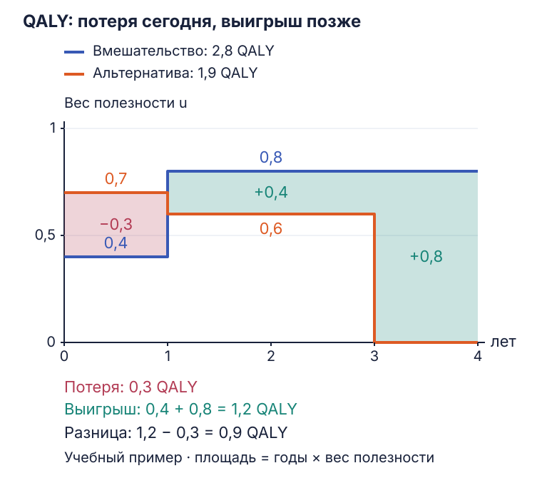

УЭЗ · 7 октября 2026 · Василий Викторович Власов

# Медицинские технологии, QALY и исследования «случай–контроль»

Новое лечение может облегчить симптомы сегодня, повлиять на продолжительность жизни через несколько лет и занять значительную часть бюджета. Для оценки технологии приходится совместить три вопроса: какую пользу получает пациент, насколько надёжно она установлена и какую помощь система сможет оплатить при выбранной цене.

На занятии эти вопросы разбирали через клинические исследования, QALY, договоры об оплате за результат и исторические примеры. Цифры и выводы отдельных исследований сверены с публикациями; ссылки стоят рядом с соответствующими кейсами.

## Как технология входит в практику

Для лекарственного препарата обычная последовательность разработки выглядит так:

| Этап | Что выясняют |
| :--- | :--- |
| Доклинические исследования | Свойства вещества, механизмы действия и токсичность в лабораторных моделях, включая исследования на животных. |
| Фаза I | Переносимость, безопасность, фармакокинетику и диапазон доз в небольшой группе. |
| Фаза II | Предварительную эффективность, нежелательные явления, подходящую дозу и режим лечения. |
| Фаза III | Пользу и риски в более крупном сравнительном исследовании; часто используют рандомизацию. |
| Регистрация и применение | Регулятор оценивает данные для конкретного показания. После выхода на рынок продолжают наблюдение за безопасностью и проводят дополнительные исследования, в том числе фазу IV. |

Это схема разработки лекарств. У операций, медицинских изделий и организационных вмешательств свои пути исследования и внедрения. [Фазы клинических исследований — FDA](https://www.fda.gov/patients/drug-development-process/step-3-clinical-research).

В практике технология распространяется ещё и через профессиональные сообщества, спрос пациентов, инвестиции, рекламу и привычки клиник. При тяжёлой болезни желание попробовать новый метод особенно велико. Поэтому распространённость вмешательства и объём его доказательной базы могут расти с разной скоростью. Регистрация тоже оставляет вопросы об отдалённых последствиях, отдельных группах пациентов и сравнении с доступными альтернативами.

### Какие исходы измерять

Пациенту важны продолжительность жизни, боль, самостоятельность, возможность работать, частота инсультов и других тяжёлых событий. Исследователь часто может раньше измерить давление, лабораторный показатель или размер опухоли. От выбора исхода зависит, что именно позволяет заключить исследование.

| Тип исхода | Примеры | Как читать результат |
| :--- | :--- | :--- |
| Клинический, значимый для пациента | Смерть, инсульт, инвалидизация, боль, качество жизни | Показывает влияние на здоровье и повседневную жизнь. Важно учитывать величину эффекта и срок наблюдения. |
| Суррогатный | Артериальное давление, С-реактивный белок, размер опухоли на КТ | Предполагает связь с клиническим результатом. Надёжность этой связи оценивают для конкретной болезни и вмешательства. |

Закрытие туберкулёзной каверны на снимке — анатомический показатель. Чтобы оценить пользу лечения в целом, его сопоставляют с излечением, рецидивами, функцией лёгких, выживаемостью и другими клиническими исходами.

Суррогатные показатели сокращают время получения результата и могут помогать принять решение при тяжёлой болезни. Степень уверенности зависит от их валидации: насколько изменение показателя действительно предсказывает изменение клинического исхода. Для некоторых суррогатов такая связь установлена, для других остаётся предположением. [FDA: применение суррогатных конечных точек](https://www.fda.gov/drugs/development-resources/surrogate-endpoint-resources-drug-and-biologic-development).

### С кем сравнивают новую терапию

При историческом контроле пациентов, получивших новое лечение, сравнивают с больными прошлых лет. За это время могли улучшиться реанимационная помощь, антибиотики, питание, диагностика и поддерживающая терапия. Часть разницы в выживаемости тогда объясняется изменением всей помощи.

Сравнение разных клиник тоже требует проверки состава пациентов. В обсуждении приводили коммерческий центр «Медси» и крупную городскую скоропомощную больницу — ГКБ № 67. Это пример возможного различия потоков: плановая помощь, экстренные поступления, тяжесть болезни, сопутствующая патология и социальные условия влияют на исходы. По одной итоговой смертности оценить вклад самой клиники трудно.

Одновременная контрольная группа уменьшает влияние изменений во времени. Рандомизация помогает сделать группы сопоставимыми по известным и неизвестным исходным факторам. Для наблюдательных сравнений особенно важны критерии включения, поправки на тяжесть состояния и прозрачное описание оставшихся ограничений. Подробнее — [клинические испытания и контроль](vlasov-clinical-trials-evidence.md).

## QALY: длительность жизни с поправкой на качество

**QALY** — число лет жизни, взвешенных по качеству состояния здоровья. В стандартной шкале полезности полному здоровью соответствует 1, смерти — 0; некоторые тяжёлые состояния могут получать отрицательные значения. Опросники описывают состояние человека, а специальные правила оценки переводят его в вес полезности. Например, EQ-5D учитывает подвижность, самообслуживание, повседневную деятельность, боль и тревогу/депрессию. [NICE: экономическая оценка и измерение полезности](https://www.nice.org.uk/process/pmg36/chapter/economic-evaluation-2).

При постоянном качестве за период:

$$
QALY = \text{длительность в годах} \times \text{вес полезности}.
$$

Два года с весом 0,5 дают 1 QALY. Если качество меняется, периоды считают отдельно и складывают. На графике это площадь под траекторией «качество — время»: ширина участка измеряется в годах, высота — весом полезности.

### Как учесть тяжёлое лечение и последующую пользу

Химиотерапия может сначала ухудшать самочувствие из-за токсичности, а затем давать ремиссию и дополнительное время жизни. Поэтому оценка включает и период лечения, и дальнейший исход. Сравнивают две траектории: при выбранном вмешательстве и при его альтернативе.

В учебном примере ниже качество внутри каждого периода постоянно. Числа подобраны для расчёта площадей.

<figure class="lecture-figure" markdown>

</figure>

| Период | Вмешательство | Альтернатива |
| :--- | :--- | :--- |
| 0–1 год | $1 \times 0{,}4 = 0{,}4$ QALY | $1 \times 0{,}7 = 0{,}7$ QALY |
| 1–3 года | $2 \times 0{,}8 = 1{,}6$ QALY | $2 \times 0{,}6 = 1{,}2$ QALY |
| 3–4 года | $1 \times 0{,}8 = 0{,}8$ QALY | $0$ QALY |
| Всего | **2,8 QALY** | **1,9 QALY** |

Все участки здесь прямоугольные. Их площадь — ширина × высота. Например, от первого до третьего года ширина равна $3 - 1 = 2$ годам. Высота траектории вмешательства — 0,8; площадь этого участка равна $2 \times 0{,}8 = 1{,}6$ QALY.

Дополнительный результат вмешательства:

$$
\Delta QALY = 2{,}8 - 1{,}9 = 0{,}9.
$$

Его можно получить и через разницу площадей. В первый год потеря составляет $1 \times (0{,}7 - 0{,}4) = 0{,}3$. Между первым и третьим годом выигрыш — $2 \times (0{,}8 - 0{,}6) = 0{,}4$, а на четвёртом году — $1 \times 0{,}8 = 0{,}8$. Итого: $0{,}4 + 0{,}8 - 0{,}3 = 0{,}9$ QALY.

В экономической оценке QALY сопоставляют с затратами. Если новое лечение дороже, отношение дополнительных затрат к дополнительным QALY показывает цену единицы дополнительного результата — ICER. [Формула и связь с другими методами экономической оценки](../year-1/public-sector-economics-welfare.md).

## Цена и оплата за результат

Производителю важно заранее понимать, какие данные потребуются для регистрации препарата и решения о его финансировании. Ранние консультации с регуляторами и агентствами оценки технологий помогают выбрать компаратор, исходы, сроки наблюдения и план экономического анализа. У NICE и MHRA есть соответствующая процедура научного консультирования. [MHRA/NICE: ранние требования к доказательствам](https://www.gov.uk/guidance/medicines-get-integrated-scientific-advice-from-the-mhra-and-nice).

Оценка технологии и коммерческие условия связаны: одинаковый клинический эффект при разных ценах даёт разную стоимость дополнительного QALY. При соглашениях об оплате за результат производитель принимает на себя часть риска: например, возвращает стоимость лечения пациента, у которого заранее определённый результат достигнут не был. В записи занятия использован термин *pay-for-performance*; применительно к лекарству речь идёт о договоре с производителем, привязанном к исходам. У NICE управляемый доступ может включать сбор дополнительных данных и коммерческое соглашение. [NICE: managed access](https://www.nice.org.uk/what-nice-does/patient-access-schemes-and-pricing-agreements/managed-access).

В обсуждении фигурировал условный препарат стоимостью £100 000: при успехе плательщик оплачивает лечение, при неудаче получает возврат. У такого договора нужно определить:

- что считается успехом: лабораторный ответ, отсутствие рецидива, выживаемость или другой исход;
- когда измеряют результат и кто подтверждает данные;
- какой возврат предусмотрен и какие сопутствующие расходы остаются у системы;
- что происходит при потере пациента для наблюдения.

Если успех определён через суррогат, договор переносит на плательщика неопределённость связи между маркером и клинической пользой. При высокой частоте успеха возвратов будет мало, поэтому цена и бюджетная нагрузка по-прежнему важны. В качестве такого примера на занятии обсуждали высокоэффективные препараты прямого действия против гепатита C, включая софосбувир. Конкретный результат зависит от схемы лечения и группы пациентов. [ВОЗ: лечение гепатита C препаратами прямого действия](https://www.who.int/news-room/fact-sheets/detail/hepatitis-c).

## Как выбирали приоритеты в Орегоне

Орегонский эксперимент связан с попыткой расширить Medicaid для людей с низкими доходами, включая работающих бедных. Реформу инициировали в 1989 году; важную роль в ней сыграл врач и политик Джон Кицхабер. В 1994 году штат начал использовать ранжированный список пар «состояние — лечение» для определения покрытия.

При ранжировании учитывали эффективность, стоимость и общественные представления о важности помощи. Законодательное собрание устанавливало бюджетную черту: положение услуги в списке влияло на её финансирование. Покрытие также зависело от правил программы и исключений, в том числе для диагностических услуг. Подход сделал выбор приоритетов более явным, но сами приоритеты включали оценочные решения наряду с экономическими расчётами. [Oregon Health Authority: история и устройство списка](https://www.oregon.gov/oha/hpa/dsi-herc/pages/prioritized-list-overview.aspx).

В лекции обсуждали и язык таких решений. «Рационирование» подчёркивает ограниченность доступной помощи; «выбор приоритетов» — основания распределения бюджета. В обоих случаях остаётся вопрос, какие потребности удовлетворить за общие средства и как обосновать решение перед населением.

По состоянию на октябрь 2026 года Орегон готовит изменение правил с **1 января 2027 года**: федеральные требования предусматривают переход от покрытия через бюджетную черту списка к категориям услуг Medicaid. Штат заявляет о сохранении текущих льгот и добавлении части покрытия. Поэтому пример лекции важно читать в его историческом контексте. [Официальное описание перехода](https://www.oregon.gov/oha/HSD/Medicaid-Policy/Pages/Benefit-Update.aspx).

## Исследование «случай–контроль»

При редком исходе наблюдение за большой группой людей до появления достаточного числа случаев может занять годы. Исследование «случай–контроль» начинает с отбора людей по исходу: отдельно набирают заболевших и контрольную группу. Затем сравнивают, как часто у них встречалась предшествующая экспозиция.

**Случаи** — участники с изучаемой болезнью или исходом. **Контроли** представляют ту исходную популяцию, из которой возникли случаи: при развитии болезни они могли бы попасть в группу случаев. Для обеих групп нужны сопоставимые критерии отбора, место и период исследования. Подбор контролей по самому изучаемому фактору исказит сравнение.

Логика направлена от исхода к предшествующему воздействию. Данные о воздействии получают из интервью, медицинских документов, регистров или образцов, собранных ранее. Во вложенном исследовании внутри когорты часть этих данных может быть записана ещё до развития болезни. [CDC: выбор дизайна и источника контролей](https://www.cdc.gov/field-epi-manual/php/chapters/design-conduct-analyze-field-studies.html).

### Таблица 2×2 и отношение шансов

| | Случаи: заболевание есть | Контроли: заболевания нет |
| :--- | :---: | :---: |
| Экспозиция была | $a$ | $b$ |
| Экспозиции не было | $c$ | $d$ |

Шансы экспозиции среди случаев равны $a/c$: число подвергшихся воздействию делят на число тех, у кого его не было. Среди контролей аналогичная величина равна $b/d$. Их отношение — **odds ratio, OR**:

$$
OR = \frac{a/c}{b/d} = \frac{ad}{bc}.
$$

Это формула для простой несопоставленной таблицы. При индивидуальном подборе пар используют анализ, учитывающий сопоставление; при поправке на другие факторы — соответствующую статистическую модель.

Учебный пример: среди 100 случаев воздействие было у 40 человек, среди 100 контролей — у 20.

| | Случаи | Контроли |
| :--- | :---: | :---: |
| Экспозиция была | 40 | 20 |
| Экспозиции не было | 60 | 80 |
| Всего | 100 | 100 |

$$
OR = \frac{40 \times 80}{20 \times 60}
= \frac{3200}{1200} \approx 2{,}67.
$$

Шансы экспозиции среди случаев в 2,67 раза выше, чем среди контролей. В общем случае OR описывает отношение шансов; для редкой болезни при обычном отборе контролей он приближается к относительному риску. Для результата исследования нужны также доверительный интервал и информация об отборе участников. [CDC: интерпретация OR](https://www.cdc.gov/field-epi-manual/php/chapters/analyze-interpret-data.html).

Соотношение 100 случаев к 100 контролям задано исследователем. По нему невозможно определить, какая доля исходной популяции заболевает. Для расчёта заболеваемости понадобятся данные о числе людей под риском и времени наблюдения.

### Что влияет на достоверность

Дизайн особенно полезен при редких болезнях и длительном промежутке между воздействием и исходом. По сравнению с запуском большой когорты он часто требует меньше времени и ресурсов. Его убедительность во многом зависит от качества отбора и данных об экспозиции.

| Проблема | Как возникает | Что проверить |
| :--- | :--- | :--- |
| Ошибка воспоминаний, recall bias | После диагноза человек может подробнее искать причины и иначе вспоминать прошлые воздействия. | Одинаково ли собирали данные; доступны ли независимые документы или биоматериал. |
| Смещение отбора | Контроли отличаются от исходной популяции по связи с экспозицией. | Откуда взяты обе группы и могли ли контроли стать случаями при развитии болезни. |
| Конфаундинг | Возраст, курение, социальные условия или другой фактор связаны и с экспозицией, и с исходом. | Что измерено, как проведена поправка и какие факторы остались за пределами анализа. |
| Обратная причинность | Болезнь или её ранние проявления меняют поведение, которое затем принимают за причину. | Предшествовало ли воздействие развитию заболевания. |
| Статистическая неопределённость | При малом числе случаев оценка может быть нестабильной. | Размер эффекта, доверительный интервал и согласованность с другими исследованиями. |

Сильная ассоциация может стать важной частью причинного вывода. Для её оценки учитывают последовательность во времени, возможные смещения, биологические данные и результаты других работ. История DES ниже показывает, насколько значимым бывает хорошо проведённое исследование редкого исхода.

На занятии упоминались Алван Фейнштейн, один из ведущих авторов клинической эпидемиологии, и Дуглас Альтман, развивавший практику качественного статистического анализа и представления доверительных интервалов. *Statistics with Confidence* — коллективное руководство; первое издание редактировали Мартин Гарднер и Дуглас Альтман. [Их статья о доверительных интервалах в BMJ](https://www.bmj.com/content/292/6522/746).

## Семь кейсов из обсуждения

### Фекальная трансплантация при рецидивирующей инфекции C. difficile

В РКИ van Nood и соавторов 2013 года сравнивали несколько схем лечения рецидивирующей инфекции. В группе введения донорского материала через назодуоденальный зонд после первой инфузии ответ получили у **13 из 16 пациентов**. После повторной процедуры ответили ещё двое — **15 из 16 суммарно**. Исходом было разрешение диареи без рецидива через десять недель. В двух группах ванкомицина результат получили у 4 из 13 и 3 из 13 пациентов. [Оригинальная публикация](https://pubmed.ncbi.nlm.nih.gov/23323867/).

Эффективность способа введения зависит от конкретного протокола. В РКИ 2017 года капсулы удовлетворили критерию сопоставимой эффективности с колоноскопическим введением: в анализе пациентов, выполнивших протокол, отсутствие рецидива через 12 недель составило 96,2% в обеих группах. [Kao и соавторы, JAMA](https://jamanetwork.com/journals/jama/fullarticle/2664458).

При этом донорский материал может передавать патогены. В 2019 году FDA сообщил о двух инвазивных инфекциях ESBL-*E. coli* у иммунокомпрометированных реципиентов материала одного донора; один пациент умер. Материал предварительно не проверяли на этот микроорганизм. [Сообщение FDA](https://www.fda.gov/safety/medical-product-safety-information/fecal-microbiota-transplantation-safety-communication-risk-serious-adverse-reactions-due).

В лекции обсуждали расширение энтузиазма вокруг метода на экзему, болезни лёгких и глаз. Каждое такое показание требует своей оценки пользы и риска. В США уже зарегистрированы конкретные микробиотные продукты для профилактики рецидива инфекции *C. difficile* после антибактериального лечения, включая Rebyota и пероральный Vowst. Правовой статус зависит от страны, продукта и показания. [FDA: Vowst и ранее одобренный Rebyota](https://www.fda.gov/news-events/press-announcements/fda-approves-first-orally-administered-fecal-microbiota-product-prevention-recurrence-clostridioides).

### Рентгеновская примерка обуви

В обувных магазинах 1930–1950-х годов использовали флюороскопы — педоскопы. Покупатель и продавец могли рассмотреть расположение стопы в обуви. Технология создавала эффект точной и современной примерки, одновременно подвергая покупателей и персонал ионизирующему излучению. В дальнейшем её применение ограничивали и прекращали. Кейс показывает, как привлекательность устройства способна вытеснить оценку необходимости и безопасности. [ORAU: история обувных флюороскопов](https://www.orau.org/health-physics-museum/collection/shoe-fitting-fluoroscope/index.html).

### Рентгенотерапия болезни Бехтерева

Облучение позвоночника применяли для уменьшения симптомов анкилозирующего спондилита. Последующие наблюдения за облучёнными пациентами выявили повышенный отдалённый риск лейкоза и других опухолей. Эти исследования стали важным источником данных о радиационном канцерогенезе и зависимости риска от дозы. При оценке вмешательства краткосрочное облегчение приходится сопоставлять с последствиями, которые проявляются спустя годы. [Court-Brown и Doll, отчёт 1957 года](https://pubmed.ncbi.nlm.nih.gov/13430091/).

### Интерфероны

Развитие генно-инженерного производства расширило возможности применения интерферонов. В обсуждении внимание уделяли разрыву между первоначальными ожиданиями и тяжестью нежелательных эффектов: системной токсичностью, потерей массы тела и нейропсихиатрическими осложнениями, включая депрессию и суицидальное поведение.

Профиль риска и польза зависят от конкретного препарата и показания. Интерфероны применяются при ряде заболеваний: например, пегинтерферон альфа-2a имеет показания при вирусных гепатитах и некоторых миелопролиферативных заболеваниях, интерферон бета-1a — при определённых формах рассеянного склероза. При выборе терапии учитывают доступные альтернативы. [EMA: Pegasys](https://www.ema.europa.eu/en/medicines/human/EPAR/pegasys), [EMA: Avonex](https://www.ema.europa.eu/en/medicines/human/EPAR/avonex).

### DES: убедительная гипотеза и отдалённый вред

Диэтилстильбэстрол, синтетический эстроген, назначали беременным для предупреждения осложнений. Контролируемое исследование 1953 года показало отсутствие ожидаемой пользы, однако назначения продолжались. [NCI: история DES и первичные исследования](https://www.cancer.gov/about-cancer/causes-prevention/risk/hormones/des-fact-sheet).

В 1971 году Herbst, Ulfelder и Poskanzer исследовали восемь молодых пациенток с редкой светлоклеточной аденокарциномой влагалища и 32 сопоставленных контроля. Матери **семи из восьми пациенток** принимали DES во время беременности; среди матерей контролей таких случаев было **ноль**. Возраст появления первых симптомов у пациенток составлял 14–22 года. Работа выявила очень сильную связь внутриутробного воздействия с заболеванием; последующие данные подтвердили причинную связь. [Оригинальная статья с таблицами](https://jhanley.biostat.mcgill.ca/c609/articles/HerbstNEJM1971.pdf).

Здесь исследование «случай–контроль» помогло обнаружить редкое последствие воздействия, произошедшего много лет назад. История также показывает, как привычная клиническая идея сохраняется после появления данных о её эффективности.

### Анаболические стероиды и структура мозга

В MRI-исследовании Bjørnebekk и соавторов сравнили 82 нынешних или бывших пользователя анаболических андрогенных стероидов с 68 тренирующимися мужчинами без такого употребления. У пользователей обнаружили различия в объёмах серого вещества и толщине коры. Авторы учитывали ряд измеренных факторов и охарактеризовали результаты как корреляционные. [Публикация](https://pubmed.ncbi.nlm.nih.gov/27616036/).

Это поперечное сравнение групп по экспозиции. Для причинного вывода нужно установить, как структура мозга менялась во времени, что предшествовало употреблению и какие различия между группами могли повлиять на результат. Объём отдельных структур и интеллект — разные характеристики; вывод об интеллектуальных способностях требует самостоятельных измерений.

### Сексуальные контакты с животными и рак полового члена

В бразильском исследовании из 16 центров участвовали 118 мужчин с раком полового члена и 374 контроля. Об изучаемой экспозиции сообщили 44,9% случаев и 31,6% контролей. Авторы выявили ассоциацию, которая сохранялась в многофакторном анализе. Работа была опубликована онлайн в 2011 году и в журнальном выпуске 2012 года. [Zequi и соавторы](https://pubmed.ncbi.nlm.nih.gov/22023719/).

Предположение о передаче онкогенных вирусов — отдельный вопрос о механизме: эта работа его не установила. Для оценки причинности важны отбор участников, достоверность сообщений, курение, фимоз и другие факторы. Общая доля сообщивших об экспозиции составила 34,8% **в этой отобранной выборке**. Распространённость в других популяциях требует отдельного исследования.

## Реплики из обсуждения

??? quote "Реплики Власова по переданной записи занятия"

    Формулировки сохранены из записи. Научные результаты разобраны в разделах выше.

    **Об увлечении фекальной трансплантацией:**

    > «Врачи отчаялись вылечить пациенту экзему. Пациент отчаялся. Ну почему бы в конце концов не съесть дерьма?»

    **О назначениях DES:**

    > «Идея настолько кажется очевидной: ну как же... "Пилите, Шура, пилите, они золотые!" Ну идея-то золотая! Надо пилить — вот она и золотая!»

    **Об интерпретации исследования стероидов:**

    > «Связь есть: много анаболиков — мало мозгов. Но что здесь первично? Это анаболики уменьшают мозг, или просто люди с маленьким мозгом едят анаболики, а у кого мозг побольше — те их не едят?»

    **О слове «реформа» — рассказ о разговоре на Гайдаровском форуме:**

    > «Я спрашиваю: "Почему не ставится вопрос о планомерном реформировании системы здравоохранения?" Вероника Игоревна [Скворцова] не успела рот открыть, как дама из Правительства РФ мне говорит: "Вы ничего не понимаете! Российский народ устал от реформ! Слово «реформа» вызывает у людей жуткое раздражение, мы не можем его применять!"»

    **О приспособлении к условиям работы:**

    > «Строгость законов смягчается необязательностью их исполнения, как писал великий Гоголь... У нас всё происходит через приспособление. Это нормально, человеческое действие — мы все действуем через приспособление: к большой зарплате приспосабливаемся легко, к маленькой — с трудом, если задерживают — тоже приспосабливаемся...»

    **О государственной политике:**

    > «Для провалов рынка существует вмешательство государства, которое создает новые провалы рынка!»

## Связанные темы

- [Клинические испытания: рандомизация, контроль, эффективность и безопасность](vlasov-clinical-trials-evidence.md).
- [Продольные исследования: причинность и конфаундинг](epidemiology-lecture-2.md).
- [Диагностические тесты и скрининг](diagnostic-tests-and-screening.md).
- [Экономическая оценка и QALY в ЭОС](../year-1/public-sector-economics-welfare.md).
- [Карта курса УЭЗ](../year-1/healthcare-economics.md).
