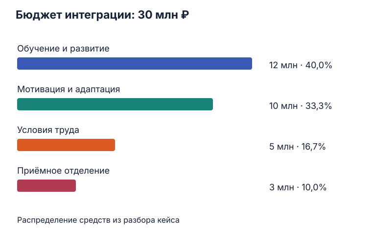
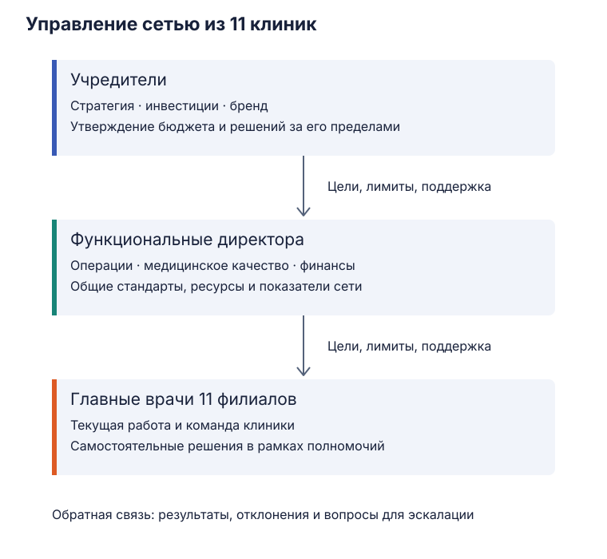

Управление медицинскими и страховыми организациями · 28 сентября 2026

# Объединение больниц, эмпатия и рост сети

Академический центр и городская больница объединяются, хотя привыкли по-разному оценивать свою работу. В другом кейсе сотрудники тяжёлых отделений нуждаются в поддержке и восстановлении. В третьем два основателя продолжают лично решать почти все вопросы сети из 11 клиник. На семинаре команды предложили решения для этих ситуаций; ниже разобраны их причины, затраты и способы оценить результат.

## Объединение академического центра и городской больницы

У академического центра и городской больницы разные привычные ориентиры. В центре ценят исследования, публикации, индекс цитирования и работу со сложными случаями. У больницы на первом плане поток пациентов, койко-дни и выполнение государственного задания. После объединения эти коллективы должны согласовать маршруты пациентов, правила работы и оплату труда.

Команда описала конфликт как столкновение развития и стабильности. Центр приносит новые подходы и требования, а сотрудники больницы хотят сохранить понятный порядок ежедневной работы. В теории Шварца близкую ось образуют **открытость изменениям и сохранение**: самостоятельность и поиск нового соседствуют с потребностью в безопасности и предсказуемости. Ценности помогают понять, чего люди ждут от изменений; профиль конкретного коллектива выясняют через его сотрудников. [Шварц: теория базовых ценностей](https://scholarworks.gvsu.edu/orpc/vol2/iss1/11/).

Общей основой группа выбрала заботу о пациенте, сервис и единую медицинскую культуру. Эту идею можно проверить на маршруте пациента: где ему удобнее пройти обследование, где получить сложную помощь и кто продолжит наблюдение после выписки.

### Как распределить работу

Участники предложили сохранить у двух организаций разные функции и связать их маршрутизацией и общим цифровым контуром.

| Академический центр | Городская больница |
| :--- | :--- |
| Научная работа | Первичное звено и диспансеризация |
| Сложные и высокотехнологичные случаи | Дневной стационар |
| Клинические исследования | Реабилитация и дальнейшее наблюдение |

При таком распределении пациента направляют в центр, когда требуется его компетенция, а последующее наблюдение организуют ближе к привычному месту обращения. Для каждого перехода нужно договориться, кто назначает следующий этап, передаёт результаты и отвечает на вопрос пациента о дальнейших действиях. Единая МИС помогает видеть эти решения обеим сторонам.

Например, после сложного вмешательства центру нужно передать больнице план наблюдения, результаты и критерии повторного направления. Если документы доступны, но ответственного за следующий приём никто не назначил, пациент всё равно будет самостоятельно искать продолжение помощи. Поэтому цифровое объединение требует согласованного порядка работы.

### Откуда возникает сопротивление

В подготовке решения группа выделила три разрыва.

| Разрыв | Как он проявляется | Что предложила команда |
| :--- | :--- | :--- |
| Коммуникация | Рядовые сотрудники слабо вовлечены, информацию получают из разных источников | Общие рабочие группы и единое информационное поле |
| Процессы | Регламенты и СОПы центра переносят в больницу без адаптации к её условиям | Совместная разработка процессов и смешанные дежурства |
| Мотивация | Исследовательскую работу и поток пациентов оценивают по разным критериям | Прозрачные дифференцированные KPI с учётом сложности и объёма |

У этих проблем есть общий механизм. Сотруднику предлагают изменить привычную работу, но оставляют мало возможностей повлиять на правила. Затем его результат оценивают по критериям, которые могут плохо подходить его задачам. Даже полезное изменение в такой ситуации воспринимается как дополнительная нагрузка и потеря контроля.

Рабочую группу имеет смысл собирать вокруг конкретного процесса: приёма, направления в центр, выписки или реабилитации. Сотрудники обеих организаций описывают, как он устроен сейчас, согласуют переходы и проверяют новый порядок на небольшом участке работы. Смешанные дежурства позволяют увидеть нагрузку коллег и обнаружить, где написанный регламент расходится с реальным потоком пациентов.

С KPI возникает похожая задача. Количество случаев показывает объём, но один сложный случай может требовать значительно больше времени и ресурсов. Научная активность тоже отвечает отдельной цели. Поэтому показатели нужно привязать к функциям подразделения: учитывать объём и сложность помощи, качество, своевременность переходов между учреждениями, а научные результаты оценивать там, где они входят в работу. Иначе сотрудникам выгодно улучшать цифру, по которой платят премию, даже если весь маршрут пациента от этого становится хуже.

### На что команда предложила потратить 30 млн рублей

| Направление | Сумма | Доля бюджета | Содержание |
| :--- | ---: | ---: | :--- |
| Обучение и развитие | 12 млн ₽ | 40% | Внедрение МИС, обучение стандартам и СОПам |
| Мотивация и адаптация | 10 млн ₽ | 33,3% | KPI, премиальный фонд, надбавки за наставничество, лекции и сложные дежурства |
| Условия труда | 5 млн ₽ | 16,7% | Комнаты отдыха, душевые, спальные места и кофемашины |
| Приёмное отделение больницы | 3 млн ₽ | 10% | Входная группа, навигация и триаж |
| **Всего** | **30 млн ₽** | **100%** | |

<figure class="lecture-figure" markdown>

{ loading=lazy }
  <figcaption markdown>Бюджет трансформации, предложенный командой.</figcaption>
</figure>

**12 млн на обучение.** Сотрудникам потребуется время, чтобы освоить МИС и новый порядок работы. Эксперты должны разработать и проверить СОПы, рабочие группы — согласовать их между организациями. На занятии отдельно обсуждали оплату этой работы: документ появляется благодаря труду конкретных специалистов. В смете поэтому нужны часы разработчиков, преподавателей и участников, а в графике — время на обучение и проверку процесса.

**10 млн на мотивацию.** Наставничество, обучение коллег и сложные дежурства требуют дополнительных усилий. Надбавки делают эту работу видимой в оплате. При разработке премий нужно согласовать, за какое действие начисляется выплата и кто проверяет результат. Например, у наставника есть задачи по введению сотрудника в работу, а у руководителя — возможность увидеть, освоил ли тот процесс и получил ли поддержку.

**5 млн на условия труда.** Команда предложила нормальные места для сна и отдыха, душевые и бытовые удобства для дежурящих сотрудников. Их смысл связан с восстановлением между периодами нагрузки. Во время обсуждения прозвучало сравнение таких мер с премиями; практический выбор зависит от причин усталости в конкретном подразделении. Если перерыв существует только в расписании, комнатой отдыха воспользоваться будет трудно. Поэтому обустройство помещений нужно связать с графиком, покрытием смен и возможностью передать работу на время отдыха.

**3 млн на приёмное отделение.** Входная группа и навигация помогают пациенту быстрее найти нужное место, а триаж задаёт порядок оценки состояния и направления на помощь. Для этого направления результат можно оценивать по времени ожидания, движению пациентов и числу обращений из-за непонятного маршрута. Потребуются согласованные процессы приёма и распределения потока.

Суммы складываются в 30 млн; доли двух средних строк округлены до десятых процента. Развёрнутая смета должна также показать срок программы, стоимость лицензий и оборудования МИС, сопровождение после внедрения, замену сотрудников на время обучения и резерв на дополнительные работы. В обсуждении для этих расходов отдельные суммы не названы. Их нужно разместить внутри согласованных статей либо предусмотреть дополнительное финансирование.

### Как связать расходы с результатом

Для проверки предложения удобно выбрать по каждому направлению одно изменение работы и показатель, по которому его будет видно.

| Изменение | Что можно измерить | Кто может отвечать в предлагаемой модели |
| :--- | :--- | :--- |
| Согласованная маршрутизация | Время перехода между учреждениями, доля пациентов с назначенным следующим этапом | Руководители клинического направления в обеих организациях |
| Освоенные СОПы и МИС | Ошибки передачи данных, повторные действия, применение процесса в практике | Владелец процесса и руководители обучения |
| Наставничество и понятная оплата | Выполнение задач адаптации, кадровая стабильность | Руководители подразделений и кадровая служба |
| Доступное восстановление | Переработки, использование перерывов, оценка нагрузки сотрудниками | Руководитель подразделения |
| Организованный приём | Ожидание и затруднения в движении пациентов | Руководитель приёмного отделения |

Это способ дополнить решение команды. До запуска собирают исходные значения, после пилота сравнивают результат и разбирают причины изменений. Тогда становится понятнее, какие расходы помогают интеграции и что следует изменить перед расширением программы.

## Эмпатия и профилактика выгорания

Первая выступавшая команда разбирала, как поддерживать контакт с пациентом при высокой эмоциональной нагрузке. Она предложила сочетать понимание переживаний пациента, конкретную помощь и навыки саморегуляции.

### Что происходит в общении с пациентом

| Подход из доклада | Что он означает в работе |
| :--- | :--- |
| Эмоциональная эмпатия | Врач откликается на переживания пациента и может сам испытывать сходные эмоции |
| Когнитивная эмпатия | Врач понимает, чего пациент боится, что чувствует и почему так реагирует |
| Сострадательная, или действенная, эмпатия | Понимание переходит в помощь: объяснение, поддержку и профессиональное действие |

Эмоциональный отклик помогает замечать состояние человека. При тяжёлых повторяющихся ситуациях он может также сопровождаться сильным личным напряжением. Когнитивная эмпатия позволяет понять переживание и выбрать способ общения; сострадательная добавляет действие в пределах профессиональных возможностей.

В исследованиях связь эмпатии и выгорания зависит от того, какой компонент измеряют. Личный эмоциональный дистресс и способность учитывать точку зрения пациента связаны с компонентами выгорания по-разному. Поэтому в программе полезно развивать понимание, поддержку и саморегуляцию, одновременно меняя условия работы. [Обзор и метаанализ компонентов эмпатии у медицинских работников](https://pmc.ncbi.nlm.nih.gov/articles/PMC9939791/).

Команда рассмотрела три ситуации.

**Сообщение плохих новостей.** Врач сначала понимает, как пациент воспринимает информацию, затем помогает ему сориентироваться в дальнейших действиях. В докладе выделили спокойный тон, паузы, дозирование информации и понятный язык. Если сообщить весь объём сразу, человек может услышать диагноз и потерять остальную часть разговора. Пауза и уточнение понимания позволяют выбрать, сколько информации он готов воспринять сейчас; объяснение ближайшего шага помогает сохранить ориентир.

**Паллиативная помощь.** Здесь участники сделали акцент на сострадательной эмпатии и профессиональных границах. Врач или медсестра продолжают помогать пациенту и поддерживать его близких в рамках своих возможностей. Возможность облегчать страдание и организовывать помощь сохраняется при тяжёлом прогнозе. Для сотрудников при этом нужны восстановление и поддержка: повторяющиеся потери создают эмоциональную нагрузку, которую трудно выдерживать в одиночку.

**Работа врача и медицинской сестры.** Команда предложила активное слушание, ясные задачи, взаимное уважение и поддержку рабочего фокуса. Если коллега перегружен или неверно понял поручение, короткое уточнение помогает согласовать действия. Уважительный контакт делает проще сообщение о затруднении; понятное распределение задач уменьшает напряжение внутри бригады.

В обсуждении эксперт связал качество общения с доверием: врачу важно понимать эмоциональный отклик пациента и аудитории, выбирать слова и видеть, как они воспринимаются.

### Нагрузка, восстановление и организация работы

ВОЗ связывает выгорание с хроническим рабочим стрессом. Его компоненты — истощение, дистанцирование от работы или цинизм и снижение профессиональной эффективности. [Определение ВОЗ](https://www.who.int/standards/classifications/frequently-asked-questions/burn-out-an-occupational-phenomenon).

Для управленца это связывает состояние сотрудника с устройством работы: числом и длительностью смен, нагрузкой, контролем над задачами и доступной поддержкой. ВОЗ относит к факторам риска давление времени, продолжительные часы работы, сменный режим и недостаток поддержки; среди организационных мер выделяет изменение нагрузки и расписаний, перерывы, коммуникацию и командную работу. [Рекомендации ВОЗ для здравоохранения](https://www.who.int/tools/occupational-hazards-in-health-sector/psycho-social-risks-mental-health).

Предложения команды охватывают несколько из этих условий:

- Контролировать переработки и пересмотреть график смен.
- Проводить обучение общению в оплачиваемое рабочее время.
- Обустроить комнаты отдыха, кушетки и кофе-зоны.
- Организовать психологическую поддержку и группы балинтовского типа для разбора сложных отношений с пациентами. [О формате балинтовской группы](https://americanbalintsociety.org/what_is_a_balint_group.php).

У обучения и условий труда разные задачи. Тренинг помогает отработать разговор, а пересмотр смен и нагрузки даёт возможность пользоваться этими навыками без постоянного истощения. Сотрудник, который умеет выдержать паузу и объяснить решение, всё равно нуждается во времени на разговор. Для комнаты отдыха нужен доступный перерыв, для группового разбора — выделенное время и ведущий.

Команда выбрала три направления для пилота:

| Подразделение | Основание выбора в докладе | Что поставить в центр программы |
| :--- | :--- | :--- |
| ОРИТ | Тяжёлые состояния, разговоры с родственниками, высокий стресс и риск циничной защитной реакции | Общение в острых ситуациях, поддержка внутри команды, восстановление после смен |
| Паллиативное отделение | Частое столкновение со смертью, эмоциональная нагрузка сестринского персонала | Профессиональные границы, поддержка пациента и семьи, разбор переживаний сотрудников |
| Химиотерапия / радиология | Длительное сопровождение тяжёлых онкологических пациентов | Последовательное общение, поддержка в ходе лечения и сохранение контакта |

Последний столбец развивает предложенный выбор. Для запуска в конкретной организации полезно сопоставить нагрузку, кадровую ситуацию и готовность руководителей выделить время на участие.

### Как команда предложила внедрять программу

| Этап | Срок из выступления | Содержание |
| :--- | :--- | :--- |
| Представить программу и вовлечь сотрудников | До 1 месяца | Обсудить задачи с заведующими и неформальными лидерами |
| Собрать исходные данные | 1–2 месяца | Анкетирование, шкалы выгорания Маслач, оценка эмпатии |
| Разобрать результаты и выбрать фокусные группы | До 1 месяца | Определить, какие трудности и подразделения требуют приоритета |
| Провести обучение | 3–6 месяцев | Симуляции, разбор видеозаписей, скрипты эмпатического общения |
| Оценить изменения и расширить программу | Через 6–12 месяцев | Сравнить динамику и решить, что переносить на другие подразделения |

Диагностика помогает выбрать содержание обучения. Если сотрудники чаще затрудняются в разговорах с родственниками, нужны соответствующие ситуации для симуляций. Если основная проблема связана с переработками, в программу входит работа с расписанием и нагрузкой. Само анкетирование результат программы ещё не показывает: он появляется после изменений и повторного измерения.

Скрипт общения можно использовать как опору при тренировке: начать разговор, уточнить ожидания, сообщить информацию, выдержать реакцию и согласовать следующий шаг. Во время разбора смотрят, понял ли пациент объяснение и как сотрудник реагирует на его эмоции. Затем навык проверяют в разных ситуациях, чтобы сотрудник мог выбирать подходящую формулировку.

В календаре руководитель определяет, какие этапы идут одновременно. Оценку через 6–12 месяцев нужно привязать к началу программы и периоду после обучения, чтобы сравнивать одинаковые интервалы. Первая точка измерения даёт исходный уровень, повторная — динамику по тем же показателям.

### Из чего складывается экономический эффект

Команда связала программу с тремя направлениями экономии: меньшей текучестью, сокращением жалоб и уменьшением дней нетрудоспособности сотрудников.

В выступлении называли ориентир **40–50% жалоб, связанных с грубостью или дефицитом общения**. Для расчёта конкретной организации долю коммуникационных жалоб определяют по её обращениям: поводам, частоте и времени, которое требуется на разбор. Так можно увидеть, какую часть работы способна изменить программа.

Пусть `ΔN` — сколько случаев замены сотрудника удалось избежать за выбранный период, а `Cзамены` — средние затраты на подбор и адаптацию. Тогда:

`Экономия на текучести = ΔN × Cзамены`.

В стоимость замены входят поиск, отбор, ввод в работу и оплачиваемое время наставников. Дополнительную нагрузку на остальных сотрудников и потери из-за незакрытой позиции также можно оценить отдельными статьями. Расчёт должен последовательно учитывать каждый расход один раз.

Если удалось уменьшить число дней отсутствия на `ΔD`, а дополнительные затраты на замещение одного дня составляют `Cдня`, получаем:

`Экономия на замещении отсутствий = ΔD × Cдня`.

Здесь учитывают расходы, которые действительно меняются: дополнительные смены, подмену и другие затраты на покрытие отсутствия. Такой подход связывает число дней с конкретной финансовой статьёй.

Для жалоб можно оценить время разных участников разбора:

`Стоимость высвобождённого времени = Σ(сокращение часов сотрудника × стоимость его часа)`.

При фиксированных окладах освобождённые часы позволяют выполнить другую работу, а фонд оплаты труда остаётся прежним. Денежная экономия появляется, например, при сокращении оплачиваемых переработок или внешних услуг по разбору жалоб. Обозначим только реально сокращённые расходы как `Eтекучести`, `Eотсутствий` и `Eжалоб`:

`Чистый денежный эффект = Eтекучести + Eотсутствий + Eжалоб − расходы программы`.

В расходы программы входят обучение, работа ведущих и наставников, организация поддержки, подготовка помещений и замещение сотрудников на время занятий. Суммы по этому кейсу в выступлении не приведены, поэтому формула задаёт структуру оценки. Изменение доверия пациента, состояния сотрудников и качества общения рассматривают вместе с денежным результатом.

Для проверки полезно сравнивать одинаковые периоды и учитывать изменения нагрузки, состава пациентов и численности команды. Жалобы удобно оценивать на число обращений, текучесть — относительно численности, а отсутствия — относительно отработанного времени. Тогда рост потока пациентов или расширение отделения меньше искажает сравнение.

## Рост сети «Дмитрий и Ольга»

Дмитрий и Ольга открыли клинику в 2014 году с 14 сотрудниками. Через десять лет сеть выросла до 11 филиалов, а штат превысил 100 человек. Основатели сохранили порядок управления, привычный для небольшой клиники: лично собеседуют каждого врача, согласуют все счета свыше **300 тыс. рублей** и разбирают жалобы пациентов.

Весь коллектив пользуется одним общим Telegram-чатом. Распоряжения теряются среди сообщений, уведомления перегружают сотрудников. Главврачи филиалов располагают малым объёмом полномочий и уходят из-за постоянного вмешательства основателей. Новые врачи слабо знают основателей и исходные ценности семейной клиники.

Удовлетворённость пациентов в условиях кейса снизилась с **91% до 76%**, то есть на **15 процентных пунктов**. Докладчица связала это с частой сменой лечащих врачей. Запрос основателей — сохранить дух компании и освободить время от повседневного управления сетью.

### Почему прежний порядок перестал справляться

Один врач, один счёт или одна жалоба по отдельности требуют ограниченного времени. В 11 филиалах такие решения возникают параллельно и сходятся к двум людям. Пока основатели занимаются одним вопросом, остальные ждут. Главврач видит проблему на месте и отвечает за работу филиала, но вынужден согласовывать действия за его пределами.

Такая зависимость ослабляет роль руководителя филиала. Сотрудники могут сразу обращаться к основателям, обходя главврача; сам главврач постепенно теряет возможность отвечать за результат. При уходе руководителя и смене врачей пациенту приходится заново объяснять свою историю и выстраивать контакт с новым специалистом. Это возможный механизм связи кадровой нестабильности с удовлетворённостью, который стоит проверить по филиалам и обращениям.

Общий чат усиливает задержки другим способом. Задача смешивается с обсуждением, решение сложно найти, а ответственность за исполнение остаётся неясной. Сотрудники тратят время на поиск сообщения и повторные уточнения. Для управления сетью каждому поручению нужны адресат, срок и место, где виден результат.

### Роли основателей, директоров и филиалов

Команда предложила разделить стратегическую работу и ежедневное управление. Основатели сохраняют общую стратегию, развитие бренда, крупные инвестиции и финансовый контроль. В сети появляются операционный директор, директор по качеству и финансовый директор. Главврачам передают оперативные решения в рамках согласованных правил и бюджета.

<figure class="lecture-figure" markdown>

{ loading=lazy }
  <figcaption markdown>Разделение ответственности в предложении команды.</figcaption>
</figure>

Функции директоров можно раскрыть через конкретную работу. Операционный директор согласует процессы филиалов и помогает решать вопросы, затрагивающие сеть. Директор по качеству организует общие стандарты, их применение и разбор проблем качества. Финансовый директор обеспечивает бюджеты и финансовую отчётность. Основатели получают результаты и принимают решения, которые меняют направление или ресурсы всей компании.

Для подробного разбора предлагаемой модели удобно составить таблицу полномочий. В ней сразу видно, когда решение остаётся в филиале, а когда требуется участие сети.

| Вопрос | Решение в филиале | Когда передать выше |
| :--- | :--- | :--- |
| Найм линейного медперсонала | Главврач подбирает сотрудников в рамках согласованного штата и требований | Нужна новая штатная позиция, изменение фонда оплаты или решение вне принятых требований |
| Графики и текущая нагрузка | Главврач распределяет работу сотрудников | Требуются ресурсы другого филиала или изменение общих правил работы |
| Текущие расходы | Филиал распоряжается утверждённым бюджетом | Расход выходит за бюджет, относится к инвестициям или затрагивает несколько филиалов |
| Локальные конфликты | Главврач организует разбор и решение на месте | Конфликт связан с несколькими подразделениями или требует полномочий сети |
| Жалобы пациентов | Филиал отвечает на обращение и устраняет проблему в своей зоне | Выявлена повторяющаяся проблема качества, затронуты несколько филиалов или требуются дополнительные ресурсы |
| Общие стандарты и крупные инвестиции | Филиал участвует в подготовке и применяет согласованное решение | Решение относится к ответственности директоров и основателей |

Это аналитическое продолжение предложения команды. Конкретные пределы расходов и порядок согласования нужно определить в регламенте. В исходной ситуации назван порог 300 тыс. рублей; новый предел автономии команда числом не задала.

Передача полномочий требует доступных ресурсов и понятного контроля. Например, если главврач отвечает за подбор, ему нужны согласованный штат, фонд оплаты и поддержка кадровой службы. Если он управляет расходами, ему нужны актуальный бюджет и данные об уже принятых обязательствах. Тогда ответственность соответствует возможности действовать.

### Как передать культуру новым сотрудникам

Команда предложила наставника для каждого нового врача на первые **три месяца** и книгу стандартов и ценностей семейной клиники. Наставник помогает разобраться в маршрутах, правилах общения, взаимодействии с коллегами и действиях в сложных ситуациях. Через такую работу врач знакомится с культурой компании в ежедневной практике.

В книгу полезно включать конкретные ситуации: как принимают нового пациента, передают его другому врачу, обсуждают жалобу и помогают сотруднику, у которого возникло затруднение. Общая ценность становится понятнее, когда сотрудник видит соответствующее ей действие.

В докладе также предложили типологическое тестирование при подборе для оценки совместимости с командой. Методика не названа. В разборе этого предложения важно определить, какое рабочее качество хотят оценить и как результат соотносится с поведением кандидата. Совместимость можно дополнительно обсуждать через реальные задачи сотрудничества, обратную связь и работу с конфликтами.

Для коммуникации участники предложили перенести задачи в МИС или корпоративный трекер и разграничить каналы уведомлений. Клиническая информация, поручение сотруднику и общее объявление требуют разных способов передачи. У рабочей задачи есть исполнитель и срок; у срочного сообщения — определённый адресат и порядок подтверждения. Общий чат после этого может выполнять свою удобную роль для общения коллектива.

### По каким признакам оценить изменения

Основатели хотят освободиться от операционных решений, а пациенты — получать последовательную помощь. Поэтому оценка модели должна охватывать оба результата.

| Результат | Возможный показатель | Как использовать |
| :--- | :--- | :--- |
| Решения принимаются быстрее | Время согласования типовых расходов и кадровых вопросов | Найти вопросы, которые продолжают задерживаться между уровнями управления |
| Филиалы пользуются полномочиями | Доля типовых решений, завершённых на месте, и число повторных согласований | Проверить, соответствует ли реальная практика регламенту |
| Руководители и врачи остаются в сети | Текучесть по филиалам, причины ухода, завершение трёхмесячной адаптации | Выделить кадровые проблемы конкретного филиала |
| Пациент сохраняет последовательность помощи | Частота вынужденной смены лечащего врача, организация передачи пациента | Проверить связь кадровых изменений с опытом пациента |
| Опыт пациента улучшается | Удовлетворённость и содержание обращений | Сравнить с исходными 76% по одинаковой методике |
| Сеть сохраняет качество и финансовую управляемость | Выполнение стандартов, повторяющиеся проблемы, исполнение бюджетов | Определить, где требуется помощь директора или решение основателей |

Одинаковая методика особенно важна для удовлетворённости: результаты зависят от вопроса, состава ответивших и момента опроса. Для проверки объяснения из доклада можно сопоставить филиалы по сменяемости врачей и оценкам пациентов, затем разобрать обращения, связанные с передачей между специалистами. Так становится видно, где улучшение полномочий, адаптации и преемственности действительно решает проблему сети.

[Управление изменениями в здравоохранении](healthcare-management-and-change.md){ .md-button }
[Карта курса](medical-organizations.md){ .md-button }
[Все конспекты](notes.md){ .md-button }
