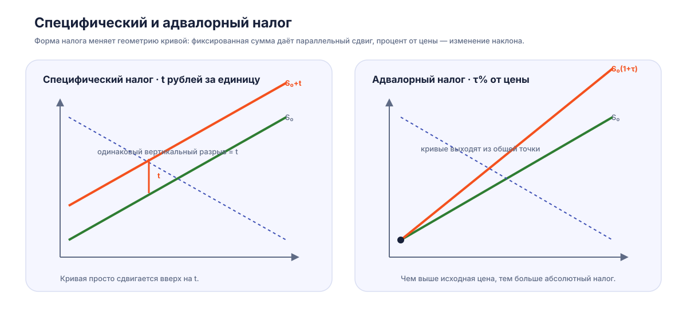

Экономика общественного сектора

# Налоговое бремя и рыночное равновесие { #tax-incidence }

Налог на каждую проданную единицу создаёт две цены: покупатель платит с учётом налога, а продавец получает сумму после его перечисления. Через изменение этих цен налог распределяется между участниками рынка. Для расчёта нужны спрос, предложение и правило, по которому взимают платёж.

Здесь рассматривается конкурентный рынок в частичном равновесии: остальные условия спроса и предложения заданы, до налога обмен эффективен, внешние эффекты отсутствуют. Все формулы с положительным объёмом предполагают, что торговля сохраняется. [Подробные решения семинара](public-sector-economics-tax-seminar.md) включают также монополию и корректирующее налогообложение.

## Налоговый клин { #price-wedge }

Обозначим исходные цену и количество через $P_0,Q_0$, после налога — через $P_D,P_S,Q_t$. Индекс $D$ относится к покупателю, $S$ — к продавцу. При специфическом налоге $t$ на единицу:

$$P_D-P_S=t,\qquad Q_D(P_D)=Q_S(P_S).$$

Покупатель выбирает количество по полной цене $P_D$. Производитель сопоставляет объём с чистой ценой $P_S$, остающейся у него. Разница между этими ценами поступает в бюджет.

На графике с ценой по вертикали и количеством по горизонтали налог на продавца изображают предложением $S(Q)+t$. Его пересечение со спросом определяет $P_D$ и $Q_t$. От этой точки опускаются на $t$ до исходной кривой предложения и находят $P_S$.

Если налог перечисляет покупатель, продавцу доступна цена $D(Q)-t$. Пересечение этой кривой с исходным предложением даёт $P_S$ и то же $Q_t$; добавление $t$ даёт $P_D$. Оба способа записи приводят к условию $D(Q_t)-S(Q_t)=t$. При одинаковом налоге и тех же условиях рынка юридический способ перечисления сохраняет это равновесие.

<figure class="lecture-figure" markdown>

<figcaption markdown>При количестве $Q_t$ расстояние между спросом и исходным предложением равно $t$.</figcaption>
</figure>

## Эластичность и распределение налога { #elasticity-incidence }

Покупатели могут сократить покупки или выбрать заменитель; производители — изменить выпуск или использование ресурсов. Возможность изменить количество определяет, насколько каждая сторона реагирует на изменение своей цены. Ценовая эластичность измеряет такую реакцию в процентах:

$$\varepsilon_D=\frac{dQ_D}{dP_D}\frac{P_D}{Q},\qquad
\varepsilon_S=\frac{dQ_S}{dP_S}\frac{P_S}{Q}.$$

У обычного спроса $\varepsilon_D<0$, поэтому при сравнении используют $|\varepsilon_D|$. Значения от 0 до 1 означают изменение количества меньше изменения цены в процентах; значение 1 — одинаковое процентное изменение; значение больше 1 — более сильную реакцию количества. Например, $\varepsilon_D=-2$ означает, что около рассматриваемой точки повышение цены на 1% сокращает спрос примерно на 2%.

Наклон кривой выражен в единицах цены и количества. Эластичность дополнительно учитывает их соотношение в выбранной точке. На прямой линии наклон постоянен, а эластичность меняется вдоль неё. Сравнивая рисунки, нужно сохранять масштабы осей и исходную точку.

В конкурентной модели большая доля налога приходится на сторону, которой труднее изменить количество. Для небольшого налога около исходного равновесия доли в изменении цены равны:

$$\frac{dP_D}{dt}=
\frac{\varepsilon_S}{\varepsilon_S+|\varepsilon_D|},\qquad
-\frac{dP_S}{dt}=
\frac{|\varepsilon_D|}{\varepsilon_S+|\varepsilon_D|}.$$

Эластичности здесь вычисляют в одной исходной точке с общей ценой $P_0$. Если предложение реагирует сильнее спроса, продавцы легче сокращают выпуск и большая часть клина приходится на цену покупателя.

Для линейных обратных кривых $D(Q)=a-bQ$, $S(Q)=c+dQ$, где $b,d>0$, можно получить точный результат для всего интервала сохранения торговли:

$$Q_0=\frac{a-c}{b+d},\qquad
Q_t=\frac{a-c-t}{b+d},$$

$$P_D-P_0=\frac{b}{b+d}t,\qquad
P_0-P_S=\frac{d}{b+d}t.$$

Чем больше $b$ при том же $d$, тем меньшим сокращением покупок спрос отвечает на рост цены и тем большую часть $t$ платит покупатель. В общей нелинейной модели для большого налога решают новые уравнения равновесия: эластичности могут измениться вместе с ценами и количеством.

## Излишки, доход бюджета и чистые потери { #surplus-dwl }

**Излишек потребителя $CS$** — сумма разниц между готовностью платить и фактической ценой. На графике это площадь под спросом и над ценой покупателя до проданного количества.

**Излишек производителя $PS$** — сумма разниц между чистой ценой и минимальной ценой предложения. При кривой предложения, отражающей предельные издержки, это площадь над предложением и под ценой продавца. Постоянные издержки учитываются отдельно при переходе от излишка к прибыли.

До налога участники делят общий выигрыш от обмена. После введения налога часть этого выигрыша получает бюджет:

$$T=tQ_t.$$

Для выручки фирмы сохраняется обозначение $TR$: в этой модели чистая выручка от продаж равна $TR=P_SQ_t$. Таким образом, в формулах можно сразу различить доход бюджета $T$ и доход продавца $TR$.

Снижение цены продавца и повышение цены покупателя сокращают излишки. Каждая из потерь включает платёж на сохранившихся сделках и выигрыш от сделок, которые перестали совершаться. Для линейных кривых:

$$\Delta CS=(P_D-P_0)Q_t+
\frac12(P_D-P_0)(Q_0-Q_t),$$

$$\Delta PS=(P_0-P_S)Q_t+
\frac12(P_0-P_S)(Q_0-Q_t).$$

Прямоугольники первой части вместе дают $T$. Треугольники второй части вместе образуют **избыточное налоговое бремя, или $DWL$**:

$$DWL=\frac12t(Q_0-Q_t),\qquad
\Delta CS+\Delta PS=T+DWL.$$

Потерянные сделки находились между $Q_t$ и $Q_0$: покупатели оценивали их выше предельных издержек производства, но налог сделал их невыгодными участникам. Для произвольных кривых их общий выигрыш находят интегралом:

$$DWL=\int_{Q_t}^{Q_0}\bigl[D(q)-S(q)\bigr]\,dq.$$

Эти выражения сравнивают эффективный исходный обмен с обменом после налога. При внешнем ущербе или исходной монопольной цене общественная оценка требует учесть существующее искажение. Корректирующий налог может сокращать потери, если приближает объём к общественно эффективному.

## Четыре предельных случая { #elasticity-extremes }

В каждом случае другая сторона рынка имеет обычную наклонную кривую, а после налога сохраняется положительное количество. Все результаты следуют из клина $P_D-P_S=t$ и формы соответствующей кривой.

  <figure class="lecture-figure" markdown>

<figcaption markdown>Фиксированный спрос: $P_D=P_0+t$, $P_S=P_0$.</figcaption>
  </figure>
  <figure class="lecture-figure" markdown>

<figcaption markdown>Горизонтальный спрос: $P_D=P_0$, $P_S=P_0-t$.</figcaption>
  </figure>
  <figure class="lecture-figure" markdown>

<figcaption markdown>Фиксированное предложение: $P_D=P_0$, $P_S=P_0-t$.</figcaption>
  </figure>
  <figure class="lecture-figure" markdown>

<figcaption markdown>Горизонтальное предложение: $P_D=P_0+t$, $P_S=P_0$.</figcaption>
  </figure>

### Фиксированный спрос { #fixed-demand }

Вертикальный спрос удерживает $Q_t=Q_0$. При этом объёме предложение задаёт прежнюю цену продавца $P_S=P_0$, а клин добавляет $t$ к цене покупателя. Всё ценовое бремя приходится на покупателей. Количество сделок сохраняется, поэтому $DWL=0$ в данной модели.

### Горизонтальный спрос { #flat-demand }

Горизонтальная кривая фиксирует цену покупателя на $P_0$. Чтобы сохранить клин, цена продавца становится $P_0-t$. При возрастающем предложении продавцы сокращают выпуск, поэтому $Q_t<Q_0$ и $DWL>0$. Его величина зависит от налога и реакции предложения.

### Фиксированное предложение { #fixed-supply }

Вертикальное предложение удерживает $Q_t=Q_0$. Спрос при этом количестве задаёт прежнюю цену покупателя. Чистая цена продавца уменьшается на $t$, поэтому всё ценовое бремя несут продавцы. Сохранившийся объём даёт $DWL=0$.

### Горизонтальное предложение { #flat-supply }

Горизонтальная кривая фиксирует чистую цену продавца $P_S=P_0$. Покупатель платит $P_0+t$ и сокращает количество по обычной кривой спроса. Всё ценовое бремя приходится на покупателей, а сокращение взаимовыгодных сделок создаёт $DWL>0$.

## Специфический, адвалорный и аккордный налог { #tax-types }

### Фиксированная сумма за единицу { #specific-tax }

Специфический налог задаёт $t$ в денежных единицах на единицу товара. Если исходное предложение записано как $P_S=S(Q)$, предложение в ценах покупателя имеет вид:

$$P_D=S(Q)+t.$$

У линии $S(Q)=c+dQ$ коэффициент наклона остаётся $d$, а вертикальный перехват становится $c+t$. Поэтому на графике получается параллельный сдвиг.

### Процент от стоимости { #advalorem-tax }

Для адвалорного налога важно указать стоимость, от которой считают процент. При ставке $\tau_n$ на **чистую цену продавца**:

$$t(Q)=\tau_nP_S(Q),\qquad P_D=(1+\tau_n)P_S.$$

При ставке $\tau_g$ на **полную цену покупателя**:

$$t(Q)=\tau_gP_D(Q),\qquad P_S=(1-\tau_g)P_D.$$

Одинаковый денежный клин соответствует ставкам:

$$\tau_g=\frac{\tau_n}{1+\tau_n},\qquad
\tau_n=\frac{\tau_g}{1-\tau_g}.$$

Например, множитель $1+\tau_n$ применяется именно к чистой базе. Если налог задан как доля полной цены, предложение в ценах покупателя равно $S(Q)/(1-\tau_g)$.

Для $S(Q)=c+dQ$ оба способа меняют и перехват, и наклон:

$$P_D=(1+\tau_n)c+(1+\tau_n)dQ,$$

или

$$P_D=\frac{c}{1-\tau_g}+\frac{d}{1-\tau_g}Q.$$

Общий выход линий из начала координат получается при $c=0$. При ненулевом $c$ линия после налога имеет другой перехват на оси цены; ширина клина растёт вместе с ценой. Способ перечисления налога и выбор процентной базы — разные свойства налогового правила.

<figure class="lecture-figure" markdown>

<figcaption markdown>Постоянный клин за единицу и клин, пропорциональный указанной цене.</figcaption>
</figure>

### Фиксированная сумма с плательщика { #lump-sum-tax }

Аккордный налог задаёт сумму $T=F$, которая сохраняется при разных решениях о труде и потреблении. Он уменьшает располагаемые средства и может менять покупки через **эффект дохода**. Относительные цены вариантов выбора остаются прежними, поэтому **эффект замещения** в базовой модели отсутствует.

Для него сохраняется единая цена сделки между покупателем и продавцом. При оценке избыточного бремени такой фиксированный платёж служит эталоном с $DWL=0$, хотя выплата уменьшает возможности человека и одинаковая сумма занимает разную долю дохода у разных плательщиков.

## Налог на рынке труда { #labor-tax }

Работник продаёт труд, работодатель покупает его. Поэтому аналог цены покупателя — расходы работодателя на единицу труда $w_D$, а цены продавца — чистая зарплата работника $w_S$.

При налоге $t$ на единицу труда:

$$w_D-w_S=t,\qquad L_D(w_D)=L_S(w_S),\qquad T=tL_t.$$

Если налог составляет долю $\tau$ брутто-зарплаты, соотношение другое по форме, но сохраняет тот же смысл двух цен:

$$w_S=(1-\tau)w_D,\qquad T=\tau w_DL_t.$$

При вертикальном предложении количество работников в модели задано. Спрос определяет прежнюю зарплату работодателя; налог уменьшает чистую зарплату работников. При восходящем предложении снижение чистой зарплаты сокращает доступный труд, занятость уменьшается, а часть клина приходится на рост расходов работодателя. Точные значения получают из новой функции предложения.

[Задача 17 с таблицей, графиками и расчётом](public-sector-economics-tax-seminar.md#task-17) показывает оба случая.

[Решения налогового семинара](public-sector-economics-tax-seminar.md){ .md-button }
[Краткая шпаргалка](public-sector-economics-tax-incidence-cheatsheet.md){ .md-button }
[Карта курса](public-sector-economics.md){ .md-button }
