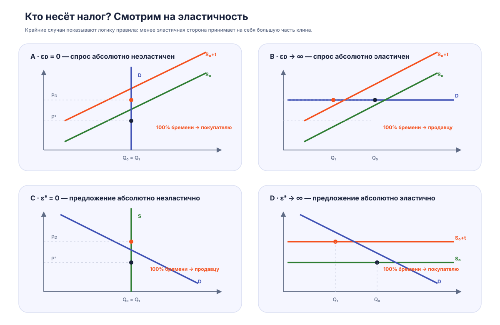

# Экономика общественного сектора: налоговое бремя, эластичность и эффекты налогообложения

## 1. Налоговый клин и равновесие на рынке

При введении налога между ценой, которую платит покупатель, и ценой, которую получает продавец, возникает разрыв:

$$P_D - P_S = t$$

где:

- $P_D$ — цена для покупателя;
- $P_S$ — цена для продавца;
- $t$ — величина налога.

После введения налога:

- кривая предложения сдвигается вверх на величину налога;
- цена для покупателей увеличивается;
- цена для производителей уменьшается;
- равновесный объём продаж сокращается.

Возникает чистая потеря общественного благосостояния:

$DWL > 0$

<figure class="lecture-figure" markdown>

<figcaption>Налоговый клин: разрыв между ценой покупателя и ценой продавца, налоговые поступления и чистые потери благосостояния.</figcaption>
</figure>

---

## 2. Распределение налогового бремени

Юридическое возложение налога не определяет фактического плательщика.

Фактическое распределение бремени зависит от эластичности спроса и предложения.

Основное правило:

> Большую часть налога несёт менее эластичная сторона рынка.

Если спрос менее эластичен:

- потребители сильнее принимают рост цены;
- большая часть налога перекладывается на покупателей.

Если предложение менее эластично:

- производители имеют меньше возможностей изменить объём выпуска;
- большая часть налога ложится на продавцов.

---

## 3. Крайние случаи эластичности

### Абсолютно неэластичный спрос

$$\varepsilon_D = 0$$

Количество спроса не изменяется при изменении цены.

Следствия:

- весь налог несут покупатели;
- объём рынка остаётся прежним;
- $DWL = 0$.

### Абсолютно эластичный спрос

$$\varepsilon_D \rightarrow \infty$$

Покупатели не готовы платить более высокую цену.

Следствия:

- налог полностью ложится на продавцов;
- объём рынка сокращается;
- возникает значительный $DWL$.

<figure class="lecture-figure" markdown>

<figcaption>Крайние случаи эластичности: кто несёт налоговое бремя и когда возникает чистая потеря благосостояния.</figcaption>
</figure>

---

## 4. Специфический и адвалорный налог

### Специфический налог

Фиксированная сумма на единицу товара:

$$P_S(Q)=P(Q)+t$$

Графически вызывает параллельный сдвиг кривой предложения.

### Адвалорный налог

Налог как процент от цены:

$$P_S(Q)=P(Q)(1+t)$$

Вызывает изменение наклона кривой предложения.

<figure class="lecture-figure" markdown>

<figcaption>Специфический налог даёт постоянный вертикальный разрыв; адвалорный меняет наклон кривой предложения.</figcaption>
</figure>

---

## 5. Налог на рынке труда

Основные элементы анализа:

- предложение труда $L^S$;
- спрос на труд $L^D$;
- ставка заработной платы $w$;
- налог на единицу труда.

Равновесие определяется условием:

$$L^S=L^D$$

При абсолютно неэластичном предложении труда:

- количество занятых не изменяется;
- чистая заработная плата работников уменьшается на величину налога;
- налоговое бремя полностью несут работники.

Доход государства:

$$TR=t\times L$$

Если предложение труда эластично:

- часть работников сокращает предложение труда;
- занятость уменьшается;
- возникает чистая потеря благосостояния.

---

## 6. Выводы

1. Налог создаёт разрыв между ценой покупателя и ценой продавца.
2. Распределение налогового бремени определяется эластичностью, а не формальным плательщиком.
3. Чем сильнее налог меняет поведение участников рынка, тем больше $DWL$.
4. Неэластичная сторона рынка несёт большую часть налогового бремени.