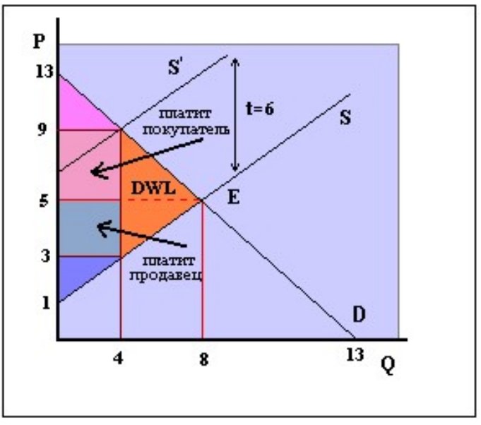
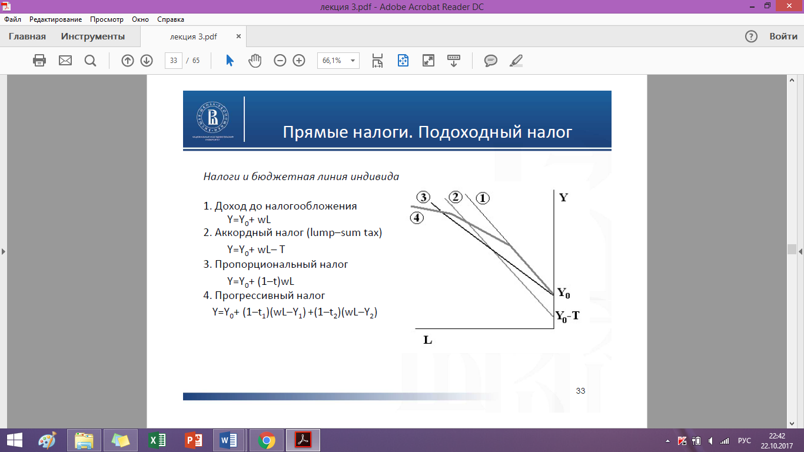
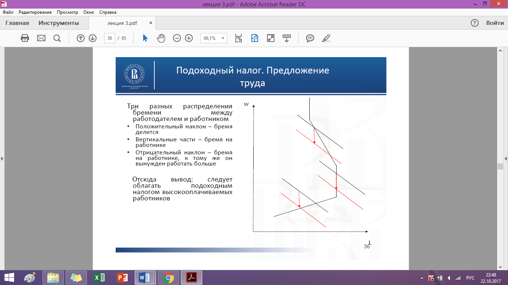
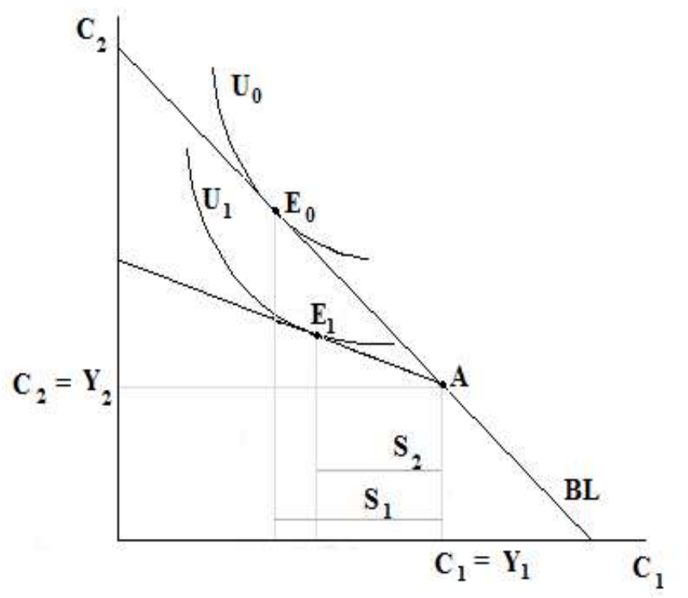
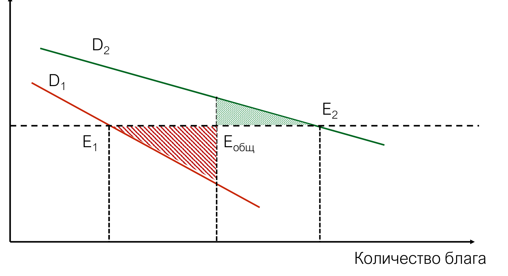
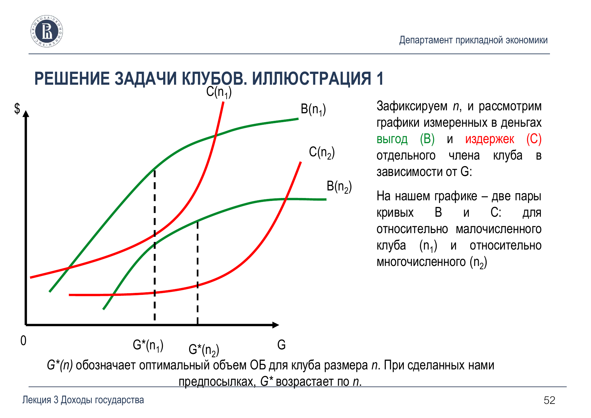
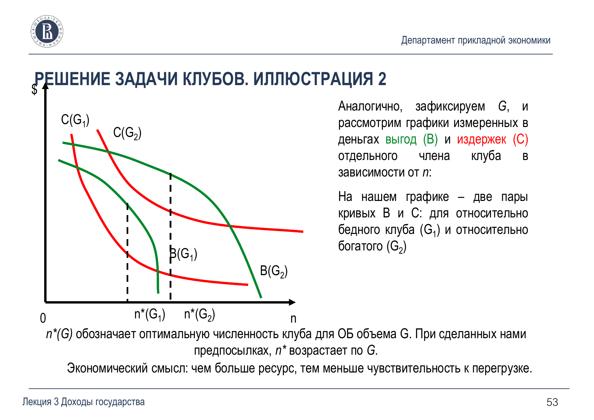

Экономика общественного сектора

# Налоги, доходы и бюджетный федерализм

Налог меняет доход бюджета и условия, на которых люди покупают товары, работают и сберегают. Для каждого налога нужно различать три результата: кто перечисляет деньги, кто в итоге несёт бремя и какие решения меняются из-за налога.

Конспект по презентации А. М. Калинина «Доходы государства. Вопросы бюджетного федерализма», включая приложение с графиками к семинару.

[Презентация целиком — PDF](../materials/eos/lecture-2.pdf){ .md-button }
[Теории и графики — DOCX](../materials/eos/theory-and-graphs.docx){ .md-button }

## Доходы государства и классификация налогов

На слайде 2 источники средств разделены на «собрать», «заработать» и «занять». Заимствование даёт финансирование сейчас, но создаёт обязательство вернуть долг. Его следует отличать от налоговых и неналоговых доходов.

| Признак | Варианты |
| :--- | :--- |
| Объект налогообложения | Прямые налоги на доход, прибыль или имущество; косвенные налоги на товары и услуги |
| Использование поступлений | Маркированные, закреплённые за определённой целью; немаркированные |
| Способ расчёта | Стоимостной — доля стоимости; специфический — сумма на единицу; аккордный — платёж, не зависящий от текущего выбора |
| Уровень налоговой компетенции | Федеральный, региональный, местный |
| Изменение нагрузки с ростом базы | Прогрессивное, пропорциональное или регрессивное налогообложение |

**Средняя ставка** `ATR = T(Y) / Y` показывает долю дохода, уплаченную в виде налога. **Предельная ставка** `MTR = dT/dY` показывает налог с дополнительной единицы дохода.

В прогрессивной системе средняя ставка растёт с доходом; на соответствующем участке `MTR > ATR`. При пропорциональном налоге ставки равны, при регрессивном `MTR < ATR`.

Пример со слайда 3: `T(Y) = tY − S`. Предельная ставка постоянна и равна `t`, а средняя `t − S/Y` растёт с доходом при положительном `S`. Так можно получить прогрессивность даже без роста предельной ставки. Если формула допускает отрицательный налог, он означает выплату получателю.

### По каким критериям сравнивают налоги

На слайдах 4–5 перечислены равенство обязательств, экономическая нейтральность, гибкость, организационная простота и прозрачность. Они могут конфликтовать: адресная льгота помогает одной группе, но усложняет администрирование.

**Горизонтальное равенство** — одинаковая нагрузка для людей в одинаковом положении. **Вертикальное равенство** — обоснованные различия нагрузки для людей с разными возможностями. Основанием может служить платёжеспособность или выгода, которую человек получает от общественных услуг; эти принципы не дают автоматически одинаковую налоговую шкалу.

## Кто несёт налоговое бремя

**Сфера действия налога** — круг лиц, чьи реальные доходы в конечном счёте снижаются. Юридический плательщик и фактический носитель бремени могут не совпадать: продавец перечисляет налог, но часть перекладывает в цену.

Для специфического налога на конкурентном рынке:

`Pᵈ − Pˢ = t`

Здесь `Pᵈ` — цена покупателя, `Pˢ` — выручка продавца на единицу после налога, `t` — налог на единицу. Относительно исходной цены `P₀` покупатель теряет `Pᵈ − P₀` на единицу, продавец — `P₀ − Pˢ`.

<figure class="lecture-figure lecture-figure--compact" markdown>

<figcaption>Прямоугольник показывает поступления бюджету, треугольник DWL — потерю взаимовыгодных сделок. Схема из таблицы «Теории и графики».</figcaption>
</figure>

**Большую долю бремени обычно несёт менее эластичная сторона:** ей труднее изменить покупку, выпуск или место приложения ресурса. В предельных случаях совершенно неэластичного спроса бремя ложится на покупателя, совершенно эластичного спроса — на продавца. Просто назвать спрос «эластичным» недостаточно, чтобы сделать вывод о полном переносе бремени.

В анализе можно также различать распределение нагрузки между трудом и капиталом, поколениями и территориями. Для этого уже недостаточно одной кривой спроса и предложения.

### Числовой пример из презентации

На слайдах 7 и 65 до налога `Q₀ = 8`, `P₀ = 5`. После налога `t = 6` количество снижается до `Q₁ = 4`, покупатель платит `9`, продавцу остаётся `3`.

<figure class="lecture-figure lecture-figure--compact" markdown>

<figcaption>График со слайда 7. На осях P и Q предложение имеет наклон 1/2; указанное в тексте слайда значение 2 относится к обратной записи Q(P).</figcaption>
</figure>

| Расчёт | Результат |
| :--- | :--- |
| Поступления в бюджет | `T = t × Q₁ = 6 × 4 = 24` |
| Нагрузка покупателя на единицу | `9 − 5 = 4`, или `2/3` налога |
| Нагрузка продавца на единицу | `5 − 3 = 2`, или `1/3` налога |
| Избыточное бремя для линейных кривых | `DWL = ½ × t × (Q₀ − Q₁) = 12` |

Поступления `24` не равны потерям `12`: деньги бюджета остаются ресурсом общества, а DWL возникает из-за исчезнувших выгод от обмена.

### Специфический, стоимостной и эквивалентный налоги

Специфический налог создаёт постоянный разрыв между ценами — например, 5 денежных единиц с каждой единицы товара. Стоимостной зависит от цены. Для него надо уточнять базу процента: если ставка `τ` начисляется на цену продавца, `Pᵈ = (1 + τ)Pˢ`; если долю `α` удерживают из цены покупателя, `Pˢ = (1 − α)Pᵈ`.

**Эквивалентные налоги** дают одинаковые поступления и одинаковые значимые экономические последствия. На конкурентном рынке специфический и стоимостной налоги можно подобрать так, чтобы совпали конечные цены и количество. Равенства ставок или одного только DWL для этого недостаточно. Графики разных способов взимания — на слайдах 61–64.

## Налог при монополии

Монополист выбирает объём по условию `MR = MC`, затем находит цену на кривой спроса. `MR` означает **предельную выручку**, `MC` — **предельные издержки**. Это не общая выручка и не все издержки. Самостоятельной кривой предложения, как у конкурентного рынка, у монополиста нет.

<figure class="lecture-figure lecture-figure--compact" markdown>

<figcaption>Схема из DOCX; такой же механизм показан на слайде 66.</figcaption>
</figure>

При **линейном спросе и постоянных предельных издержках** специфический налог `t` повышает цену на `t/2`. Именно для этих предпосылок в лекции говорят о переносе половины налога на покупателя. Это не означает, что общие потери прибыли и благосостояния покупателей обязательно равны.

При спросе с постоянной ценовой эластичностью по модулю больше единицы и постоянных предельных издержках рост цены может превысить налог на единицу. Нелинейность сама по себе такого результата не гарантирует — нужна конкретная функция спроса.

Стоимостной и специфический налоги по-разному меняют решение монополиста. В рассматриваемых на слайдах 8 и 69 моделях при одинаковых поступлениях стоимостной налог даёт больший выпуск; подобрать полную эквивалентность, как при конкуренции, нельзя.

## Избыточное бремя и правила оптимального налогообложения

Избыточное бремя связано с **эффектом замещения**: налог меняет относительные цены и отклоняет выбор от исходного эффективного состояния. Аккордный платёж уменьшает доход, но не меняет относительных цен; в стандартной модели у него нет такого искажения.

В презентации встречается формулировка «потери всегда существуют». Для расчёта её нужно читать вместе с предпосылками. Вертикальный обычный спрос ещё не доказывает отсутствия потерь: эффект дохода может скрывать эффект замещения. Строгий анализ использует **компенсированный спрос**, то есть спрос при сохранении исходной полезности. Если и компенсированная реакция отсутствует, утверждение о неизбежном положительном DWL уже не следует. Это различие разбирается на слайдах 70–72 и в [материалах MIT по анализу налогов](https://ocw.mit.edu/courses/14-471-public-economics-i-fall-2012/d3513f9dccf9bc5696d162cdd418fa9c_MIT14_471F12_Tax_Analysis.pdf).

Кроме того, корректирующий налог при внешнем вреде может уменьшать исходную неэффективность; к нему нельзя автоматически применять результат для рынка без экстерналий.

### Правило Рамсея

При необходимости собрать заданную сумму и при предпосылках учебной модели налоги подбирают по компенсированной реакции спроса. Для малых изменений правило описывают как одинаковое пропорциональное сокращение компенсированного спроса на облагаемые товары:

`ΔA/A = ΔB/B`

Частный результат — **правило обратных эластичностей**. При отсутствии перекрёстных компенсированных эффектов между облагаемыми товарами менее эластичный спрос допускает большую долю налога в цене покупателя. Обозначим эту долю `αᵢ = tᵢ / Pᵈᵢ`, где `tᵢ` — налог на единицу:

`α_A / α_B = |ε_Bᶜ| / |ε_Aᶜ|`

Здесь речь о компенсированных эластичностях и модели минимизации потерь при заданных поступлениях. Отношение налогов в рублях без поправки на цены использовать нельзя. Если стоимостную ставку `τ` начисляют на цену до налога, то `α = τ / (1 + τ)`. [Вывод правила в материалах MIT](https://economics.mit.edu/sites/default/files/inline-files/lecture_3_-_commodities_and_public_goods_with_redistributive_concerns.pdf).

Из этого не следует, что товары первой необходимости всегда нужно облагать сильнее: распределение нагрузки и связи между товарами могут менять решение.

Одинаковый стоимостной налог сохраняет соотношение цен **между облагаемыми товарами**. Но если остаётся необлагаемое благо, например досуг, относительные цены по отношению к нему меняются. Поэтому одинаковая ставка не гарантирует полной нейтральности.

### Правило Корлетта — Хейга

Если досуг напрямую обложить нельзя, его дополнения в стандартной модели облагают относительно сильнее, чем заменители. Так косвенное налогообложение частично затрагивает необлагаемый досуг. Правило со слайда 15 дополняет анализ рынка труда; оно не задаёт готового перечня ставок для реальных товаров.

## Налоги на труд, прибыль и сбережения

### Выбор между трудом и досугом

В модели `L` — часы труда, `Le` — досуг, `L + Le = 24`, `w` — почасовая зарплата, `Y₀` — нетрудовой доход.

| Режим | Располагаемый доход |
| :--- | :--- |
| До налога | `Y = Y₀ + wL` |
| Аккордный налог | `Y = Y₀ + wL − T` |
| Пропорциональный налог на заработок | `Y = Y₀ + (1 − t)wL` |
| Прогрессивная шкала | `Y = Y₀ + wL − T(wL)`, где средняя ставка `T(wL)/(wL)` растёт с заработком |

<figure class="lecture-figure lecture-figure--compact" markdown>

<figcaption>Схема из исходной таблицы: 1 — до налога, 2 — аккордный, 3 — пропорциональный, 4 — прогрессивный. При показанной ступенчатой шкале предельная ставка меняется на границах интервалов.</figcaption>
</figure>

Налог на заработок снижает цену часа досуга — упущенную чистую зарплату. Эффект замещения склоняет к большему досугу, а эффект дохода при нормальном досуге может заставить работать больше. Итоговая реакция труда зависит от их соотношения.

<figure class="lecture-figure lecture-figure--compact" markdown>

<figcaption>Три случая из конспекта и слайда 13. На обратном участке снижение чистой оплаты может сопровождаться ростом часов работы.</figcaption>
</figure>

На восходящем участке предложения бремя делят работник и работодатель; при вертикальном предложении оно ложится на работника. Обратный участок показывает, почему нельзя всегда предсказывать сокращение труда после повышения налога. Вывод слайда о налогообложении высокооплачиваемых относится к этой модели реакции труда, а не является самостоятельным доказательством оптимальной прогрессивной шкалы.

### Налог на прибыль

Если налог составляет постоянную долю **экономической прибыли**, то `π_after = (1 − t)π`. При неизменных условиях максимизация этой величины даёт то же `MR = MC`: выбранные цена и объём не меняются, налог уменьшает прибыль владельца.

Оговорка существенна: фактическая налоговая база может отличаться от экономической прибыли; налоговый режим также влияет на инвестиции, финансирование и принятие риска. Статический результат со слайда 16 не означает нейтральности любого реального налога на прибыль. Поступления от прибыли к тому же зависят от экономического цикла.

### Сбережения и межвременной выбор

На слайде 73 человек выбирает потребление сегодня `C₁` и в будущем `C₂`. Доходы двух периодов — `Y₁` и `Y₂`, сбережения — `s = Y₁ − C₁`, процентная ставка — `r`.

`C₂ = Y₂ + s(1 + r)`

Эквивалентная запись бюджетного ограничения:

`C₁ + C₂/(1 + r) = Y₁ + Y₂/(1 + r)`

<figure class="lecture-figure lecture-figure--compact" markdown>

<figcaption>График со слайда 73. A — потребление текущих доходов в каждом периоде; E₀ и E₁ — выбор при разных бюджетных линиях. На рисунке сбережения уменьшаются с S₁ до S₂.</figcaption>
</figure>

Налог на процентный доход снижает чистую доходность сбережений. Для сберегателя, если облагаются только проценты по ставке `τ`, вместо `r` используется `r(1 − τ)`. Меняются и возможности будущего потребления, и стимул откладывать деньги. Общий эффект на размер сбережений зависит от предпочтений.

Нужно различать налогообложение нового потока сбережений, накопленного имущества и дохода от инвестиций. В лекции приведён аргумент за низкое налогообложение капитала в некоторых долгосрочных моделях, а затем прямо отмечено отсутствие общего правила «труд и капитал всегда облагать одинаково» или «капитал всегда облагать меньше». Практические аргументы — стимулы к накоплению и риск переоформления трудового дохода как дохода от капитала.

## Перераспределение при неполной информации

Государство видит доход, но не всегда может отделить талант, удачу, усилие и доступные человеку возможности. Если назначать выплаты только по наблюдаемому доходу, правила сами начинают влиять на усилие и раскрытие информации.

### Две теоремы благосостояния

**Первая:** конкурентное равновесие при необходимых условиях, включая локальную ненасыщаемость предпочтений и отсутствие соответствующих провалов рынка, Парето-эффективно. Это не утверждение о справедливости распределения и не описание любого фактического рынка.

**Вторая:** при дополнительных предпосылках, в частности выпуклости, выбранное Парето-эффективное распределение можно поддержать конкурентными ценами после подходящего перераспределения начальных ресурсов. Практическая трудность — определить индивидуальные аккордные платежи, не привязав их к поведению и не создав новых искажений.

Отсюда в лекции переход к **второму наилучшему**: правила выбирают с учётом информационных и других ограничений, а не сравнивают с недостижимым безупречным распределением.

### Откровенность, налоговый принцип и смешанная система

**Принцип откровенности** не означает, что люди сами по себе будут честны. Если определённый результат реализуется некоторым механизмом в заданном понятии равновесия, его можно представить прямым механизмом, где правдивое сообщение частной информации является равновесной стратегией. В правилах должны быть обеспечены соответствующие стимулы.

**Принцип налогообложения** в рассматриваемой на слайдах 27–29 модели позволяет представить допустимое распределение через налоговую систему, при которой человек сам выбирает выгодный ему набор. Это результат об устройстве механизма при заданных ограничениях. Он не доказывает, что любая существующая налоговая система оптимальна или что целью государства всегда должна быть максимизация сборов.

В **смешанной системе** одновременно используют налоги на доходы и товары. На слайде 30 сопоставлены два основания базы:

- подход Хейга — Саймонса — облагать совокупный доход;
- подход Калдора — облагать потребление, то есть ресурсы, которые человек использует сейчас.

Разницу видно в модели жизненного цикла: часть сегодняшнего дохода сберегают и потребляют позже. Поэтому сравнивать базы только за один год недостаточно.

### Денежные и натуральные трансферты

Денежная выплата расширяет возможности получателя и в стандартной модели сохраняет свободу выбора. Натуральный трансферт — конкретная услуга или благо — ограничивает, на что пойдёт поддержка.

На слайдах 31–32 перечислены основания предоставлять помощь в натуре: общественные и политические цели программы, самоотбор получателей и устойчивость предоставления во времени. Например, услугу можно дать сейчас, тогда как обещание будущей выплаты зависит от будущей политики. Это аргументы для сравнения инструментов, а не общее доказательство превосходства натуральной помощи.

## Имущество, платные услуги и приватизация { #property }

Государство владеет землёй, резервами, имуществом учреждений и предприятий, долями компаний. Оно может использовать имущество для общественных задач, сдавать в аренду, вести коммерческую деятельность или продавать.

Для платной услуги в простом конкурентном ориентире цена выше предельных издержек ограничивает полезное потребление, а цена ниже них стимулирует потребление, чья дополнительная ценность меньше издержек. При внешних эффектах, экономии на масштабе и требованиях доступности нужны дополнительные условия анализа. Затратный расчёт тарифа осложняет то, что поставщик лучше заказчика знает свои реальные расходы.

Приватизация даёт разные бюджетные результаты:

| Имущество до продажи | Возможный финансовый результат |
| :--- | :--- |
| Не использовалось и не требовало расходов | Разовый доход от продажи; после вовлечения в оборот возможны налоговые поступления |
| Не использовалось, но требовало содержания | Дополнительно отпадает часть расходов на содержание |
| Использовалось убыточно | Сокращаются связанные с ним расходы бюджета |
| Приносило прибыль | Возникает разовое поступление, но государство теряет будущий поток доходов собственника |

Эффективность зависит и от собственности, и от конкуренции. Преобразование государственной монополии в частную само по себе не создаёт конкурентный рынок. На слайдах 37–40 противопоставлены стимулы снижать издержки и риски потери экономии на масштабе, роста цен, сокращения охвата услугами и банкротства. Длинная цепочка «избиратели — органы власти — руководство — исполнитель» также осложняет контроль и согласование целей.

## Бюджетный федерализм

Управленческая децентрализация передаёт задачи и контроль ближе к исполнителям. Бюджетный федерализм рассматривает, как разные уровни власти формируют запрос на услуги, принимают решения и финансируют их.

Выигрыш децентрализации — возможность подобрать разные наборы услуг для территорий с разными предпочтениями. Цена — расходы на координацию, возможная потеря масштаба и эффекты, выходящие за границы территории.

| Функция общественных финансов | Логика распределения полномочий |
| :--- | :--- |
| Стабилизация | Требует координации на макроуровне: экономика региона открыта, результаты политики выходят за его границы |
| Перераспределение | Местные программы возможны, но миграция и конкуренция территорий осложняют их; важны общенациональные гарантии и выравнивание |
| Предоставление благ | Локальные блага легче подстраивать под местный спрос, если их выгоды и издержки остаются внутри территории |

### Гранты между уровнями бюджета

**Блочный грант** оставляет получателю широкую свободу расходования. **Категориальный грант** связан с определённой целью. Внутри целевых грантов различают недолевое финансирование, не требующее софинансирования получателя, и долевое — когда центр оплачивает часть расходов, а территориальный бюджет участвует своими средствами. Эти схемы по-разному меняют цену дополнительной услуги для местной власти.

### Теорема децентрализации

Если децентрализация не увеличивает издержки, а выгоды локального блага не выходят за пределы соответствующих территорий, местный выбор объёма может быть эффективнее единого централизованного стандарта или не уступать ему. В сравнении предполагается именно **единый** стандарт центра.

<figure class="lecture-figure" markdown>

<figcaption>Слайд 45. E₁ и E₂ — предпочтительные объёмы двух территорий; при общем объёме Eобщ возникают заштрихованные потери.</figcaption>
</figure>

Выигрыш зависит от различий в предпочтениях и эластичности спроса. Экономия на масштабе, межтерриториальные эффекты и расходы на выявление пользователей способны изменить результат. Эмпирические примеры на слайде 47 относятся к указанным там исследованиям и периодам; корреляция децентрализации с качеством управления сама по себе не устанавливает причинность.

### Модель Тибу: «голосование ногами»

Человек выбирает территорию с подходящим сочетанием местных услуг и платежей. При достаточном разнообразии юрисдикций жители с похожими запросами группируются, а местные наборы благ лучше соответствуют предпочтениям.

Предпосылки на слайдах 48–49: выгоды и издержки локализованы, миграция не вызвана одной лишь погоней за перераспределительными выплатами, вариантов территорий достаточно, а переезд почти не создаёт издержек ни самому человеку, ни его прежним и новым соседям. Дорогой переезд, привязка к работе и ограничения выбора жилья мешают этому механизму.

### Клубные блага и модель Бьюкенена

Клубное благо допускает ограничение доступа и остаётся несоперничающим до перегрузки. Увеличение числа участников позволяет делить расходы, но после определённого уровня теснота и очереди ухудшают пользование. Клубные и локальные общественные блага могут пересекаться, но не являются синонимами: первое понятие описывает доступ и перегрузку, второе — территорию распространения выгод.

В модели со слайдов 50–53:

- `x` — частное потребление участника;
- `n` — число членов клуба;
- `G` — объём клубного блага;
- `c(n,G)` — общие издержки;
- `w` — исходный запас частного блага.

Одинаковые участники выбирают `n` и `G`, максимизируя `U(x,n,G)`; при равных взносах `x = w − c(n,G)/n`.

<figure class="lecture-figure lecture-figure--compact" markdown>

<figcaption>Слайд 52: при фиксированном числе участников выбирают G с наибольшей разностью совокупных выгод B и издержек C отдельного участника. Равенство B и C означает нулевой чистый выигрыш, а не оптимум.</figcaption>
</figure>

<figure class="lecture-figure lecture-figure--compact" markdown>

<figcaption>Слайд 53: при фиксированном G сравнивают экономию на взносе с ухудшением использования из-за перегрузки. В предпосылках рисунка больший объём блага позволяет выбрать более многочисленный клуб.</figcaption>
</figure>

Размер клуба и объём блага выбирают совместно. На рисунках показаны два условных шага: сначала фиксируют один параметр, затем исследуют другой.

Модель индивидуальных платежей Линдаля и механизм выявления предпочтений Гровса — Кларка со слайдов 54–57 разобраны в [конспекте по общественным расходам](public-sector-economics-welfare.md#public-goods).

[Задачи по налогам и общественным благам](public-sector-economics-practice-archive.md){ .md-button }
[Все материалы курса](public-sector-economics-materials.md){ .md-button }
