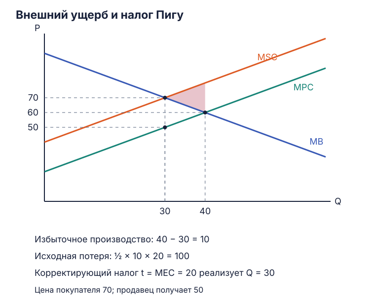
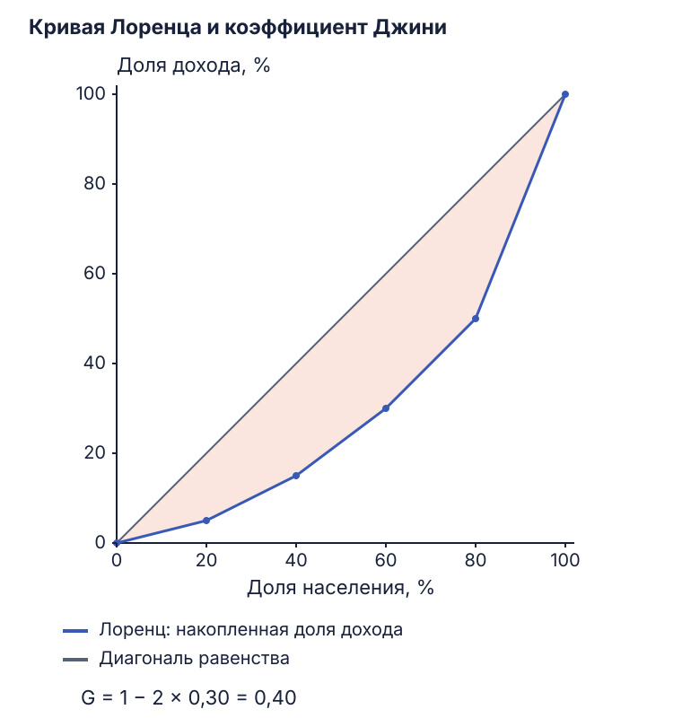
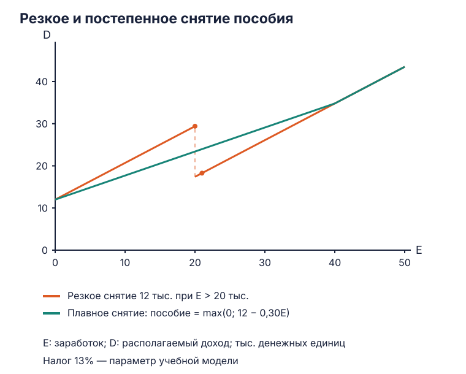

Экономика общественного сектора · 1 октября 2026

# Провалы рынка, неравенство и перераспределение

[Презентация лекции — PDF, 74 страницы](../materials/eos/eos-lecture-2026-10-01.pdf){ .md-button }

Лекция «Причины вмешательства государства в рыночную экономику». На титульном слайде указана Наталья Алексеевна Хоркина. Конспект объединяет материал презентации и переданные записи обсуждения; расчёты с условными числами сопровождаются исходными данными.

## Какую задачу решает государство

У рыночной цены есть пределы: она может учитывать расходы продавца и выгоды покупателя, оставляя за рамками ущерб соседям, качество, которое покупатель не умеет оценить, или потребность в благе, за которое трудно собрать индивидуальную плату. Но даже рынок, эффективно использующий ресурсы, может давать распределение доходов, которое общество считает несправедливым. Эти две причины вмешательства требуют разных аргументов.

В лекции выделены четыре функции государства:

| Функция | Что требуется сделать | Пример экономической задачи |
| :--- | :--- | :--- |
| Спецификация и защита прав собственности | Определить, кому принадлежат ресурсы, какие действия разрешены и как исполняются договоры | Участники понимают, кто вправе пользоваться объектом и кто отвечает за нанесённый ущерб |
| Корректировка провалов рынка | Изменить правила и стимулы, из-за которых ресурсы используются неэффективно | Учитывать внешний вред, ограничивать рыночную власть, обеспечивать качество и общественные блага |
| Перераспределение | Изменить распределение доходов, рисков и доступа к благам | Налоги, пособия, финансирование помощи людям с низкими доходами |
| Макроэкономическая стабилизация | Сглаживать колебания выпуска, занятости и цен | Бюджетная политика и автоматические стабилизаторы при спаде |

**Парето-улучшение** происходит, когда хотя бы один участник выигрывает, а положение остальных сохраняется или улучшается. **Парето-эффективное распределение** достигнуто, если дальнейшее такое улучшение невозможно. Критерий ничего не говорит о том, насколько равны доходы: крайне неравное распределение тоже может быть эффективным по Парето.

**Провал рынка** — ситуация, в которой свободное взаимодействие участников не обеспечивает Парето-эффективное распределение ресурсов. В лекции рассматриваются монополия, асимметрия информации, внешние эффекты и общественные блага. Низкий доход конкретного человека сам по себе ещё не указывает, какой из этих механизмов работает. Для обоснования меры нужно назвать механизм и объяснить, как она его меняет.

## Монополия: откуда берётся рыночная власть

У монополии один продавец, у его продукции отсутствуют близкие заменители, а вход других поставщиков затруднён. Важны границы рынка: одна клиника в небольшом городе и одна клиника среди десятков доступных в большом городе имеют разные возможности влиять на цену. Даже уникальное оборудование не всегда создаёт монополию, если ту же потребность можно удовлетворить другим способом.

В стандартной модели конкурентный поставщик принимает цену как заданную и расширяет выпуск до равенства цены и предельных издержек: \(P=MC\). Монополист сталкивается со спросом на собственную продукцию. Чтобы продать больше, ему обычно приходится снижать цену; поэтому предельная выручка \(MR\) ниже цены. Он выбирает объём по условию \(MR=MC\), затем определяет цену по кривой спроса. По сравнению с конкурентной моделью при тех же спросе и издержках получается меньший объём и более высокая цена.

Часть потребителей, чья готовность платить превышает издержки предоставления услуги, остаётся без неё. Их несостоявшиеся сделки создают потерю общественного выигрыша. При этом высокая цена может дополнительно ограничивать доступ людей с низкими доходами. Первый аргумент относится к эффективности, второй — к распределению.

### Три вида монополии в лекции

| Вид | Источник преимущества | Как выбирать государственную меру |
| :--- | :--- | :--- |
| Ситуативная | Контроль редкого ресурса, канала снабжения или других условий, мешающих конкурентам войти | Устранять барьеры, обеспечивать доступ к ресурсу, применять антимонопольные меры; разукрупнение имеет смысл, если оно создаёт жизнеспособную конкуренцию |
| Естественная | При данном спросе один поставщик может обслужить рынок с меньшими совокупными затратами, чем несколько поставщиков | Регулировать тарифы, качество и доступ к инфраструктуре; сравнивать регулируемое частное и общественное производство |
| Легальная | Закон закрепляет исключительное право | Определять объём права, срок и условия его использования; учитывать последствия для инноваций и доступа |

Для **естественной монополии** характерны большие первоначальные затраты и экономия от масштаба. Дублировать водопроводную сеть может быть дороже, чем пользоваться одной сетью. Здесь дробление оператора способно увеличить затраты. В презентации названы газо- и водоснабжение, метрополитен и городская телефонная сеть. Последний пример относится к исторической модели фиксированной сети: технологические изменения могут менять границы естественной монополии.

Линии электропередачи и трубопровод на слайде 9 приведены в разделе ситуативной монополии. Их классификация зависит от причины рыночной власти. Контроль единственного доступа к ресурсу объясняет ситуативное преимущество; высокая стоимость параллельных сетей и экономия от масштаба объясняют естественную монополию. Для выбора меры важнее установить этот механизм, чем заучить название объекта.

### Патент и медицинская лицензия

Патент создаёт временное исключительное право на изобретение. Возможность получать доход от защищённого результата повышает стимул вкладываться в исследования. Цена такой защиты — ограничение конкуренции в пределах патентного права. В фармацевтике возникает компромисс между разработкой новых продуктов и доступностью уже созданных.

В России базовый срок исключительного права на изобретение составляет **20 лет с даты подачи первоначальной заявки**. Для некоторых изобретений, относящихся к лекарственным средствам и другим продуктам, применение которых требует разрешения, закон предусматривает продление при выполнении условий; предел продления — пять лет. Поэтому «25 лет для любого лекарства» не является общим правилом. [Роспатент: срок права](https://rospatent.gov.ru/ru/faq/kakov-srok-deystviya-isklyuchitelnogo-prava-na-izobretenie-poleznuyu-model), [условия продления](https://rospatent.gov.ru/index.php/ru/documents/rec_pcd_iz).

Медицинская лицензия подтверждает допуск к определённой деятельности при выполнении требований. Получение лицензии клиникой само по себе не закрепляет за ней единственное право обслуживать рынок: лицензированными могут быть несколько поставщиков. Ограничение входа ради качества и юридическое исключительное право нужно рассматривать отдельно. [Росздравнадзор: лицензирование медицинской деятельности](https://www.roszdravnadzor.gov.ru/Medactivities/Licensing).

## Асимметрия информации и медицинский спрос

Асимметрия возникает, когда важная для сделки информация преимущественно доступна одному участнику. Пациенту трудно оценить необходимость исследования, квалификацию специалиста и ожидаемый эффект вмешательства. Врач знает больше о медицинских показаниях, пациент — о собственных симптомах, предпочтениях и выполнении назначений. Разница в знаниях может существовать в обе стороны.

На рынке труда работодатель до найма плохо наблюдает реальную производительность и добросовестность сотрудника; соискатель может не знать фактическую нагрузку и условия работы. Дипломы, репутация, испытание и раскрытие информации сокращают неопределённость, но имеют свои издержки.

Для анализа удобно различать три механизма:

| Механизм | Где находится информационная проблема | Последствие |
| :--- | :--- | :--- |
| Неблагоприятный отбор | До сделки одна сторона лучше знает свой риск или качество | Средняя цена привлекает более дорогие риски или вытесняет качественных поставщиков |
| Моральный риск | После заключения договора действия участника трудно наблюдать, а часть последствий несёт другая сторона | Страховая защита или способ оплаты меняют обращаемость, профилактику и объём услуг |
| Отношения принципала и агента | Заказчик поручает решение специалисту, чьи интересы могут отличаться | Медицинская рекомендация может зависеть от дохода поставщика и условий оплаты |

**Спрос, индуцированный поставщиком**, возникает, если специалист использует информационное преимущество, чтобы увеличить потребление сверх объёма, который пациент выбрал бы при достаточной информированности. Поуслуговая оплата усиливает финансовый стимул к дополнительным назначениям. Сам факт роста числа обследований этого механизма не доказывает: новая клиника может удовлетворять ранее неудовлетворённую потребность. Для вывода нужны данные о показаниях, результатах, информированном выборе и системе оплаты.

В презентации названы два широких направления вмешательства: участие государства в производстве услуг с сильной информационной асимметрией и государственный контроль производства и сбыта. На практике экономический смысл контроля состоит в проверке квалификации, качества, раскрытии информации и согласовании стимулов. Государственная собственность тоже оставляет проблему наблюдения: руководителю и покупателю помощи всё равно нужно оценивать работу исполнителя. Подробнее об отборе и моральном риске — в [конспекте по страхованию и благосостоянию](public-sector-economics-welfare.md#страхование-и-поведение-пациентов-и-врачей).

## Внешние эффекты: выгоды и ущерб за пределами сделки

**Внешний эффект** возникает, когда производство или потребление влияет на третьих лиц, а соответствующая выгода или издержка не отражена в условиях сделки. Покупатель и продавец учитывают собственные последствия, поэтому выбранный ими объём может отличаться от общественно эффективного.

| Признак | Варианты | Пример |
| :--- | :--- | :--- |
| Знак эффекта | Положительный или отрицательный | Благоустройство соседней территории приносит пользу; ночной шум причиняет ущерб |
| Источник | Производство или потребление | Выбросы предприятия; шум при использовании оборудования дома |
| Направление | Односторонний или двусторонний | Загрязнитель влияет на соседей; сад и пасека могут взаимно повышать результаты работы |

Вакцинация служит примером положительного эффекта, когда снижение передачи конкретной инфекции приносит защиту окружающим. Размер эффекта зависит от заболевания, вакцины и охвата; личная польза и польза другим людям учитываются отдельно. [ВОЗ: индивидуальная и общественная защита](https://www.who.int/news-room/feature-stories/detail/how-do-vaccines-work).

Для отрицательного производственного эффекта обозначим частные предельные издержки \(MPC\), предельный внешний ущерб \(MEC\) и общественные предельные издержки \(MSC\). Тогда:

\[
MSC(Q)=MPC(Q)+MEC(Q).
\]

Конкурентный рынок сравнивает спрос с \(MPC\); общественная оценка сравнивает предельную выгоду с \(MSC\). Если внешний ущерб положителен, рынок выпускает слишком много относительно этого критерия. Для положительного эффекта потребления общественная предельная выгода \(MSB\) превышает частную \(MPB\); участник учитывает лишь \(MPB\), и объём оказывается недостаточным. Эти выводы относятся к модели, где прочие условия конкуренции выполнены.

### Как читать график отрицательной экстерналии

<figure class="lecture-figure" markdown>

<figcaption markdown>Учебный пример. Все величины условные; предельный внешний ущерб постоянен.</figcaption>
</figure>

По горизонтали отложен объём \(Q\), по вертикали — цена, предельные выгоды и издержки одной дополнительной единицы. Кривая спроса одновременно показывает предельную выгоду \(MB\). Частная кривая предложения лежит ниже общественных издержек на величину внешнего ущерба. Исходные функции:

\[
MB=100-Q,\qquad MPC=20+Q,\qquad MEC=20,\qquad MSC=40+Q.
\]

**Рыночная точка.** Покупатель и производитель сравнивают частную выгоду с частными издержками:

\[
100-Q=20+Q\quad\Rightarrow\quad Q_m=40,\quad P_m=60.
\]

**Общественно эффективная точка.** В расчёт входит ущерб третьим лицам:

\[
100-Q=40+Q\quad\Rightarrow\quad Q^*=30,\quad MB(Q^*)=MSC(Q^*)=70.
\]

На интервале от 30 до 40 каждая следующая единица приносит меньше выгоды, чем совокупных издержек. У точки 30 разница равна нулю, у точки 40 — \(80-60=20\). Площадь треугольника между \(MSC\) и \(MB\) на этом интервале — общественная потеря:

\[
DWL=\frac12(40-30)\cdot20=100.
\]

**Налог Пигу.** Ставка \(t=MEC(Q^*)=20\) заставляет производителя учитывать внешний ущерб. После налога предложение для покупателя соответствует \(MPC+t\), объём сокращается до 30. Покупатель платит 70, производителю после перечисления налога остаётся 50; \(MPC(30)=50\). Налоговый сбор равен \(20\cdot30=600\). Этот сбор является передачей средств государству, а площадь 100 показывает потери от избыточного выпуска до коррекции. Они измеряют разные вещи.

При переменном внешнем ущербе оптимальная ставка равна ущербу **в эффективной точке**, а не произвольному среднему ущербу. Для её расчёта регулятору нужны сведения о вреде и реакции участников.

### Четыре способа включить внешний эффект в решение

| Способ из лекции | Как работает | Где возникает ограничение |
| :--- | :--- | :--- |
| Интеграция | Источник эффекта и затронутая деятельность объединяются; внешний ущерб или выгода входят в общий результат | Объединить всех затронутых людей трудно; интеграция может усиливать рыночную власть |
| Корректирующий налог или субсидия | Отрицательный эффект повышает цену деятельности, положительный — увеличивает вознаграждение за неё | Нужны оценка эффекта, контроль и финансирование субсидии |
| Количественное ограничение | Задаётся допустимый объём выпуска, выбросов или другой деятельности | Единое ограничение может обходиться дорого участникам с разными затратами сокращения |
| Определение прав собственности | Становится понятно, кто вправе использовать ресурс и с кем согласовывать последствия | Переговоры и исполнение соглашений требуют затрат |

**Теорема Коуза** в учебной модели: при чётко определённых правах, возможности договориться и нулевых трансакционных издержках стороны могут согласовать эффективное использование ресурса. Первоначальное распределение прав влияет на направление компенсации. Если житель имеет защищённое право на тишину, за согласованное нарушение должен платить источник шума; если допустимое использование закреплено за источником, житель может предлагать плату за его сокращение. Переговоры ищут решение, при котором дополнительная выгода соответствует дополнительным издержкам.

В реальном споре нужно найти участников, измерить ущерб, договориться и обеспечить исполнение. При тысячах пострадавших эти затраты могут сделать частное соглашение недостижимым. Рынок разрешений на выбросы сочетает установление прав с заданным регулятором общим ограничением; он требует отдельной организации и контроля.

## Общественные блага и проблема безбилетника

У благ есть два независимых свойства. **Конкурентность** означает, что потребление одним человеком уменьшает доступное другим количество или качество. **Исключаемость** означает возможность ограничить доступ тем, кто не выполнил условие, например не заплатил.

| | Исключить потребителя возможно | Исключение невозможно или слишком дорого |
| :--- | :--- | :--- |
| Потребление конкурентно | Частное благо: лекарственная упаковка, еда, индивидуальное место при ограниченной вместимости | Общий ресурс: рыба в открытом доступе, перегруженный ресурс без контроля доступа |
| Потребление неконкурентно | Клубное благо: доступ к цифровому продукту или инфраструктуре до перегрузки | Чистое общественное благо: национальная оборона, доступное всем предупреждение об угрозе |

Чистое общественное благо одновременно неконкурентно и неисключаемо. Предельные затраты допуска ещё одного пользователя могут быть близки к нулю, хотя создание и поддержание самого блага требует денег. Производство такого блага и число пользующихся им людей — разные величины.

Классификация зависит от условий. На пустой платной дороге дополнительный автомобиль почти не мешает остальным; при перегрузке поездки становятся конкурентными. В метро можно ограничить вход, а вместимость вагонов ограничена. Бюджетное финансирование транспорта не превращает каждую поездку в чистое общественное благо.

Индивидуальная медицинская услуга использует время специалиста, оборудование и место. Поэтому её конкурентность нужно оценивать отдельно от положительного внешнего эффекта и от решения оплачивать её общественными средствами. Эпидемиологическое наблюдение или общедоступная информация об угрозе могут иметь свойства общественного блага; приём конкретного пациента устроен иначе.

**Безбилетник** рассчитывает получить неисключаемое благо за счёт чужого платежа. Если каждый рассуждает так, добровольных средств недостаточно, даже когда общая готовность платить превышает стоимость проекта. Это проблема коллективного финансирования. Государство располагает правом обязательного сбора налогов и может организовать производство. Исполнителем при этом может быть государственная организация или частный подрядчик.

Принудительное финансирование решает задачу сбора средств, но объём и качество всё ещё нужно выбрать. Предпочтения могут различаться, а регулятор не знает их полностью. Модели выявления готовности платить разобраны в [разделе о Линдале и Гровсе — Кларке](public-sector-economics-welfare.md#public-goods).

## Доходы и причины неравенства

Презентация выделяет заработки, денежные трансферты и доходы рентного типа. Для анализа семьи полезно разложить денежный доход на оплату труда, предпринимательские доходы, доходы от собственности и социальные выплаты. **Доход** измеряется за период; **богатство** — запас активов за вычетом обязательств на определённую дату. Одинаковый годовой доход может сочетаться с разным объёмом собственности и финансовой защищённости.

### Индивидуальные и институциональные объяснения

В индивидуалистической классификации лекции названы элитарная, эгалитарная и стохастическая версии. Переданные записи связывают их соответственно с различиями исходных способностей и условий, накопленного человеческого капитала и случайных обстоятельств. Это учебные объяснения происхождения различий. Эгалитарная версия в этой классификации допускает исходную близость возможностей и объясняет часть разрыва обучением и накопленными навыками; её следует отличать от эгалитарного критерия справедливости, обсуждаемого далее.

Институциональные причины на слайде 22 — монополизация, профсоюзы и дискриминация. Рыночная власть может создавать ренту, часть которой достаётся работникам. Коллективные переговоры меняют соотношение сил работодателя и сотрудников. Дискриминация означает различия в обращении с сопоставимыми работниками по признакам, не объясняющим их производительность. Один наблюдаемый разрыв средней зарплаты ещё не позволяет отделить эти механизмы от различий в профессиях, квалификации и рабочем времени.

На слайде 23 главным фактором различий названы индивидуальные заработки и приведена оценка: трудовые доходы составляют около 70% доходов в России. У числа нет периода и описания методики на слайде; для эмпирической работы долю берут из структуры доходов за выбранный год. Экономический смысл тезиса — различия в оплате труда могут сильно влиять на общий денежный доход населения.

### Отраслевая зарплата: что именно сравнивается

Средняя начисленная зарплата относится к работникам организаций и суммам до удержаний. Она отличается от медианной зарплаты, располагаемого дохода семьи и среднедушевого дохода всего населения. Сравнение отраслей показывает различия средних, но не доказывает различия оплаты одинакового труда.

Значения таблицы на слайде 24, руб. в месяц:

| Категория | Значение в презентации |
| :--- | ---: |
| В среднем по экономике | 74 854 |
| Добыча полезных ископаемых | 131 588 |
| Производство нефтепродуктов | 109 467 |
| Производство табачных изделий | 142 866 |
| Финансовая и страховая деятельность | 170 600 |
| Государственное управление, военная безопасность и социальное обеспечение | 73 949 |
| Образование | 54 315 |
| Здравоохранение и социальные услуги | 61 651 |

В заголовке слайда стоит 2025 год, однако **74 854 руб. — средняя зарплата за 2023 год** в официальном ряду. За 2025 год Росстат публикует 100 360 руб. по Российской Федерации. Поэтому таблица выше сохраняет числовой пример лекции; для сравнения отраслей за 2025 год требуется единая таблица Росстата за этот период. [Росстат: «Труд и занятость в России», данные 2023 года](https://rosstat.gov.ru/storage/mediabank/Trud_2025.pdf), [средняя зарплата за 2025 год](https://www.rosstat.gov.ru/storage/mediabank/privolj_fo_2025.pdf).

На слайде 25 приведён исторический пример концентрации собственности в США со ссылкой на *The Economist*: около 22% национального богатства у 1% населения в начале 1980-х и более 40% в начале 1990-х. Это показатели запаса богатства, а не доли текущих заработков. Полная ссылка и методика на слайде отсутствуют; числа сохраняются как пример из лекции, а для межстранового расчёта нужен исходный ряд с сопоставимым определением богатства.

### Почему неравенство меняется при переходе к рынку

В лекции названы неравномерная адаптация к новым возможностям, обесценивание части человеческого капитала, бюджетная экономия и неравномерное распределение выгод приватизации. Например, квалификация, востребованная в прежней структуре производства, может потерять рыночную ценность, тогда как навыки для новых отраслей быстро дорожают. Одновременно меняются собственность и доходы от неё. Такой разрыв нельзя объяснить одним фактором «люди стали работать по-разному».

На рисунке 27 изображена **кривая Кузнеца**: по горизонтали ВВП на душу населения, по вертикали показатель неравенства \(G\). Перевёрнутая U обозначает гипотезу: на некотором этапе развития неравенство растёт, затем снижается. Это возможная связь между развитием и распределением, а не гарантированная траектория каждой страны. Рисунок сам по себе не доказывает, что экономический рост автоматически устранит неравенство.

## Как измерять неравенство и бедность

### Коэффициент фондов и децильный коэффициент

Население упорядочивают по доходу и делят на десять равных по численности групп. **Коэффициент фондов** сравнивает средние доходы крайних групп:

\[
K_f=\frac{\overline y_{\text{верхние }10\%}}{\overline y_{\text{нижние }10\%}}.
\]

Если средние доходы этих групп равны 120 и 10 условным единицам, \(K_f=12\). Поскольку группы равны по численности, тот же результат получится из отношения их совокупных доходов.

**Децильный коэффициент** в терминологии Росстата сравнивает границы групп: минимальный доход среди верхних 10% с максимальным доходом среди нижних 10%, то есть \(P_{90}/P_{10}\). Он отличается от отношения средних. Эти показатели могут двигаться неодинаково. [Росстат: определения и показатели дифференциации](https://rosstat.gov.ru/folder/13723).

Из самого коэффициента не следует универсальный «допустимый порог 8–10». Оценка распределения зависит от выбранного критерия справедливости, структуры доходов, бедности и доступа к услугам.

### Лоренц и Джини: расчёт по пяти группам

Для **кривой Лоренца** людей располагают от меньшего дохода к большему. По горизонтали показывают накопленную долю людей \(x\), по вертикали — накопленную долю их совокупного дохода \(L(x)\). Диагональ \(L=x\) соответствует равенству. Точка \((0{,}6;0{,}3)\) означает: нижние 60% населения получают 30% всех доходов.

<figure class="lecture-figure" markdown>

<figcaption markdown>Учебный пример, согласованный с таблицей. Доходы внутри каждой группы одинаковы.</figcaption>
</figure>

Пусть есть пять одинаковых по численности групп. Их средние доходы равны 10, 20, 30, 40 и 100 условным единицам. Для расчёта долей можно взять по одному представителю каждой группы: сумма равна 200.

| Группа, от бедной к богатой | Доход | Доля дохода группы | Накопленная доля людей \(x\) | Накопленная доля дохода \(L\) |
| :--- | ---: | ---: | ---: | ---: |
| Начало координат | — | — | 0% | 0% |
| 1 | 10 | 5% | 20% | 5% |
| 2 | 20 | 10% | 40% | 15% |
| 3 | 30 | 15% | 60% | 30% |
| 4 | 40 | 20% | 80% | 50% |
| 5 | 100 | 50% | 100% | 100% |

Нижние 80% получают половину доходов, верхние 20% — другую половину. На графике точки соединены отрезками. Предположение об одинаковых доходах внутри групп делает эту ломаную точной кривой примера. Если известны только средние доходы крупных групп реального населения, неравенство внутри них остаётся скрытым.

**Коэффициент Джини** равен доле площади между диагональю равенства и кривой Лоренца в площади всего треугольника под диагональю. При осях от 0 до 1 площадь треугольника равна \(1/2\). Если площадь под Лоренцем обозначить \(B\), то:

\[
G=\frac{\tfrac12-B}{\tfrac12}=1-2B.
\]

Площадь под каждым отрезком считается как площадь трапеции: средняя высота умножается на ширину. Здесь все ширины равны 0,2:

\[
\begin{aligned}
B&=\frac{0{,}2}{2}\big[(0+0{,}05)+(0{,}05+0{,}15)\\
&\qquad +(0{,}15+0{,}30)+(0{,}30+0{,}50)+(0{,}50+1)\big]\\
&=0{,}1\cdot3=0{,}30,\\
G&=1-2\cdot0{,}30=0{,}40.
\end{aligned}
\]

Для любой ломаной с накопленными долями удобно использовать формулу:

\[
G=1-\sum_{i=1}^{n}(x_i-x_{i-1})(L_i+L_{i-1}).
\]

Коэффициент 0 означает равенство. Значение 1 используется как предельный случай максимальной концентрации. В конечной невзвешенной выборке из \(n\) людей, если весь доход получает один, ненормированный коэффициент равен \(1-1/n\); поэтому верхняя граница зависит также от принятой нормировки. Обычный учебный диапазон записывают как \(0\leq G\leq1\).

Джини характеризует распределение в целом, но не сообщает, сколько людей живёт в бедности. Два общества могут иметь одинаковый Джини и разные уровни доходов. Если кривые Лоренца пересекаются, один коэффициент также не раскрывает, у каких групп распределение изменилось.

### Бедность, медиана и прожиточный минимум

Для денежной бедности задают границу \(z\). Численность бедных \(N_{\text{бед}}\) и их доля — разные показатели:

\[
H=\frac{N_{\text{бед}}}{N}\cdot100\%.
\]

Если из 100 человек у 12 доход ниже границы, уровень бедности равен 12%. Этот показатель не показывает глубину нехватки дохода: одинаковую долю можно получить при доходах чуть ниже границы и при тяжёлой нуждаемости.

**Медианный среднедушевой доход** делит упорядоченное население пополам: у половины доход ниже этой величины, у половины выше. Среднее чувствительнее к высоким доходам. У пяти человек с доходами 10, 20, 30, 40 и 100 среднее равно 40, медиана — 30.

Слайд 31 описывает привязку прожиточного минимума к 44,2% медианного среднедушевого дохода. Эта нормативная схема была введена для 2021 года; формулировку слайда «с 2020 г.» следует понимать через дату принятия изменений в конце 2020 года. В 2026 году конкретные федеральные значения устанавливает закон о федеральном бюджете. Поэтому умножение текущей медианы на 44,2% не заменяет проверку действующей величины.

Для 2026 года прожиточный минимум на душу населения составляет **18 939 руб. по России** и **25 342 руб. в Москве**. Федеральная цифра презентации подтверждается; московские 24 342 руб. на слайде отличаются от установленного значения. Для трудоспособных, пенсионеров и детей существуют отдельные величины. [Минюст: федеральные значения и ч. 4 ст. 8 закона № 426-ФЗ](https://to19.minjust.gov.ru/ru/events/3673/), [постановление Правительства Москвы](https://www.mos.ru/upload/documents/files/9425/Document-0-2103-src-17629274408464.pdf).

Для официальной статистики бедности с 2021 года применяется отдельная **граница бедности**: базовая величина IV квартала 2020 года индексируется на потребительские цены. Она может отличаться от прожиточного минимума, используемого для социальных решений. В оперативной публикации Росстата за 2025 год годовая граница равна 16 903 руб. в месяц, ниже неё находились 9,8 млн человек, или 6,7% населения. Это годовая оценка; квартальные показатели имеют сезонность и не подменяют её. [Росстат, публикация 13 марта 2026 года](https://rosstat.gov.ru/storage/mediabank/33_13-03-2026.html).

### Исторический ряд в презентации

На слайде 32 сопоставлены три измерения: бедность, Джини и разрыв крайних децилей. Ниже сохранены значения слайда; уточнения к двум строкам приведены сразу после таблицы.

| Год | Бедность, % — на слайде | Джини — на слайде | Коэффициент фондов — на слайде |
| :--- | ---: | ---: | ---: |
| 1991 | 4,1 | 0,260 | 4,5 |
| 1995 | 24,7 | 0,387 | 13,5 |
| 2001 | 27,3 | 0,397 | 13,9 |
| 2007 | 13,4 | 0,45 | 16,8 |
| 2011 | 18,7 | 0,416 | 16,1 |
| 2015 | 13,3 | 0,412 | 15,6 |
| 2020 | 12,1 | 0,403 | 14,5 |
| 2023 | 8,5 | 0,405 | 14,8 |
| 2025 | 6,7 | 0,422 | 16,0 |

В архивной таблице Росстата за 2007 год Джини равен **0,423**, а в публикации по бедности за 2011 год доля равна **12,7%**. Эти значения уточняют 0,45 и 18,7% на слайде. Для исследования весь ряд следует брать из одной версии официальных данных с учётом пересмотров и смены определения границы бедности. [Росстат: распределение доходов, 2005–2010](https://rosstat.gov.ru/bgd/regl/b11_44/IssWWW.exe/Stg/d01/05-02.htm), [бедность, 2000–2012](https://rosstat.gov.ru/bgd/regl/b13_13/IssWWW.exe/Stg/d1/06-26.htm).

Содержательный вывод таблицы: снижение доли людей ниже границы может сочетаться с ростом концентрации доходов. Бедность оценивает положение относительно границы, Джини — относительное распределение всей суммы. Экономический рост и трансферты могут повышать доходы нижних групп, пока верхние группы увеличивают свои доходы ещё быстрее.

## Справедливость: какой результат считать предпочтительным

Налоговый трансферт от одного человека другому обычно уменьшает располагаемый доход донора. Поэтому его нельзя обосновать только условием, что никто не проигрывает. Слайд 41 формулирует это как конфликт перераспределения с критерием Парето. При этом сама общественная программа может приносить налогоплательщикам дополнительные выгоды — например, объединение рисков. Итог зависит от всех её последствий, а не только от денежного платежа.

**Критерий Калдора — Хикса** допускает изменения с выигравшими и проигравшими: выгоды первых должны позволять потенциально компенсировать потери вторых и сохранить выигрыш. Если выгода 100, потери 60, ресурс для компенсации существует. Без фактической выплаты проигравшие всё равно теряют 60. Поэтому критерий потенциальной компенсации не гарантирует ни Парето-улучшения, ни желаемого распределения. Подробная связь критериев — в [конспекте по благосостоянию](public-sector-economics-welfare.md#парето-калдор-хикс-и-дырявое-ведро).

На рисунке 43 люди разного роста смотрят матч через ограждение: одинаковые подставки дают одинаковый ресурс, а разные подставки позволяют учитывать исходные условия. В экономическом анализе это различие можно выразить через равный объём помощи, равные возможности или доступ к результату. Выбор между ними требует критерия справедливости.

### Пять подходов из курса

Пусть \(U_i\) — благосостояние участника, а \(W\) — общественная оценка. Формулы ниже представляют упрощённые модели курса. Для суммирования и сравнения полезностей модель должна допускать межличностную сопоставимость.

| Подход | Критерий в учебной модели | Что это означает для перераспределения |
| :--- | :--- | :--- |
| Утилитаризм | \(W=\sum_i U_i\) | Выбирают наибольшую сумму полезностей. При одинаковых функциях полезности и убывающей предельной полезности дохода передача бедному может увеличить сумму; потери и изменения поведения могут уменьшить выигрыш |
| Эгалитаризм | Приоритет равенства выбранного показателя | Стремятся сократить различия. Нужно указать, что выравнивается: доход, полезность, возможности или доступ. Эти равенства дают разные решения |
| Ролзианство, maximin | \(W=\min_i U_i\) | Улучшают положение наименее благополучного. Неравенство допускается, если устройство системы повышает положение этой группы |
| Maximax, на слайде «ницшеанство» | \(W=\max_i U_i\) | Приоритет получает наилучшее положение. Это крайняя учебная модель; ярлык курса не передаёт всю философию Ницше |
| Либертарианство, Р. Нозик | Оценка правомерности приобретения и передачи благ | Важны права, добровольность и исправление неправомерных приобретений. Само неравенство исхода не доказывает несправедливость; принудительное выравнивание требует отдельного обоснования |

Ролз связывает справедливость также с основными свободами и честным равенством возможностей; формула maximin передаёт лишь часть учебного рассуждения. Либертарианство тоже нельзя свести к утверждению, что любой фактический рыночный результат справедлив: происхождение прав и исправление нарушений имеют значение.

**Учебный пример выбора.** Сравним три распределения благосостояния двух людей: \(A=(2;8)\), \(B=(4;5)\), \(C=(1;10)\).

| Критерий | A | B | C | Предпочтение |
| :--- | ---: | ---: | ---: | :--- |
| Сумма полезностей | 10 | 9 | 11 | C |
| Минимальная полезность | 2 | 4 | 1 | B |
| Максимальная полезность | 8 | 5 | 10 | C |
| Разрыв между двумя людьми | 6 | 1 | 9 | B, если цель — меньший разрыв |

Либертарианскую оценку по этой таблице получить невозможно: в ней нет истории приобретения и обмена. Один набор чисел потому и получает разные оценки, что критерии задают разные общественные приоритеты.

**Горизонтальная справедливость** требует сопоставимого обращения с людьми в сопоставимом положении. **Вертикальная справедливость** допускает различия в обращении с людьми, чьи возможности и потребности различаются. Для медицинской программы одинаковые правила при одинаковой нуждаемости относятся к горизонтальному измерению; дополнительная помощь при большей потребности — к вертикальному. Само распределение разных сумм ещё не доказывает нарушение равенства.

На слайде 46 говорится, что практические решения обычно сохраняют распределение или предусматривают умеренное перераспределение, а рост неравенства редко получает поддержку. Это характеристика политического компромисса в лекции. Объяснение конкретного решения требует его критериев, ограничений и позиции затронутых групп.

## Перераспределение и стимулы

Два основных инструмента лекции — налоги и трансферты. На рисунке 35 сначала показано распределение исходных доходов, затем влияние налогов и трансфертов: кривая располагаемых доходов приближается к диагонали равенства. Для такой оценки необходимо знать, кто фактически несёт налог и кто получает выплаты. Один факт существования налога ещё не определяет направление перераспределения; влияние косвенных налогов зависит также от цен и потребления. Механизм переноса налоговой нагрузки разобран в [конспекте по налоговым последствиям](public-sector-economics-lecture-tax-incidence.md).

### «Дырявое ведро» Оукена

Перенос средств требует расходов на сбор налогов, проверку права и организацию выплат. Кроме того, правила меняют труд, сбережения, инвестиции и способы декларировать доход. Эти потери Оукен описывает образом дырявого ведра. У образа нет постоянного коэффициента: в презентации не указан закон, по которому до получателя обязательно доходит 60–70 копеек из рубля.

Административные расходы и потери от изменения поведения нужно считать отдельно. Например, выплата в пользу человека является трансфертом внутри общества, а труд сотрудников, обслуживающих программу, использует ресурсы. Снижение рабочего времени тоже нельзя автоматически объявлять общественной потерей всей величины заработка: следует учитывать выбранный досуг, здоровье и последствия для выпуска и налоговой базы.

Хорошая конструкция программы стремится приблизить фактический результат к желаемому и уменьшить издержки. Помощь может поддерживать здоровье, обучение и возможность работать. Поэтому вопрос о стимулах решается через конкретные условия и данные, а не через общий вывод, что получатель выплаты перестаёт трудиться.

### Ловушки безработицы

В лекции различаются две ситуации. При **сильной ловушке безработицы** чистый денежный доход без работы превышает чистый доход после трудоустройства. При **слабой** денежный доход от работы выше, но выигрыш не покрывает отрицательную полезность усилий и сопутствующие затраты.

Для сравнения учитывают зарплату после налогов, изменение пособий, дорогу, уход за ребёнком и другие расходы, возникающие из-за работы. Если без работы доступно 25 условных единиц, а работа приносит 28 после налога, но требует 5 на дорогу и уход, располагаемые средства уменьшаются до 23. Это учебный пример сильной денежной ловушки. Если после всех денежных расходов остаётся 27, денежный выигрыш равен 2; он может оказаться недостаточным с учётом нагрузки. Этот второй вывод относится к предпочтениям человека и не следует из зарплаты без дополнительных условий.

### Ловушки бедности: дополнительный заработок и потеря помощи

**Эксплицитный налог** — обычный явный платёж государству. **Имплицитный налог** здесь означает уменьшение пособия или льготы при росте заработка. Если за каждый дополнительный рубль заработка человек теряет 50 копеек пособия и платит 20 копеек налога, у него остаются 30 копеек.

Обозначим заработок до удержаний \(E\), налог \(T(E)\), пособие \(B(E)\), располагаемый доход \(D(E)\). При отсутствии других доходов:

\[
D(E)=E-T(E)+B(E),\qquad
METR=1-\frac{\Delta D}{\Delta E}.
\]

\(METR\) — эффективная предельная ставка изъятия на рассматриваемом приросте заработка. Она объединяет явный налог и потерю помощи. В слабой ловушке бедности дополнительный заработок почти целиком поглощается изъятиями: прирост располагаемого дохода близок к нулю. В сильной — изъятия превышают заработанный прирост, располагаемый доход падает. При плавных функциях можно использовать производные; при резкой отмене пособия сравнивают конкретные точки по разные стороны порога.

<figure class="lecture-figure" markdown>

<figcaption markdown>Учебная программа: условный налог 13%, пособие 12 тыс. и порог заработка 20 тыс. Эти параметры не описывают действующие пособия или НДФЛ.</figcaption>
</figure>

В модели пособие 12 тыс. сохраняется при заработке не более 20 тыс. и полностью отменяется после порога:

\[
D(E)=
\begin{cases}
0{,}87E+12,& E\leq20,\\
0{,}87E,& E>20.
\end{cases}
\]

При заработке 20 тыс. располагаемый доход равен \(17{,}4+12=29{,}4\) тыс. При заработке 21 тыс. он равен 18,27 тыс. Заработок увеличился на 1 тыс., налог — на 0,13 тыс., пособие уменьшилось на 12 тыс. В итоге человек потерял 11,13 тыс.:

\[
\Delta D=1-0{,}13-12=-11{,}13,\qquad
METR=1-\frac{-11{,}13}{1}=12{,}13=1213\%.
\]

Большая ставка получилась на конкретном переходе через резкий порог; это не постоянная ставка на весь заработок. На рисунке виден разрыв бюджетной зависимости: немного больший заработок даёт значительно меньший итоговый доход.

Альтернатива на том же графике — плавное изъятие:

\[
B(E)=\max(0;12-0{,}3E),\qquad D(E)=0{,}87E+B(E).
\]

Пособие сокращается на 30 копеек за дополнительный рубль и исчерпывается при заработке 40 тыс. До этой точки сохраняется 57 копеек дополнительного рубля, \(METR=43\%\); после неё — 87 копеек, \(METR=13\%\). Резкое падение исчезает. При этом более высокий порог окончания поддержки увеличивает круг получателей и может менять расходы программы. Настройка постепенного изъятия требует одновременно оценивать адресность, бюджет и трудовые стимулы.

## Социальная помощь, страхование и форма поддержки

Общественные расходы в лекции решают три задачи: производство и приобретение общественных благ, помощь людям, которые не могут себя обеспечить, и обязательное страхование. Бюджет может финансировать крупный инвестиционный проект, если общественные выгоды и условия финансирования обосновывают участие государства. Большой размер проекта сам по себе такого обоснования не даёт.

### Помощь и страхование

**Социальная помощь** обычно связывает право на поддержку с нуждаемостью или установленной категорией. **Социальное страхование** объединяет социальные риски и задаёт право на выплаты или услуги при наступлении предусмотренного события. Взносы и бюджетные средства могут сочетаться; конкретная система определяет, кто финансирует защиту и какие условия права применяются.

Схема на слайде 52 связывает взносы, страховые фонды, риски, страховой случай и выплаты получателям. Названы болезнь, старость, несчастный случай, материнство, инвалидность и утрата кормильца; на схеме перечислены СФР и ФФОМС. Это разные виды защиты, поэтому соответствующий риск и способ выплаты проверяют по конкретной программе. ОМС оплачивает медицинскую помощь, а не только заменяет утраченный заработок.

На слайде 53 показаны разные способы формирования взносов: платежи, связанные с заработком работника, фондом оплаты труда работодателя и доходом самостоятельно занятого человека. Экономически имеет значение база платежа и распределение нагрузки; юридический порядок платежей нельзя вывести из одной общей схемы. Страховой фонд также не обязательно является личным накопительным счётом: в солидарной системе текущие поступления финансируют предусмотренные обязательства перед получателями.

| Измерение | Социальное страхование: модель лекции | Социальная помощь: модель лекции |
| :--- | :--- | :--- |
| Источник средств | Фонд взносов участников или работодателей | Бюджет и общие налоговые поступления |
| Основание права | Страховая защита и наступление предусмотренного случая | Нуждаемость или принадлежность к установленной категории |
| Связь с прежними платежами | Может влиять на право и размер | Личные прошлые взносы обычно не являются условием |
| Организация | В лекции акцент на единых правилах | В лекции акцент на региональных особенностях |
| Форма | Денежная компенсация или оплаченная услуга | Деньги, льготы и предоставление благ |

Слайды 55–60 добавляют различия в общественном восприятии, составе получателей и размерах. Страхование описано как более «респектабельное», охватывающее активное население, с выплатами в 3–4 раза выше социальных пособий. Эти характеристики относятся к сопоставлению в лекции; универсального соотношения размеров или социального статуса из определения программы не следует. У социальной помощи также бывают федеральные правила, а страховые услуги могут предоставляться в натуральной форме.

Для здравоохранения особенно существенна граница этой схемы: **ОМС охватывает и неработающих граждан**, включая детей, неработающих пенсионеров и другие предусмотренные законом категории. Взносы за неработающее население обеспечиваются через публичного страхователя; личная занятость не является общим условием доступа гражданина РФ к ОМС. [МГФОМС: категории по ст. 10 закона № 326-ФЗ](https://www.mgfoms.ru/chastnye-lica/zashita-prav/kategorii-lic/), [закон № 326-ФЗ: финансирование неработающего населения](https://government.ru/docs/all/99737/?page=4).

### Деньги или натуральная помощь

Денежный трансферт позволяет получателю выбирать набор покупок. Натуральная помощь предоставляет конкретное благо или оплачивает его: питание, проезд, лекарство, уход. В простой модели с одинаковыми ценами и доступными товарами денежная сумма стоимости натурального пакета даёт получателю не меньшую полезность: он может купить тот же пакет либо выбрать более подходящий. Если пакет совпадает с его предпочтением, полезность может быть одинаковой.

У государства могут быть основания ограничить выбор: защитить интересы ребёнка, гарантировать доступ к услуге, поддержать потребление благ с внешними выгодами. К этому добавляются трудности покупки на месте, качество, цены и возможность проверить получение услуги. Натуральная форма повышает контроль над назначением помощи, но результат зависит от содержания пакета, исполнения и потребности человека.

**Учебный пример.** Семья располагает 1 000 условными единицами. Денежная помощь 400 расширяет доступные покупки до 1 400. Пакет питания стоимостью 400 обеспечивает именно питание на эту сумму; семья может направить свои 1 000 на другие нужды. Если ей требуется питание на сумму меньше 400 и пакет нельзя обменять, часть свободы выбора теряется. Если подходящее питание иначе недоступно или помощь адресована ребёнку, оценка программы меняется. В анализе сравнивают реальные ограничения обеих форм.

## Кто финансирует и кто производит услугу

Общественное финансирование может сочетаться с государственным или частным производством. Государство иногда создаёт услугу собственными организациями, иногда приобретает её у поставщиков. Качество организации зависит от договора, наблюдаемости результата и возможности заменить исполнителя.

На слайде 63 под общим заголовком «формы приватизации» перечислены смена собственника, аренда, контрактация и стимулирование частных предприятий и некоммерческих организаций через субсидии и налоговые льготы. Для разбора этих решений полезно разделить права:

| Решение | Что меняется |
| :--- | :--- |
| Передача собственности | Объект или предприятие переходит от государства частному собственнику |
| Аренда | Частный участник получает право использования на согласованных условиях; собственность может сохраняться у государства |
| Контрактация | Государство покупает определённый результат или услугу и принимает обязательства по оплате |
| Субсидия или налоговая льгота | Меняются условия финансирования деятельности поставщика |

Аренда, контракт и субсидия сами по себе не означают передачу собственности. Если задача касается стоимости приватизации или государственных доходов, важны также платежи от продажи и утраченные будущие поступления; эта связь разобрана в [конспекте по доходам государства](public-sector-economics-lecture-tax-system.md#property).

### Пять типов контрактов и их стимулы

Способ оплаты распределяет риск перерасхода между заказчиком и поставщиком. Любой вариант требует определить качество, доступность и правила контроля: финансовый стимул может менять наблюдаемый объём быстрее, чем медицинский результат.

| Тип из лекции | Как задаётся оплата | Стимулы и риск | Учебный пример |
| :--- | :--- | :--- | :--- |
| Фиксированная цена | Согласованная сумма за определённый результат или набор работ | Экономия остаётся поставщику, перерасход обычно несёт он; возникает стимул сокращать наблюдаемые и ненаблюдаемые затраты | Установить и ввести оборудование с заданными характеристиками за согласованную цену |
| «Издержки плюс прибыль» | Возмещаются допустимые фактические затраты и добавляется вознаграждение | Большую часть риска затрат несёт заказчик; стимул экономить слабее, особенно если вознаграждение растёт вместе с затратами | Финансирование сложной работы с трудно прогнозируемыми затратами и аудитом |
| «Издержки в расчёте на услугу» | Выплата зависит от количества единиц по согласованному правилу | Поставщик заинтересован увеличивать оплачиваемый объём; нужны показания, контроль качества и границы услуг | Тариф за выполненное исследование |
| Блочный контракт | Сумма за период при заданных обязательствах | Расходы покупателя предсказуемы; рост обращаемости повышает нагрузку на поставщика, возможны очереди и ограничения объёма | Бюджет на год для обеспечения согласованного набора услуг |
| «Издержки плюс объём» | Базовый бюджет и объём сочетаются с правилами оплаты отклонений | Стимулы зависят от доплаты за дополнительную единицу и условий пересмотра | Базовая сумма с дополнительной оплатой обращений сверх согласованной границы |

Фиксированная цена результата отличается от фиксированного тарифа за единицу: при тарифе общий платёж всё равно растёт вместе с количеством. Блочный бюджет тоже может содержать требования к объёму. Название договора без этих условий недостаточно для оценки риска.

Для медицинского заказчика цена и количество дополняются исходами и доступностью. Поуслуговая схема может расширять доступ и одновременно стимулировать лишние назначения; ограниченный бюджет может сдерживать расходы и одновременно создавать очередь. Решение требует сопоставить конкретные условия и наблюдаемые результаты. Более широкий разбор оплаты — в [разделе о контрактах](public-sector-economics-welfare.md#контракты-кто-несёт-риск-затрат).

## Государственно-частное партнёрство

В лекции **ГЧП, или PPP**, понимается широко: государство и бизнес совместно участвуют в инициативе, вносят ресурсы, планируют и принимают решения. Для анализа реального проекта дополнительно устанавливают его юридическую форму, права на объект, срок, способ возмещения затрат и распределение рисков. Обычная покупка услуг по контракту и долгосрочный инфраструктурный проект могут иметь разное устройство, даже если в обоих участвуют государство и бизнес.

| Сторона | Возможные выгоды из лекции | Риски из лекции |
| :--- | :--- | :--- |
| Государство | Дополнительные финансовые, кадровые и технологические ресурсы; распределение бюджетной нагрузки во времени; доступ к частным технологиям | Асимметрия информации, невыполнение условий, нецелевое использование имущества и ресурсов |
| Бизнес | Доступ к ранее закрытым секторам; длительный горизонт инвестиций и предусмотренные проектом государственные гарантии | Строительные и финансовые риски, кризисы, колебания валютных курсов |

Привлечение частных средств не устраняет стоимость проекта для общества. Если инвестиции возмещаются будущими платежами бюджета или пользователей, обязательства сохраняются. Важно, кто несёт риск спроса, изменения затрат и качества, а также что произойдёт при невозможности исполнить договор.

Презентация относит к сферам совместных инициатив транспортную инфраструктуру, электроэнергетику, ЖКХ, телекоммуникации, здравоохранение, образование, науку, инновации и оборону. Для медицинского примера можно рассмотреть создание диагностического центра: один участник предоставляет объект или финансирование, другой строит, оснащает либо эксплуатирует его. Право на оплату медицинской помощи и объём заказанных услуг определяются конкретными условиями; сам термин ГЧП не гарантирует центру поток пациентов или платежи ОМС.

### Исторический пример: Сочи-2014

На слайде 71 названы РЖД, «Газпром», Федеральная сетевая компания ЕЭС, Сбербанк, а также получавшие кредиты Внешэкономбанка холдинги «Базовый элемент» и «Интеррос». На следующем слайде размещена инфографика АиФ со ссылкой на данные Минрегиона:

| Объекты в инфографике | Бюджетные средства | Внебюджетные источники |
| :--- | :--- | :--- |
| Строительство в Сочи в целом | 35%, 530 млрд руб. | 65%, 1,01 трлн руб. |
| Спортивные объекты | 47%, 100 млрд руб. | 53%, 114 млрд руб. |
| Инфраструктура | 33%, 430 млрд руб. | 67%, 900 млрд руб. |

На схеме спортивного кластера отмечены «Ледяной куб», «Адлер-Арена», «Айсберг», ледовый дворец «Большой», арена «Шайба» и стадион «Фишт». Это иллюстрация объектов проекта; таблица выше позволяет отдельно сравнить расходы на спорт и обеспечивающую инфраструктуру.

Числа относятся к исторической иллюстрации лекции и округлены: сумма частей не полностью совпадает с округлённым общим итогом. Внебюджетный источник не обязательно означает независимый частный капитал: в списке есть государственные компании и кредитное финансирование. Чтобы оценить именно распределение рисков между государством и частным бизнесом, необходимо знать условия кредитов, гарантий и последующих платежей. Доля внебюджетного финансирования сама по себе этого не раскрывает.

## Эссе: содержание анализа и условия курса { #essay }

Слайд 3 фиксирует срок сдачи эссе **18 октября** и итоговую формулу оценки:

\[
\text{Оценка}=0{,}25\cdot\text{эссе}+0{,}25\cdot\text{активность}+0{,}5\cdot\text{экзамен}.
\]

Каждый компонент оценивается по десятибалльной шкале. В активность включены ответы у доски, участие в дискуссиях и письменные домашние задания.

Задача — оценить конкретное государственное решение с точки зрения **эффективности и справедливости**. Объектом может быть нормативный акт, государственная программа или проект, например национальный проект либо программа государственных гарантий. Для анализа выбирают определённый механизм: правило финансирования, налог, субсидию, ограничение или условие доступа.

### Объём, оформление и сдача

| Требование | Условие |
| :--- | :--- |
| Основной текст | **3–4 страницы** |
| Что вынесено за этот объём | Титульный лист, список литературы, таблицы в приложениях |
| Язык | Русский |
| Оформление | Шрифт 12, интервал 1,5, поля 2 см |
| Литература | **Не менее 4 источников**; желательно использовать свежие данные |
| Срок и место сдачи | **18 октября, Smart LMS** |
| Вес в итоговой оценке | 25% |

Формат и сдача указаны в [курсовой книге](public-sector-economics-coursebook.md#essay). На семинаре 3 уточнили состав основного текста и содержание анализа.

### 1. Обосновать актуальность данными

Кратко описать проблему до вмешательства: её масштаб, динамику и затронутые группы. Привести статистику с периодом и источником, затем назвать цели проекта и целевые показатели. Так читатель сможет сопоставить исходное положение с ожидаемыми изменениями.

Для медицинской программы это могут быть данные о заболеваемости, доступности помощи, очередях, расходах или территориальных различиях — в зависимости от выбранной проблемы. Целевой показатель программы и уже достигнутый результат следует рассматривать раздельно.

### 2. Разобрать экономическую эффективность

Установить, какой **провал рынка** объясняет вмешательство: информационная асимметрия, монопольная власть, внешний эффект или общественное благо. Затем проследить связь: проблема → инструмент → изменение поведения → результат.

Например, при подтверждённом положительном внешнем эффекте субсидия может увеличить полезную деятельность, которую частный участник без поддержки производил бы в недостаточном объёме. Для медицинского исследования нужно показать конкретный эффект: чью выгоду поставщик или пациент оставляет за пределами своего решения.

В оценку входят выгоды, затраты, администрирование и стимулы. Для программы диагностики важны показания, дальнейшее лечение, исходы и расходы. Рост числа исследований показывает объём деятельности; её полезность оценивают по последствиям. Субсидия может также создавать стимул к лишним назначениям — эту возможность разбирают через механизм оплаты и данные.

Сравнение с альтернативой помогает оценить выбор: что происходило бы без меры и какой другой способ мог бы решить ту же проблему?

### 3. Разобрать социальную справедливость

Определить получателей выгод и носителей расходов. Учитывать, что один человек может входить в обе группы: получать помощь и одновременно платить налоги.

- **Горизонтальная справедливость:** как обращаются с людьми в одинаковом положении? Например, одинаковая медицинская потребность предполагает сопоставимый доступ к помощи.
- **Вертикальная справедливость:** как учитываются значимые различия? Более высокая потребность может обосновывать большую помощь, а большая платёжеспособность — больший вклад в финансирование.

Оценку связать с критериями курса:

| Подход | Какой вопрос поставить к проекту |
| :--- | :--- |
| Эгалитарный | Сокращает ли он значимое неравенство доходов, доступа или возможностей? |
| Роулсианский | Улучшается ли положение наименее благополучной группы? Кто входит в неё? |
| Утилитарный | Как меняется суммарное благосостояние с учётом выгод и потерь разных людей? |

Один проект может выглядеть по-разному при разных критериях. В эссе нужно показать, на каком основании получена собственная оценка.

### 4. Сформулировать вывод

Связать вывод с данными и разобранным механизмом: насколько мера решает исходную проблему, какие издержки создаёт и как распределяет результат. Указать условия, от которых зависит оценка, и возможное улучшение дизайна программы.

По записям устных указаний также названы **оригинальность не ниже 80%**, ограничения на использование генеративного ИИ и проверка ассистентами и преподавателем. Детальные условия использования ИИ в переданных материалах не раскрыты. Реквизиты акта, его редакцию, статистику и библиографию проверяют по источникам; прямые цитаты оформляют отдельно от собственного анализа.

## Литература, указанная в презентации

- Ле Гранд Дж., Проппер К., Смит С. *Экономический анализ социальных проблем*. М.: Издательский дом ВШЭ, 2013.
- Занадворов В. С., Колосницына М. Г. *Экономическая теория государственных финансов*. М.: ГУ ВШЭ, 2006.
- Якобсон Л. И., Колосницына М. Г., Голованова Н. В., Засимова Л. С., Ракута Н. В., Хоркина Н. А. *Экономика общественного сектора*. М.: Юрайт, 2014 и более поздние издания.

Теоретическая часть основана на [презентации 1 октября](../materials/eos/eos-lecture-2026-10-01.pdf). Правовые величины и пояснения официальной статистики сверены по приведённым первичным источникам 3 октября 2026 года.
