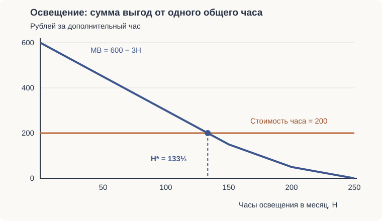

Экономика общественного сектора · практика

# Практика и задачи

**24 задания к семинарам, 14 задач по микроэкономике и 8 задач из сборника решений**. Нумерация соответствует источникам; полные файлы с рисунками — в конце страницы.

| Что повторить | Где решать |
| :--- | :--- |
| Общественные блага, голосование, бюрократия | [Семинары № 1–11](#seminars), [освещение и вывоз мусора](#additional) |
| Налоги, труд, финансирование здравоохранения | [Семинары № 12–22](#taxes), [налог на прибыль](#extra-22) |
| Организации и федерализм | [Семинары № 23–24](#seminar-23) |
| Полезность, спрос, эластичность | [Микроэкономика № 1–5](#micro) |
| Издержки, конкуренция, монополия | [Микроэкономика № 6–12](#micro-6), [табличная задача](#extra-4) |
| Парето-эффективность и внешние эффекты | [Микроэкономика № 13–14](#micro-13), [задача о бычках](#extra-11) |

## Задания к семинарам { #seminars }

Источник: [«Задания к семинарам», PDF](../materials/eos/seminar-assignments.pdf).

### 1. Коллективный выбор вокруг нас

Приведите примеры из повседневной жизни и своей организации. Как организован выбор? Равны ли права голоса? По какому правилу принимают решение? Можно ли повлиять на результат через повестку, порядок голосования или состав участников?

### 2. Устойчивость выбора: «семейные пары»

Участники выбирают партнёров. Двое могут образовать новую пару, если оба предпочитают друг друга своим нынешним партнёрам. Оставаться без пары нельзя. Проследите последовательность выборов и проверьте устойчивость результата.

| Участник | Предпочтения в первом варианте: от лучших к худшим | Во втором варианте |
| :--- | :--- | :--- |
| Александр | Влада, Александра, Ольга | Александра, Влада, Ольга |
| Александра | Александр, Олег, Влад | Влад, Олег, Александр |
| Влад | Влада, Александра, Ольга | Влада, Ольга, Александра |
| Влада | Олег, Александр, Влад | Олег, Александр, Влад |
| Олег | Александра, Влада, Ольга | Ольга, Александра, Влада |
| Ольга | Влад, Олег, Александр | Александр, Влад, Олег |

Будет ли найденное распределение устойчивым? Означает ли устойчивость, что каждый получил самый желанный вариант?

??? answer "Проверка устойчивости"
    **Блокирующая пара** — два человека из разных пар, каждый из которых предпочёл бы другого своему нынешнему партнёру. Такое распределение распадается, как только они решают объединиться.

    В первом варианте устойчивы два распределения:

    - Александр — Александра; Влад — Ольга; Олег — Влада.
    - Александр — Влада; Влад — Ольга; Олег — Александра.

    Во втором варианте устойчивы три распределения:

    - Александр — Александра; Влад — Влада; Олег — Ольга.
    - Александр — Влада; Влад — Ольга; Олег — Александра.
    - Александр — Ольга; Влад — Александра; Олег — Влада.

    В этих распределениях переход в новую пару выгоден максимум одному из двоих. Поэтому пары устойчивы, хотя часть участников получила второй или третий вариант из своего списка. Последовательность переходов зависит от начальных пар и порядка ходов.

### 3. Трактор: голосование и механизм Кларка — Гровса

В деревне восемь жителей. Эксплуатация общего трактора стоит **12 000 руб. в год**, расходы предлагается разделить поровну.

| Житель | Годовая выгода, руб. |
| :--- | ---: |
| 1 | 1 800 |
| 2 | 260 |
| 3 | 1 600 |
| 4 | 1 200 |
| 5 | 600 |
| 6 | 2 200 |
| 7 | 1 540 |
| 8 | 1 700 |

Определите общую чистую выгоду и результат голосования. Что изменится при платежах по выгоде, как в постановке с ценами Линдаля? Найдите «центрального» участника в механизме Кларка — Гровса и его платёж. Объясните, почему искажение своей оценки не повышает выигрыш участника.

??? answer "Расчёт и разбор"
    Суммарная выгода — **10 900 руб.**, чистая выгода — `10 900 − 12 000 = −1 100 руб.` Проект уменьшает совокупный излишек.

    Равный взнос равен `12 000 / 8 = 1 500 руб.` За проект проголосуют жители 1, 3, 6, 7 и 8: **пять голосов против трёх**. Большинство принимает неэффективный проект, потому что голосование не учитывает величину потерь меньшинства.

    Суммарная готовность жителей платить покрывает 10 900 руб. из требуемых 12 000. Если разделить затраты пропорционально выгоде, `Tᵢ = 12 000 × Bᵢ / 10 900`, каждый заплатит больше, чем получит, и все отвергнут проект. Для этого неделимого проекта сравниваем полные выгоды и затраты; для изменяемого объёма блага цены Линдаля определяются индивидуальными предельными оценками.

    Для механизма Кларка — Гровса используем чистые оценки относительно фиксированных взносов 1 500 руб.:

    `300; −1 240; 100; −300; −900; 700; 40; 200`.

    Их сумма отрицательна, поэтому эффективный механизм отклоняет проект. Если убрать оценку второго жителя, сумма остальных станет `−1 100 − (−1 240) = 140`. Только он меняет решение; его дополнительный платёж Кларка равен **140 руб.** Для остальных этот платёж равен нулю.

    Платёж равен потерям остальных от изменения решения. Участник учитывает их в собственном выигрыше, поэтому ему выгодно сообщить свою настоящую оценку при любых сообщениях остальных. Это свойство действует при квазилинейной полезности: денежный платёж вычитается из оценки проекта. Собранная сумма при этом может отличаться от расходов на проект.

### 4. Парадокс Кондорсе

Три равные фракции выбирают между `M`, `K` и `N`.

| Фракция | Лучший вариант | Средний | Худший |
| :--- | :--- | :--- | :--- |
| 1 | M | N | K |
| 2 | K | M | N |
| 3 | N | K | M |

??? answer "Попарные сравнения"
    `M` побеждает `N`, `N` побеждает `K`, `K` побеждает `M` — каждый раз со счётом 2:1. Возникает цикл. Единственного победителя Кондорсе нет; последовательное исключение альтернатив позволяет изменить итог порядком голосований.

### 5. Манипулирование голосованием

Четыре группы выбирают вариант благоустройства дома.

| Группа | Численность | Предпочтения от лучших к худшим |
| :--- | ---: | :--- |
| 1 | 3 | A, B, C, D |
| 2 | 7 | D, A, B, C |
| 3 | 4 | C, D, A, B |
| 4 | 6 | B, C, D, A |

Кто победит при двухступенчатом правиле относительного большинства? Можно ли манипулировать результатом попарных голосований?

??? answer "Ответ"
    В первом туре `A` получает 3 голоса, `B` — 6, `C` — 4, `D` — 7. Во второй тур выходят `D` и `B`; **D побеждает 11:9**.

    При попарных сравнениях есть цикл: `D` побеждает `B` со счётом 11:9, `B` побеждает `C` 16:4, `C` побеждает `D` 13:7. Между `A` и `C` — ничья 10:10. Поэтому единственного победителя Кондорсе нет, а правило разрешения ничьих и порядок исключения вариантов влияют на итог. Например, последовательность `A` против `B`, затем победитель против `D`, затем против `C` даёт победу `C`.

### 6. Медианный избиратель

Можно ли применять теорему к совету директоров, комиссии, студенческой группе или рабочему коллективу? Выберите одно решение, расположите предпочтительные варианты участников на общей шкале и найдите медиану. Проверьте, однопиковы ли предпочтения и действительно ли решение принимают попарным большинством.

### 7. Одобряющее голосование и теорема Эрроу

Каким условиям теоремы Эрроу не удовлетворяет одобряющее голосование? В этой процедуре участник отмечает набор приемлемых вариантов. Связь с аксиомами Эрроу зависит от того, как предпочтения превращаются в отметки: где проходит порог одобрения и как разрешаются ничьи.

### 8. Логроллинг

У трёх равных фракций следующие выигрыши от двух независимых проектов:

| Фракция | X | Y |
| :--- | ---: | ---: |
| 1 | −700 | −700 |
| 2 | +1 000 | −500 |
| 3 | −500 | +600 |

Опишите обмен голосами, при котором примут оба проекта. Эффективно ли это для общества?

??? answer "Ответ"
    По отдельности оба проекта отклоняют двумя голосами против одного. Фракции 2 и 3 могут поддержать проекты друг друга: от пакета фракция 2 получает `1 000 − 500 = 500`, фракция 3 — `−500 + 600 = 100`.

    Фракция 1 теряет 1 400. Общий результат — `−1 400 + 500 + 100 = −800`. Коалиция выигрывает за счёт остальных, а общественный излишек сокращается.

### 9. Поиск ренты

Компания не публикует исходный код программы. Достаточно ли этого, чтобы считать её поведение поиском ренты? Разберите различие между заработком на созданном продукте и затратами на получение привилегий или ограничение конкуренции через государственные решения.

### 10. Лоббирование и реклама

Почему рекламу иногда сравнивают с лоббированием и почему из этого не следует запрет любой рекламы? Сопоставьте информирование, убеждение, создание барьеров для конкурентов и влияние на решения государства.

### 11. Модель Нисканена

Два бюро имеют одинаковые издержки, но разные общественные выгоды:

| | Бюро A | Бюро B |
| :--- | :--- | :--- |
| Общая выгода | `B = 100Q − 0,5Q²` | `B = 200Q − 0,5Q²` |
| Область выпуска в условии | `0 < Q < 100` | `0 < Q < 200` |
| Общие издержки | `TC = 40Q + 0,25Q²` | `TC = 40Q + 0,25Q²` |

Определите оптимальный объём деятельности, бюджет, совокупные и средние издержки, общественный излишек. Сравните общественный оптимум с выбором бюро, максимизирующего бюджет.

??? answer "Общественный оптимум и бюджет бюро"
    Для общества максимизируем `B(Q) − TC(Q)`, поэтому `MB = MC`. Предельные издержки обоих бюро: `MC = 40 + 0,5Q`.

    Для A: `100 − Q = 40 + 0,5Q`, откуда `Q = 40`. Для B: `200 − Q = 40 + 0,5Q`, откуда `Q = 320/3 ≈ 106,67`.

    | Показатель в общественном оптимуме | A | B |
    | :--- | ---: | ---: |
    | Выпуск Q | 40 | 106,67 |
    | Общая выгода B | 3 200 | 15 644,44 |
    | Издержки TC; бюджет при возмещении затрат | 2 000 | 7 111,11 |
    | Средние издержки TC/Q | 50 | 66,67 |
    | Общественный излишек B − TC | 1 200 | 8 533,33 |

    В варианте Нисканена, где бюро получает бюджет `B(Q)` и максимизирует его при `B ≥ TC`, результаты другие. Для A ограничение финансирования даёт `Q = 80`: бюджет и издержки равны 4 800, средние издержки — 60, излишек — 0.

    Для B равенство `B = TC` даёт `Q = 640/3 ≈ 213,33`, за пределами указанной области. Внутри неё бюджет растёт вплоть до `Q = 200`: там `B = 20 000`, `TC = 18 000`, `AC = 90`, `B − TC = 2 000`. При строгом условии `Q < 200` бюро может лишь приближаться к этим значениям. Если граница входит в допустимую область, максимум достигается при `Q = 200`.

## Налоги и финансирование: семинары № 12–22 { #taxes }

### 12. Средняя и предельная налоговые ставки

По зарплате и налогу за час работы рассчитайте `ATR = T/Y`, `MTR = ΔT/ΔY`. Определите тип налога.

| Зарплата за час, $ | Налог за час, $ |
| ---: | ---: |
| 2 | 1,14 |
| 4 | 2,41 |
| 6 | 3,95 |
| 8 | 5,28 |
| 10 | 6,84 |

??? answer "Расчёт"
    | Зарплата | ATR | MTR относительно предыдущей строки |
    | ---: | ---: | ---: |
    | 2 | 57% | Не определяется без предыдущей точки |
    | 4 | 60,25% | 63,5% |
    | 6 | 65,83% | 77% |
    | 8 | 66% | 66,5% |
    | 10 | 68,4% | 78% |

    Налог **прогрессивный**: средняя ставка растёт с доходом. Предельные ставки по интервалам при этом колеблются от 63,5% до 78%.

### 13. Сравнение налогов

Оцените каждый налог по пяти критериям: равенство обязательств, экономическая нейтральность, организационная простота, гибкость и прозрачность системы.

Налоги для сравнения: НДС; на прибыль; акциз на табак; на имущество юридических лиц; на землю; подоходный; на имущество физических лиц; фиксированная подушная подать; на бездетных.

При сравнении учитывайте базу, ставку, льготы и способ администрирования: они определяют нагрузку и поведение плательщиков.

### 14. Принципы налогообложения: Анна и Морис

Анна получает доход 100, платит налог 30 и получает общественные блага стоимостью 40. Морис получает 50, платит 20 и получает такие же блага на 40. Какой принцип нарушен, если других данных нет?

??? answer "Ответ"
    Нарушен **принцип соответствия получаемой выгоде**: при одинаковой выгоде платежи различаются. Средняя ставка Анны — 30%, Мориса — 40%; в этой паре налог регрессивен. Для вывода о равенстве жертв нужны функции полезности и уточнение самого критерия жертвы.

### 15. Равенство жертв и критерий Роулза

Полезности равны `Uₐ = 0,5Rₐ`, `Uᵦ = Rᵦ`; доходы — `Rₐ = 10`, `Rᵦ = 8`. Государству нужно собрать налог `Tₐ + Tᵦ = 6`. Как распределить его по принципу равенства обязательств и по критерию `maximin`?

??? answer "Разбор критериев"
    При **равной абсолютной потере полезности** налог должен уменьшить полезность обоих на одну величину: `0,5Tₐ = Tᵦ`. Вместе с бюджетным условием это даёт `Tₐ = 4`, `Tᵦ = 2`.

    При **равной относительной жертве** условие иное: `Tₐ/10 = Tᵦ/8`. Получаем `Tₐ = 10/3`, `Tᵦ = 8/3`.

    По критерию Роулза максимизируем меньшую из полезностей после налога. В решении они равны:

    `0,5(10 − Tₐ) = 8 − Tᵦ`, `Tₐ + Tᵦ = 6`.

    Отсюда **Tₐ = 2, Tᵦ = 4**, обе итоговые полезности равны 4.

### 16. Чем финансировать дороги

Область выбирает между повышением платы за водительские права, налогом на транспортные средства, налогом на запчасти и шины, повышением налогов на табак и алкоголь.

Какие платежи связаны с выгодой от дорог, какие могут корректировать внешние эффекты, а какие сочетают обе функции? Какой вариант меньше искажает поведение? Сравнение зависит от эластичности спроса и от того, насколько база налога отражает использование дорог и причиняемый ущерб.

### 17. Налогообложение труда

Налог перечисляет работник.

| Зарплата за час, $ | Спрос на труд, чел. | Предложение труда, чел. | Налог за час, $ |
| ---: | ---: | ---: | ---: |
| 10 | 14 | 22 | 3,33 |
| 8 | 18 | 22 | 2,67 |
| 6 | 22 | 22 | 2,00 |
| 4 | 26 | 22 | 1,33 |
| 2 | 30 | 22 | 0,67 |

Определите тип налога, исходное равновесие, изменение зарплаты и занятости, доход государства. Покажите результат графически. Что изменится при высокоэластичном предложении труда?

??? answer "Решение"
    С учётом округления налог составляет **1/3 зарплаты** и является пропорциональным. Из таблицы: `Lᴰ = 34 − 2w`, `Lˢ = 22`.

    До налога `34 − 2w = 22`, поэтому **w = 6, L = 22**. Предложение совершенно неэластично: на графике это вертикальная линия при `L = 22`.

    После налога работодатель по-прежнему платит 6, работник получает `6 − 2 = 4`; занятость остаётся 22. Всё бремя несут работники. За час работы всех 22 работников бюджет получает **44 долл.**: `22 × 2`.

    При более эластичном предложении работники сильнее сокращают труд в ответ на снижение чистой зарплаты. Занятость падает, часть бремени переходит к работодателям. Точные значения зависят от новой кривой предложения.

### 18. Акцизы на водку и шоколад

Как повышение акцизов повлияет на производителей в двух отраслях? Нарисуйте налоговый клин и сравните эластичности спроса и предложения: от их соотношения зависит, какую часть налога понесут покупатели и производители.

### 19. Налоговая льгота на медицинские расходы

Покажите на графике, что произойдёт со спросом на медицинские услуги при полном освобождении медицинских расходов от налогов. Льгота может быть устроена как вычет из облагаемого дохода, налоговый кредит или отмена налога на саму услугу. Например, при вычете и ставке `τ` пациент фактически платит `(1 − τ)P`, если использует льготу полностью.

### 20. Регрессивность акцизов

Бедные тратят на сигареты и алкоголь большую долю дохода. Как меняется оценка регрессивности акциза в трёх случаях: конкурентный рынок с неэластичным предложением; монополия с линейным спросом; монополия со спросом постоянной эластичности?

Распределение бремени зависит от издержек и реакции цены на акциз. Для оценки регрессивности сопоставьте долю дохода, которую теряют покупатели и владельцы производителей в каждой группе. Здесь имеют значение и потребление, и распределение собственности.

### 21. Четыре крайних случая налогового бремени

На продавца конкурентного рынка возложен специфический налог `t`. Постройте распределение бремени при совершенно неэластичном и совершенно эластичном спросе, затем при таких же двух вариантах предложения.

??? answer "Ответ"
    | Крайний случай | Кто несёт всё бремя |
    | :--- | :--- |
    | Вертикальная кривая спроса | Покупатель |
    | Горизонтальная кривая спроса | Продавец |
    | Вертикальная кривая предложения | Продавец |
    | Горизонтальная кривая предложения | Покупатель |

    Для каждого случая предполагается обычная кривая другой стороны и сохранение торговли. Между ценой покупателя и чистой ценой продавца возникает разница `t`. Более неэластичная сторона слабее меняет объём и несёт большую долю бремени.

### 22. Доходы для здравоохранения

Сравните восемь способов увеличить финансирование. Каковы преимущества, недостатки и потери мёртвого груза каждого?

| Вариант из задания | Что включить в сравнение |
| :--- | :--- |
| Повысить НДС в целом | Ширина базы, потребление и распределение нагрузки |
| Повысить НДС на алкоголь, табак и другие «вредные» товары | Замещение между товарами и связь налога с вредом |
| Повысить акцизы на эти товары | Внешний ущерб, эластичность, нелегальный рынок |
| Повысить сборы на медицинское страхование или социальный налог | Цена труда, занятость, формальный сектор |
| Повысить налог на прибыль | Инвестиции, перенос прибыли, собственники капитала |
| Ввести фиксированный сбор «на здоровье» | Отсутствие эффекта замещения в простой модели и тяжесть платежа для бедных |
| Расширить софинансирование за счёт платных услуг | Доступность помощи, отказ от нужного лечения, выручка учреждений |
| Продать часть государственных пакетов акций | Разовый доход, цена продажи и утрата будущих дивидендов |

??? answer "Сравнение вариантов"
    Фиксированный сбор сохраняется при любом выборе труда и потребления. В базовой модели он создаёт только эффект дохода, поэтому избыточное бремя равно нулю. При этом одинаковая сумма занимает большую долю дохода бедных и может оказаться для них непосильной.

    Корректирующий акциз при отрицательном внешнем эффекте может уменьшить существующие потери. Продажа актива даёт разовый доход в обмен на будущие дивиденды. Выбор способа финансирования зависит от требуемой суммы, эластичностей и доступности помощи после введения платежа.

### 23. Организация общественного сектора { #seminar-23 }

Для каждого вида деятельности выберите форму: частная фирма, государственное предприятие или государственное агентство. Объясните, какие стимулы нужны исполнителю и как контролировать результат.

- Производство обогащённого урана для атомных электростанций.
- Добыча гелия для военных нужд государства.
- Контроль движения воздушного транспорта.
- Патентное агентство.
- Программы социальной помощи.
- Организация субсидий на питание.
- Тюрьмы.
- Служба занятости.
- Общественное жильё.

Сравнивайте измеримость качества, возможность прописать его в контракте, последствия экономии на безопасности и наличие конкуренции. Государство может оплачивать услугу как собственного учреждения, так и частного подрядчика.

### 24. Федерализм

В городе A живут **125 000 человек**, в городе B — **150 000**. Город A предлагает совместно организовать пожарную охрану и общую канализационную сеть. Жители B голосуют по каждому проекту отдельно. Каковы возможные результаты с учётом отдачи от масштаба?

??? answer "Затраты и выгоды объединения"
    Сопоставьте экономию на общих мощностях с дополнительными затратами на расстояние и координацию. Для пожарной охраны особенно важны время прибытия и размещение станций; для канализации — протяжённость сети, рельеф и загрузка очистных сооружений. Затем сравните платёж жителя B и качество услуги до и после объединения.

    Голосование в B зависит от его доли расходов и изменения качества услуг. Даже при снижении средних затрат всей системы платёж жителей B может вырасти, если на них переложат большую часть финансирования.

## Типовые задачи по микроэкономике { #micro }

Источник: [«Типовые задачи по микроэкономике», PDF](../materials/eos/microeconomics-problems.pdf). Обозначения `Q` и `q` означают объём, `P` — цену, `TC` — общие издержки, `TR` — выручку.

### 1. Одинаковые предпочтения

Четыре человека потребляют `X` и `Y`. Полезности: `U₁ = X^0,2 Y^0,3`, `U₂ = 2ln X + 3ln Y`, `U₃ = X³Y²`, `U₄ = 4X²Y³`. Какие функции описывают одинаковые предпочтения?

??? answer "Ответ"
    При `X > 0, Y > 0` одинаковы предпочтения 1, 2 и 4: `U₂ = 10ln U₁`, `U₄ = 4U₁¹⁰`. Это строго возрастающие преобразования.

    У них `MRSₓᵧ = (2/3)(Y/X)`, а у третьего `MRSₓᵧ = (3/2)(Y/X)`, поэтому его предпочтения отличаются.

### 2. Оптимальный набор потребителя

Доход — 900, полезность `U = XY³`, цены `Pₓ = 5`, `Pᵧ = 12`. Найдите объёмы покупок.

??? answer "Решение с проверкой бюджета"
    `MUₓ = Y³`, `MUᵧ = 3XY²`, поэтому `MRS = Y/(3X) = 5/12` и `Y = 1,25X`.

    Бюджет: `5X + 12Y = 900`. Подставляем: `5X + 15X = 900`.

    **X = 45, Y = 56,25.** Проверка: `5 × 45 + 12 × 56,25 = 225 + 675 = 900`.

    В PDF приведён набор `X = 400, Y = 500` стоимостью 8 000 при заданном бюджете 900.

### 3. Нормальное, низшее, необходимое и роскошное благо

Спрос зависит от дохода: `q(Y) = Y²/(100 + Y)³`, `Y > 0`. Определите интервалы для каждого типа блага.

??? answer "Решение"
    Производная: `q′(Y) = Y(200 − Y)/(100 + Y)⁴`.

    Поэтому благо нормальное при `0 < Y < 200` и низшее при `Y > 200`. В точке `Y = 200` потребление максимально, а эластичность по доходу равна нулю.

    Эластичность: `Eᵧ = q′(Y)Y/q(Y) = (200 − Y)/(100 + Y)`.

    - `0 < Y < 50`: `Eᵧ > 1`, предмет роскоши.
    - `Y = 50`: `Eᵧ = 1`.
    - `50 < Y < 200`: `0 < Eᵧ < 1`, предмет необходимости.

    В PDF указана граница 100; производная заданной функции меняет знак при **Y = 200**.

### 4. Прямая и перекрёстная эластичность

`Qₓ = 100 − 4Pₓ − 8Pᵧ`, `Qᵧ = 50 − 2Pₓ − 4Pᵧ`. Найдите эластичности при `Pₓ = 2, Pᵧ = 3` и определите связь благ.

??? answer "Расчёт"
    `Qₓ = 68`, `Qᵧ = 34`. Для каждой цены используем `E = (∂Q/∂P) × P/Q`.

    | | По цене X | По цене Y |
    | :--- | ---: | ---: |
    | Спрос на X | `−8/68 ≈ −0,118` | `−24/68 ≈ −0,353` |
    | Спрос на Y | `−4/34 ≈ −0,118` | `−12/34 ≈ −0,353` |

    Перекрёстные эластичности отрицательны: блага дополняют друг друга. В заданных функциях `Qₓ = 2Qᵧ`, то есть потребление сохраняет пропорцию 2:1. В PDF численный ответ совпадает с расчётом выше; в промежуточной формуле напечатано `−4Pₓ` на месте `−8Pᵧ`.

### 5. Эластичность нелинейного спроса

`Q = √(300 − P)`. При каких ценах спрос эластичен и неэластичен?

??? answer "Ответ"
    При `0 ≤ P < 300` модуль эластичности равен `|E| = P/[2(300 − P)]`.

    Спрос неэластичен при `0 ≤ P < 200`, единично эластичен при `P = 200`, эластичен при `200 < P < 300`. При `P = 300` объём равен нулю и формула точечной эластичности через деление на `Q` не определена.

### 6. Оптимальные ресурсы и функция затрат { #micro-6 }

`q = 2X^0,2Y^0,8`; цены ресурсов `pₓ = 5`, `pᵧ = 10`. Найдите траекторию оптимального роста и функцию затрат.

??? answer "Решение"
    Внутренний минимум затрат: `MPₓ/MPᵧ = pₓ/pᵧ`. Получаем `0,25Y/X = 0,5`, то есть **Y = 2X**.

    Тогда `q = 2^1,8 X`, `X = q/2^1,8`, `Y = 2q/2^1,8`.

    **TC(q) = 25q/2^1,8 ≈ 7,18q**. Постоянная отдача от масштаба здесь даёт линейную функцию минимальных затрат.

### 7. Средние и предельные издержки

`TC = 200 + 10q + 0,5q²`. Найдите `AC`, `MC`, минимум `AC` и соответствующий выпуск.

??? answer "Ответ"
    `AC = 200/q + 10 + 0,5q`, `MC = 10 + q`.

    `AC = MC` даёт `200/q = 0,5q`, поэтому **q = 20, min AC = 30**.

### 8. Прибыль и безубыточность

`TC = 800 + 20q + 2q²`, цена `P = 120`. Найдите функцию прибыли, безубыточные объёмы и максимум прибыли.

??? answer "Ответ"
    `π(q) = 120q − TC = −800 + 100q − 2q²`.

    `π ≥ 0` при **10 ≤ q ≤ 40**. На концах прибыль нулевая. Из `π′ = 100 − 4q = 0` получаем **q = 25, π = 450**.

### 9. Долгосрочное конкурентное равновесие

Рыночный спрос `Qᴰ = 2 000 − 20P`. У одинаковых фирм `TC(q) = 450 + 10q + 2q²`. Сколько фирм будет на рынке в долгосрочном равновесии?

??? answer "Решение"
    При свободном входе одинаковых фирм `P = min AC`. Здесь `AC = 450/q + 10 + 2q`, `MC = 10 + 4q`.

    `AC = MC` даёт `450/q = 2q`, откуда **q = 15**. Цена `P = 10 + 4 × 15 = 70`.

    Рыночный объём **Q = 2 000 − 20 × 70 = 600**. Число фирм **n = 600/15 = 40**.

### 10. Монополия

Спрос `Qᴰ = 300 − 5P`, издержки `TC = 300 + 20Q + 0,3Q²`. Найдите прибыль монополии.

??? answer "Решение"
    Обратный спрос: `P = 60 − 0,2Q`. Выручка: `TR = 60Q − 0,2Q²`, поэтому `MR = 60 − 0,4Q`.

    Издержки дают `MC = 20 + 0,6Q`. В оптимуме `MR = MC`:

    `60 − 0,4Q = 20 + 0,6Q`, откуда **Q = 40**.

    При найденном объёме `MR = MC = 44`. Цена определяется спросом: **P = 60 − 0,2 × 40 = 52**.

    `TR = 52 × 40 = 2 080`.

    `TC = 300 + 20 × 40 + 0,3 × 40² = 1 580`.

    **π = 2 080 − 1 580 = 500**.

### 11. Дуополия Курно

`Qᴰ = 40 − 0,2P`, `TC₁ = 250 + 15q₁`, `TC₂ = 300 + 10q₂`, `Q = q₁ + q₂`. Найдите цену, выпуски и прибыли в равновесии Курно.

??? answer "Решение"
    `P = 200 − 5(q₁ + q₂)`. Каждая фирма максимизирует свою прибыль при фиксированном выпуске другой:

    `10q₁ + 5q₂ = 185`, `5q₁ + 10q₂ = 190`.

    Решение: **q₁ = 12, q₂ = 13, Q = 25, P = 75**.

    `π₁ = 75 × 12 − (250 + 15 × 12) = 470`.

    `π₂ = 75 × 13 − (300 + 10 × 13) = 545`.

    В PDF во вторую функцию затрат подставлено `q₁ = 12` вместо её собственного выпуска `q₂ = 13`. Отсюда разница в прибыли: в файле 555, по расчёту выше — **545**.

### 12. Монополия и покупка сырья

На внутреннем рынке `Qᴰ = 200 − 4P`. Сырьё покупают на конкурентном мировом рынке по цене `W = 10`; производство `Q = 5X`. Определите выпуск и прибыль.

??? answer "Решение"
    `P = 50 − 0,25Q`, `MR = 50 − 0,5Q`. Для единицы выпуска нужно `1/5` единицы сырья, поэтому `MC = 10/5 = 2`.

    `MR = MC` даёт **Q = 96**, затем **P = 26**, **X = 19,2**.

    При единственных указанных затратах на сырьё: **π = 26 × 96 − 10 × 19,2 = 2 304**. Эквивалентное условие на рынке ресурса — `MR × MP = W`.

### 13. Граница Парето { #micro-13 }

Множество возможностей двух индивидов: `(Uₐ − 20)² + (Uᵦ − 40)² ≤ 2 500`, `Uₐ ≥ 0`, `Uᵦ ≥ 0`. Найдите Парето-эффективную часть.

??? answer "Ответ"
    Это северо-восточная четверть окружности:

    **(Uₐ − 20)² + (Uᵦ − 40)² = 2 500, Uₐ ≥ 20, Uᵦ ≥ 40.**

    На ней рост одной полезности требует сокращения другой. В остальных допустимых точках можно увеличить хотя бы одну полезность, не уменьшая вторую.

### 14. Загрязнение и корректирующий налог

`MPC = 20 + 5Q`, `MEC = 12`, `MSB = 80 − 3Q`. Найдите выпуск без вмешательства, ставку корректирующего налога и выпуск после него.

??? answer "Решение"
    При отсутствии внешних выгод спрос отражает `MSB`. Без учёта загрязнения: `80 − 3Q = 20 + 5Q`, поэтому **Q = 7,5**.

    Общественные издержки: `MSC = MPC + MEC = 32 + 5Q`. Эффективный выпуск из `MSB = MSC`: **Q = 6**.

    Налог Пигу равен предельному внешнему ущербу: **t = 12 на единицу продукции**. Он повышает частные предельные издержки до общественных и приводит к выпуску 6.

## Задачи из сборника решений { #additional }

Источник: [«Решение задач», DOCX](../materials/eos/problem-solutions.docx). В файле восемь задач с собственными номерами; порядок ниже соответствует оригиналу.

### № 13. Освещение дачного кооператива

Спрос трёх групп на часы освещения в месяц: `H₁ = 150 − t`, `H₂ = 200 − t`, `H₃ = 250 − t`, где `t` — плата за час. Стоимость часа — 200 руб. Найдите эффективный объём общественного блага и объём, который обеспечил бы частный рынок.

??? answer "Эффективный объём: 133⅓ часа"
    Для расчёта эффективного объёма принимаем тариф 200 руб. за предельную стоимость общего часа освещения. Этот час получают все, поэтому складываем готовность групп платить **за общий объём H**:

    `MB(H) = max(150 − H, 0) + max(200 − H, 0) + max(250 − H, 0)`.

    При `0 ≤ H ≤ 150` суммарная оценка равна `MB = 600 − 3H`. При постоянной предельной стоимости 200 руб.:

    `600 − 3H = 200`, откуда **H* = 400/3 ≈ 133,33 часа в месяц**. Ответ лежит на выбранном участке.

    Индивидуальные оценки последнего часа: `16⅔ + 66⅔ + 116⅔ = 200 руб.`

    

    **Если сравнивать с частным благом**, складываем положительные объёмы при одной цене: `max(150 − 200, 0) + max(200 − 200, 0) + max(250 − 200, 0) = 50 часов`.

    **При добровольном финансировании** третья группа одна оплачивает 50 часов, остальные пользуются ими бесплатно. Это равновесие простой модели независимых взносов: каждая группа выбирает, сколько часов оплатить, с учётом уже оплаченных остальными.

    В готовом решении 50 часов названы эффективным объёмом; такой результат получается при добровольном финансировании. Эффективный общий объём при принятых затратах — 133⅓ часа. При расчёте частного спроса в файле также учтены `−50` часов первой группы; её спрос при цене 200 равен нулю.

### № 22. Налог на прибыль хлебозавода { #extra-22 }

Завод выпускает 300 тыс. булок в месяц. Цена — 750 руб., средние постоянные издержки — 100 руб. на булку, средние переменные — 500 руб. Ставка налога на прибыль в задаче — 15%. Найдите годовые поступления в бюджет.

??? answer "Ответ"
    Прибыль до налога на булку: `750 − 100 − 500 = 150 руб.`

    Годовая прибыль: `150 × 300 000 × 12 = 540 000 000 руб.`

    **Налог = 540 000 000 × 0,15 = 81 000 000 руб. в год.** Это расчёт по условной ставке из задания.

### № 4. Монополия: выручка и издержки в таблицах { #extra-4 }

По спросу и издержкам рассчитайте `TR`, `MR`, `VC`, `ATC`, `AVC`, `MC`. Постройте спрос, предельную выручку, средние и предельные издержки. Найдите выпуск, цену и прибыль монополиста.

| Q, шт. | P, руб. | TC, руб. |
| ---: | ---: | ---: |
| 0 | 13 | 12 |
| 1 | 12 | 14 |
| 2 | 11 | 18 |
| 3 | 10 | 24 |
| 4 | 9 | 32 |
| 5 | 8 | 42 |
| 6 | 7 | 54 |
| 7 | 6 | В условии не указаны |

??? answer "Расчёт таблицы и оптимума"
    Постоянные затраты `FC = TC(0) = 12`. Для дискретных объёмов `MR = TR(Q) − TR(Q−1)`, `MC = TC(Q) − TC(Q−1)`.

    | Q | TR | MR | VC | ATC | AVC | MC | π |
    | ---: | ---: | ---: | ---: | ---: | ---: | ---: | ---: |
    | 0 | 0 | — | 0 | — | — | — | −12 |
    | 1 | 12 | 12 | 2 | 14 | 2 | 2 | −2 |
    | 2 | 22 | 10 | 6 | 9 | 3 | 4 | 4 |
    | 3 | 30 | 8 | 12 | 8 | 4 | 6 | **6** |
    | 4 | 36 | 6 | 20 | 8 | 5 | 8 | 4 |
    | 5 | 40 | 4 | 30 | 8,4 | 6 | 10 | −2 |
    | 6 | 42 | 2 | 42 | 9 | 7 | 12 | −12 |
    | 7 | 42 | 0 | — | — | — | — | — |

    Среди объёмов с заданными затратами максимум при **Q = 3, P = 10, π = 6 руб.** Третья единица добавляет 8 руб. выручки при 6 руб. затрат; четвёртая добавила бы только 6 при затратах 8.

    На графике прибыль изображается прямоугольником высотой `P − ATC = 10 − 8 = 2` и шириной 3. В этой таблице `MR` и `MC` — приращения при добавлении целой единицы продукции.

### № 16. Земельная рента

Спрос на землю `Q = 1 000 − 50R`, где `Q` — гектары, `R` — годовая рента в тыс. руб. за гектар. Доступно 700 га, процентная ставка — 12% годовых. Найдите равновесную ренту и цену гектара.

??? answer "Ответ"
    `1 000 − 50R = 700`, поэтому **R = 6 тыс. руб. за гектар в год**.

    При постоянной бессрочной ренте и ставке дисконтирования 12%: **P = R/r = 6/0,12 = 50 тыс. руб. за гектар**.

### № 2. Эластичность и выбор цены

Цена указана в тыс. руб., спрос — в тыс. штук. Найдите дуговую эластичность на каждом интервале, расходы покупателей, выгодную продавцу цену и максимальную прибыль при полных затратах 2 тыс. руб. на единицу. Отметьте эластичные и неэластичные участки графика спроса.

| P, тыс. руб. | Q, тыс. шт. |
| ---: | ---: |
| 20 | 0 |
| 15 | 5 |
| 10 | 18 |
| 9 | 20 |
| 5 | 30 |
| 2 | 60 |
| 1 | 100 |

??? answer "Расчёт и единицы измерения"
    Используем формулу средней точки:

    `|E| = |(Q₂ − Q₁)/(P₂ − P₁)| × (P₁ + P₂)/(Q₁ + Q₂)`.

    | Интервал цен | Модуль эластичности |
    | :--- | ---: |
    | 20 → 15 | 7,00 |
    | 15 → 10 | 2,83 |
    | 10 → 9 | 1,00 |
    | 9 → 5 | 0,70 |
    | 5 → 2 | 0,78 |
    | 2 → 1 | 0,75 |

    | P, тыс. руб. | TR = PQ, млн руб. | TC = 2Q, млн руб. | π, млн руб. |
    | ---: | ---: | ---: | ---: |
    | 20 | 0 | 0 | 0 |
    | 15 | 75 | 10 | 65 |
    | 10 | 180 | 36 | **144** |
    | 9 | 180 | 40 | 140 |
    | 5 | 150 | 60 | 90 |
    | 2 | 120 | 120 | 0 |
    | 1 | 100 | 200 | −100 |

    Среди заданных вариантов выгоднее **цена 10 тыс. руб.**, прибыль — **144 млн руб.** При ценах 10 и 9 выручка одинакова; цена 10 даёт меньший объём и меньшие затраты. В оригинале результат подписан в тысячах рублей. По единицам исходной таблицы `тыс. руб. × тыс. шт.` получаем миллионы. Расчёт сравнивает семь указанных вариантов цены.

### № 14. Вывоз мусора

У трёх групп семей спрос на приезды машины в неделю: `Q₁ = 10 − P`, `Q₂ = 8 − P`, `Q₃ = 7 − P`. Стоимость приезда — 7 долл. Найдите объём для чистого общественного и для частного блага.

??? answer "Ответ"
    Считаем 7 долл. стоимостью дополнительного общего приезда. Тогда при `Q ≤ 7` суммарная предельная выгода `MB = (10 − Q) + (8 − Q) + (7 − Q) = 25 − 3Q`.

    `25 − 3Q = 7` даёт **эффективный объём — 6 приездов в неделю**. Последний приезд оценивается группами в 4, 2 и 1 долл., вместе — 7.

    В модели независимых добровольных взносов первая группа оплачивает **3 приезда**, остальные пользуются услугой за её счёт. Именно такой объём указан в готовом решении. Разница между 3 и 6 возникает из-за способа финансирования: первая группа учитывает только собственную выгоду, а эффективный объём учитывает выгоды всех трёх.

    Для частного блага складываем объёмы при цене 7: `3 + 1 + 0 = 4`. **Частный объём — 4 приезда.**

### № 7. Паутинообразная модель рынка ячменя

Фермеры выбирают посевы по ожидаемой цене, равной прошлогодней: `Pᵉₜ = Pₜ₋₁`. Спрос `Qᴰₜ = 300 − 0,8Pₜ`, предложение `Qˢₜ = −60 + Pᵉₜ`. В 2000 году цена равнялась 210. Найдите цены и объёмы на 2001–2007 годы, оцените устойчивость и предложите меры стабилизации. Постройте паутину на графике спроса и предложения и временной ряд цен.

??? answer "Расчёт: колебания расходятся"
    Статическое равновесие: `−60 + P = 300 − 0,8P`, поэтому **P* = 200, Q* = 140**.

    Производители реагируют на **прошлую** цену, а текущая цена должна очистить рынок:

    `−60 + Pₜ₋₁ = 300 − 0,8Pₜ`, откуда `Pₜ = 450 − 1,25Pₜ₋₁`.

    | Год | Прошлая цена | Текущий объём | Текущая цена |
    | ---: | ---: | ---: | ---: |
    | 2001 | 210,00 | 150,00 | 187,50 |
    | 2002 | 187,50 | 127,50 | 215,63 |
    | 2003 | 215,63 | 155,63 | 180,47 |
    | 2004 | 180,47 | 120,47 | 224,41 |
    | 2005 | 224,41 | 164,41 | 169,48 |
    | 2006 | 169,48 | 109,48 | 238,15 |
    | 2007 | 238,15 | 178,15 | 152,32 |

    Значения в таблице округлены после расчёта всей последовательности. Отклонение от 200 каждый год умножается на `−1,25`, поэтому цена колеблется всё сильнее. В готовом решении используется обратная зависимость с множителем `−0,8`: текущий спрос определяет следующую цену предложения. Условие задачи задаёт другую последовательность — прошлогодняя цена определяет урожай, а текущий спрос определяет цену его продажи.

    Стабилизировать выпуск могут более точный прогноз спроса, постепенное изменение посевных площадей и контракты с заранее согласованными объёмами. Для государственных закупок потребовалось бы сопоставить расходы на запасы с сокращением колебаний и изменением стимулов фермеров.

### № 11. Скотоводство и ущерб посевам { #extra-11 }

Скотоводческое хозяйство работает на рынке совершенной конкуренции. Его издержки `TC = Q² + 4Q + 20`, объём `Q` — тыс. голов. Рыночный спрос `Qᴰ = 6 − 0,5P`, цена `P` — тыс. руб. за голову. Дополнительный бычок причиняет ущерб посевам 800 руб. Найдите выпуск, цену и прибыль без компенсации, затем выпуск и цену с компенсацией.

??? answer "Конкурентное равновесие и компенсация ущерба"
    Рассчитаем конкурентное равновесие, трактуя `TC` как **совокупные издержки отрасли**. Тогда предложение определяется условием `P = MC`, а обратный спрос равен `P = 12 − 2Q`. Для расчёта рынка из нескольких отдельных хозяйств понадобились бы их число и совокупное предложение.

    Без компенсации: `12 − 2Q = 4 + 2Q`, поэтому **Q = 2 тыс. голов, P = 8 тыс. руб.** При измерении `TC` в млн руб. прибыль составляет `8 × 2 − (2² + 4 × 2 + 20) = −16 млн руб.` В коротком периоде выручка покрывает переменные затраты и часть постоянных; при сохранении убытков в долгом периоде производители уходят с рынка.

    Ущерб 800 руб. на голову — это **0,8 тыс. руб.** предельных затрат. С компенсацией `MC = 4,8 + 2Q`, поэтому **Q = 1,8 тыс. голов, P = 8,4 тыс. руб.**

    В готовом решении рыночный спрос принят за спрос одного продавца, что даёт модель монополии и выпуск `Q = 4/3 ≈ 1,33`. При таком выпуске затраты по записанной функции равны `Q² + 4Q + 20 ≈ 27,11 млн руб.`; в файле итог этой суммы — 1,78 млн руб. Компенсация увеличивает затраты на `0,8Q` и предельные затраты на 0,8. В файле подстановка `Q + 0,8` увеличила их на 1,6. Поэтому указанные там прибыль 10,64 млн руб. и выпуск с компенсацией 1,06 расходятся и с расчётом по модели монополии.

## Оригиналы

- [Задания к семинарам — 24 задания, 6 страниц PDF](../materials/eos/seminar-assignments.pdf).
- [Типовые задачи по микроэкономике — 14 задач, 5 страниц PDF](../materials/eos/microeconomics-problems.pdf).
- [Решение задач — 8 задач с таблицами и рисунками, DOCX](../materials/eos/problem-solutions.docx).

[Материалы курса](public-sector-economics-materials.md){ .md-button }
[Вопросы и тесты](public-sector-economics-exam-bank.md){ .md-button }
