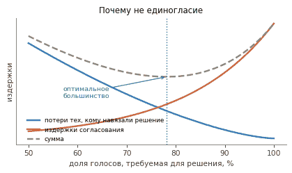
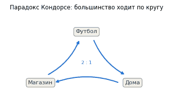
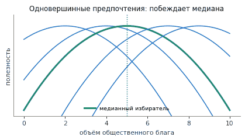
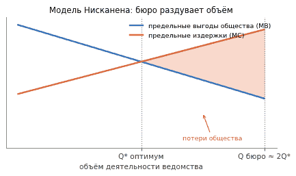

Экономика общественного сектора · модуль 1

# Общественный выбор и бюрократия

Государство вмешивается в экономику там, где рынок даёт сбой. Но само государственное решение тоже может оказаться неэффективным: у избирателей, политиков и чиновников свои интересы, а информация распределена неравномерно. Теория общественного выбора разбирает именно эту сторону общественного сектора.

!!! abstract "Главная мысль"
    Рынок и государство — не идеальные альтернативы. У каждого механизма есть свои издержки, поэтому вопрос обычно звучит не «кто лучше вообще», а «какой способ принятия решения меньше теряет в этой ситуации».

## Зачем нужен общественный сектор

Чтобы рынок работал, сначала нужны правила: права собственности, договоры и способ добиваться их исполнения. Здесь полезна логика Рональда Коуза из книги «Фирма, рынок и право»: при положительных трансакционных издержках значение имеют не только цены, но и устройство институтов.

У государства есть четыре основные экономические функции.

| Функция | Что сюда относится |
| :--- | :--- |
| Правовая | правила обмена, защита собственности, исполнение договоров |
| Макроэкономическая | работа с инфляцией, кризисами, безработицей и экономическим циклом |
| Распределительная | налоги, трансферты и другие способы перераспределения доходов |
| Аллокационная | общественные блага, внешние эффекты, монополии и другие провалы рынка |

## Парето-эффективность и провалы рынка

Состояние **Парето-эффективно**, если нельзя улучшить положение одного человека, не ухудшив положение другого. Это критерий эффективности, а не справедливости: крайне неравное распределение тоже может быть Парето-эффективным.

Государственное вмешательство обычно объясняют четырьмя группами провалов рынка:

- **монопольная власть** — цена оказывается выше, а выпуск ниже конкурентного уровня;
- **асимметрия информации** — одна сторона знает об услуге больше другой; для здравоохранения это особенно важно;
- **внешние эффекты** — часть вреда или пользы не попадает в цену, как при загрязнении или вакцинации;
- **общественные блага** — человека трудно исключить из потребления, а ещё один пользователь почти не уменьшает доступный объём блага. Без коллективного финансирования рынок обычно производит их меньше общественно желательного уровня.

## От индивидуального выбора к коллективному

Во вводном курсе Игоря Кима по микроэкономике пригодятся три понятия:

- **функция полезности** — способ представить предпочтения человека числами;
- **полнота** — человек может сравнить любые два варианта;
- **транзитивность** — если `A` предпочтительнее `B`, а `B` предпочтительнее `C`, то `A` предпочтительнее `C`.

Эти предпосылки удобны для модели, но не описывают всё поведение. В игре «Ультиматум» люди нередко отвергают маленькую сумму как несправедливую, хотя принять её выгоднее. В игре «Диктатор» участники часто делятся, хотя могут оставить всё себе. В «аукционе доллара» можно переплатить за выигрыш, лишь бы не зафиксировать уже понесённые потери.

## Чем голосование отличается от рынка

| | Рынок | Коллективное решение |
| :--- | :--- | :--- |
| Альтернативы | обычно много вариантов | набор вариантов ограничен повесткой |
| Момент решения | покупку можно отложить | голосование проходит в назначенное время |
| Предпочтения | их не обязательно раскрывать окружающим: достаточно купить или отказаться | позицию приходится выражать, сравнивать с чужими и собирать в общий результат |
| Информация | ошибка чаще всего затрагивает самого покупателя | один голос редко меняет итог, поэтому возникает рациональное неведение |

Из-за этого процедура голосования влияет на результат не меньше самих предпочтений.

## Как выбрать правило голосования

У любого правила есть две группы издержек:

- **издержки принятия решения** растут по мере приближения к единогласию: договориться всё труднее;
- **внешние издержки** несут те, кому решение навязало большинство. Чем выше требуемая доля голосов, тем меньше таких проигравших.

<figure class="lecture-figure lecture-figure--compact" markdown>

<figcaption>Оптимальное правило ищут в точке, где сумма двух видов издержек минимальна. Схема из конспекта.</figcaption>
</figure>

| Правило | Плюс | Ограничение |
| :--- | :--- | :--- |
| Единогласие | почти исключает навязывание решения несогласным | переговоры могут стать слишком долгими или зайти в тупик |
| Простое большинство | решение сравнительно дёшево принять | значительное меньшинство может проиграть |
| Квалифицированное большинство | лучше защищает от дорогой ошибки | повышает цену согласования |

### Теорема Мэя

Теорема Мэя относится к выбору **между двумя альтернативами**. Простое большинство — единственное правило, которое одновременно одинаково относится к избирателям, одинаково относится к двум вариантам и положительно реагирует на переход голоса в пользу одного из них. [Исходная статья Кеннета Мэя](https://www.jstor.org/stable/1907651).

### Результат Рэя — Тейлора

Результат Рэя — Тейлора рассматривает независимые голоса «за» и «против», когда будущие предпочтения заранее неизвестны. В этой модели простое большинство минимизирует вероятность двух ошибок для обычного участника: поддержать отклонённое предложение или выступить против принятого. [Доказательство Майкла Тейлора](https://doi.org/10.1002/bs.3830140307).

Обе теоремы объясняют, почему правило `50% + 1 голос` так распространено. Они не говорят, что большинство всегда принимает содержательно правильное решение.

## Парадокс Кондорсе и управление повесткой

У каждого участника предпочтения могут быть полными и транзитивными, а коллективный выбор всё равно зациклится. Например:

- первый избиратель предпочитает `A > B > C`;
- второй — `B > C > A`;
- третий — `C > A > B`.

Большинство выбирает `A` вместо `B`, `B` вместо `C`, но `C` вместо `A`. У группы нет устойчивого победителя — это **парадокс Кондорсе**.

<figure class="lecture-figure lecture-figure--compact" markdown>

<figcaption>Цикл большинства. Итог зависит от того, какие пары и в каком порядке вынесут на голосование.</figcaption>
</figure>

Отсюда появляется власть повестки. Её составитель может выбрать порядок сравнений, убрать неудобный вариант или добавить вариант-спойлер. Избиратель в ответ может голосовать стратегически — не за любимую альтернативу, а против наиболее нежелательной.

## Медианный избиратель и теорема Эрроу

Если варианты расположены на одной шкале, а предпочтения каждого участника одновершинны, побеждает позиция **медианного избирателя**. Именно медианного, а не «среднего»: по обе стороны от него находится одинаковое число голосов.

<figure class="lecture-figure lecture-figure--compact" markdown>

<figcaption>Одномерный выбор с одним пиком у каждого участника. Позиция медианного избирателя устойчива против альтернатив.</figcaption>
</figure>

Если критериев несколько — например, одновременно выбирают место больницы и налог на её строительство, — устойчивость может исчезнуть.

**Теорема Эрроу о невозможности** относится к выбору из трёх и более альтернатив. Нельзя построить правило, которое для любых индивидуальных предпочтений одновременно обеспечивает:

1. полный и транзитивный общественный выбор;
2. принцип Парето;
3. независимость выбора между `A` и `B` от постороннего варианта `C`;
4. отсутствие диктатора.

Это не означает, что коллективный выбор невозможен. Теорема показывает, что у любой процедуры есть ограничение и его лучше видеть заранее.

## Коалиции, логроллинг и лоббизм

Когда голосов поодиночке не хватает, участники собирают **коалиции**. Сделка может строиться вокруг общей программы или вокруг обмена поддержкой.

**Логроллинг** — обмен голосами по разным вопросам: «я поддержу твой проект, если ты поддержишь мой». Он позволяет провести важную для небольшой группы инициативу, но несколько выгодных участникам сделок не обязательно дают положительный итог всему обществу.

**Лоббизм** — попытка организованной группы повлиять на государственное решение. Само влияние может передавать политикам нужную информацию. Проблема начинается, когда ресурсы тратятся на получение исключительной привилегии вместо создания новой ценности.

Так возникает **поиск ренты**. Рента здесь — доход от особого административного положения: квоты, лицензии, барьера для конкурентов или монополии. Борьба за такую привилегию требует юристов, переговоров, рекламы и времени; эти расходы могут поглотить значительную часть ожидаемого выигрыша.

## Законы Паркинсона и модель Нисканена

Сирил Норткот Паркинсон иронично сформулировал две устойчивые черты аппарата: работа заполняет всё отведённое на неё время, а чиновник охотнее создаёт подчинённых, чем конкурентов. Это наблюдения о стимулах организации, а не строгие экономические законы.

В **модели Уильяма Нисканена** бюро стремится увеличить свой бюджет. Оно лучше заказчика знает собственные издержки и предлагает пакет «бюджет в обмен на объём услуги». Заказчик согласен, пока общая выгода от услуги не ниже общих затрат бюро.

- общественный оптимум находится там, где предельная выгода равна предельным издержкам: `MB = MC`;
- бюро расширяет выпуск до границы, где общая выгода равна общим издержкам: `TB = TC`;
- в линейной версии модели объём бюро может быть примерно вдвое больше общественного оптимума: `Qбюро ≈ 2Q*`.

<figure class="lecture-figure lecture-figure--compact" markdown>

<figcaption>Модель бюджет-максимизирующего бюро. Удвоение выпуска — результат линейной версии модели, а не универсальное правило.</figcaption>
</figure>

Модель не утверждает, что любой чиновник лично хочет потратить как можно больше. Она показывает, какой результат может дать сочетание монопольного поставщика, слабого контроля и информационного преимущества бюро.

## Чем пытаются контролировать бюрократию

| Инструмент | Что может пойти не так |
| :--- | :--- |
| Регламенты и протоколы | сотрудники начинают оптимизировать отчёт, а не результат |
| Публичность бюджетов и закупок | открытые данные ещё нужно уметь проверить и интерпретировать |
| «Одно окно» | улучшает контакт с человеком, но не меняет внутренние стимулы ведомства |
| Квазирынок | пользователь не всегда может оценить качество, а у поставщика может не быть реального конкурента |
| KPI | измеряемый показатель вытесняет то, ради чего его ввели |

На занятии это иллюстрировали пожарной службой. Если оценивать её только по числу погибших, имущество может остаться без внимания; если только по материальному ущербу — под угрозой окажутся люди. Это учебный пример того, как один показатель искажает приоритеты.

## Что стоит удержать

- Парето-эффективность не равна справедливости.
- Простое большинство хорошо обосновано для бинарного выбора, но не защищает от циклов при трёх и более вариантах.
- Медианный избиратель появляется только при одномерных и одновершинных предпочтениях.
- Коалиции и обмен голосами меняют исход даже при неизменных предпочтениях участников.
- Модель Нисканена описывает стимул к расширению бюджета при информационной асимметрии; это модель, а не портрет каждого чиновника.

[Карта курса и оценивание](public-sector-economics.md){ .md-button }
