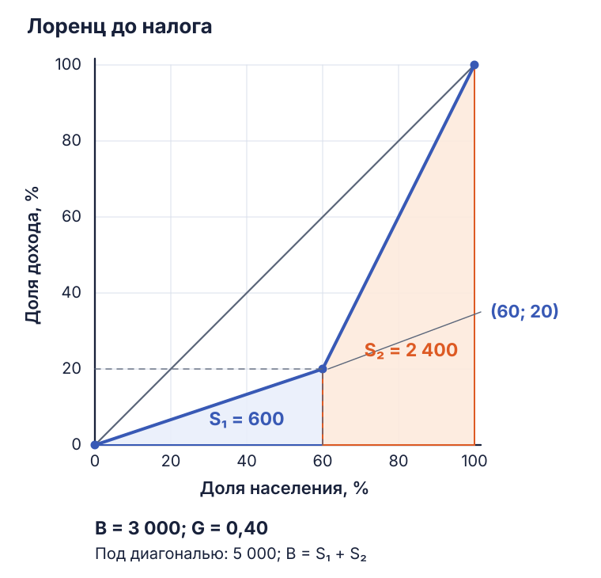
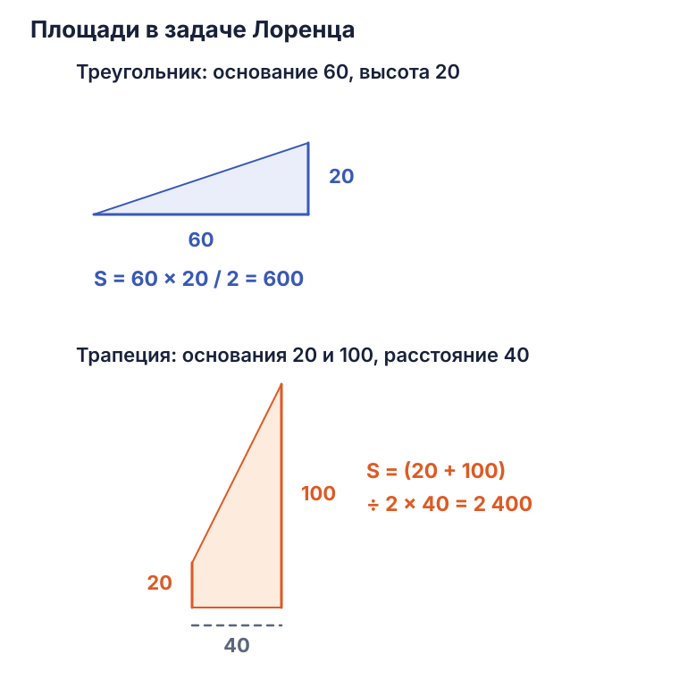
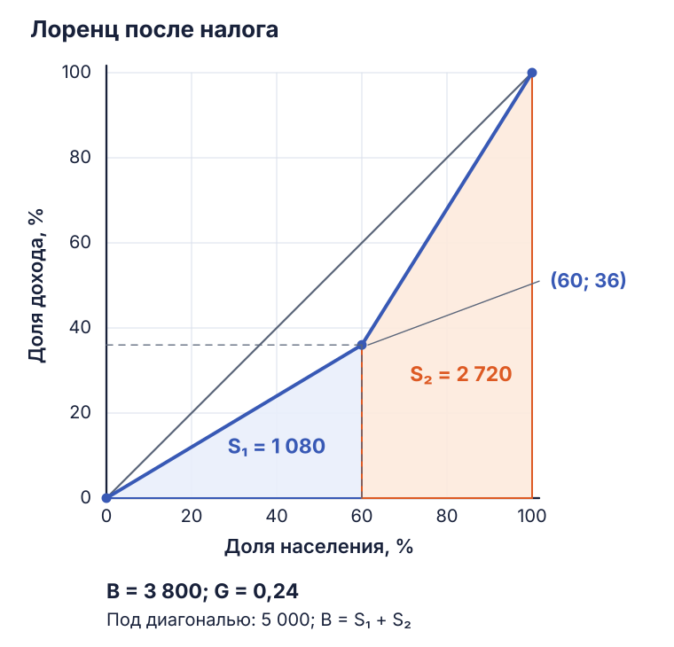
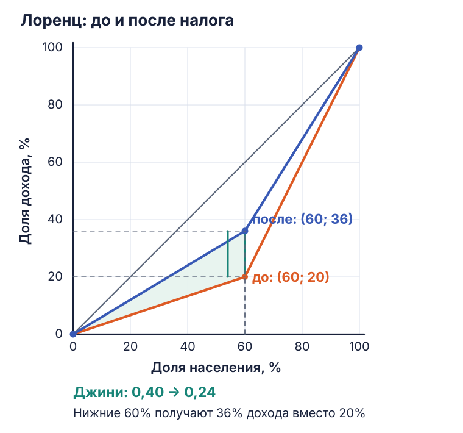
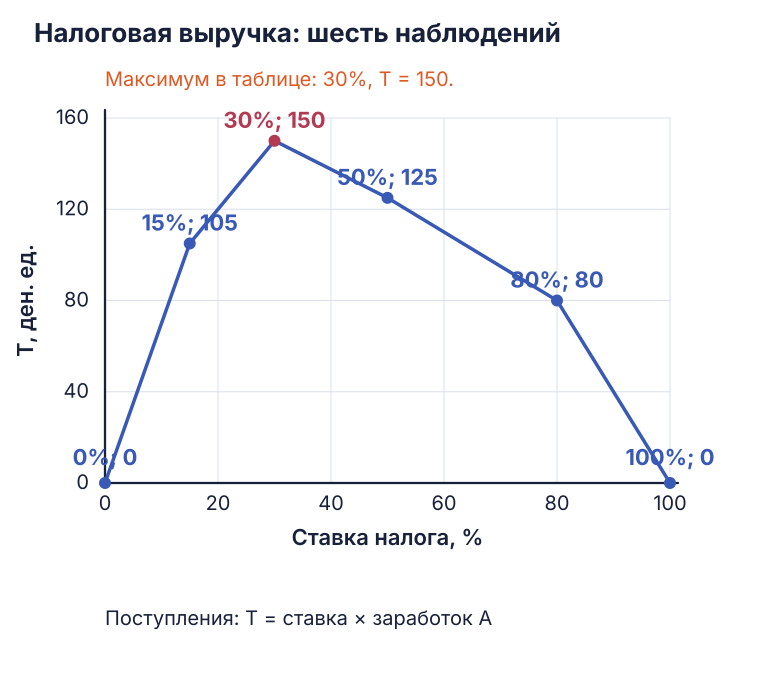

Экономика общественного сектора · 6 октября

# Семинар 3: государство, доходы и справедливость

[Условия задач — PDF](../materials/eos/seminar-3.pdf){ .md-button }
[Требования к эссе](public-sector-economics-market-failures-redistribution.md#essay){ .md-button }

В заданиях 1–5 обсуждаются общественные расходы и провалы рынка. В заданиях 6–8 — расчёт доходов, неравенства и налогов. Задание 9 связывает критерии справедливости с финансированием медицинской помощи.

Основные провалы рынка в этих обсуждениях — **монопольная власть, внешние эффекты, асимметрия информации и общественные блага**. Они объясняют, почему индивидуальные рыночные решения могут приводить к потерям эффективности. Перераспределение дополнительно оценивается по критерию справедливости.

## 1. Закон Вагнера: почему растёт общественный сектор { #task-1 }

**Вопрос:** как экономическое развитие связано с общественными расходами, чем объяснить расширение государства в XX веке и чего ожидать дальше?

Адольф Вагнер предположил, что по мере роста дохода на душу населения спрос на государственные услуги увеличивается быстрее самого дохода. Если общественные расходы растут быстрее ВВП, их доля в ВВП повышается.

Эластичность расходов по доходу показывает, на сколько процентов меняются расходы при увеличении дохода на 1%:

\[
E_Y=\frac{\%\text{ изменения общественных расходов}}{\%\text{ изменения дохода}}.
\]

Вагнеровская тенденция соответствует \(E_Y>1\). Например, рост дохода на 10% и расходов на 15% даёт \(E_Y=15/10=1{,}5\). Это учебный пример связи двух величин.

### Что увеличивает спрос на государственные услуги

- **Усложнение хозяйства.** Больше сделок, организаций и имущественных отношений — выше потребность в судах, защите прав, контроле исполнения договоров.
- **Урбанизация.** Концентрация людей требует транспорта, санитарной инфраструктуры, водоснабжения и других общих систем.
- **Рост доходов.** Люди предъявляют более высокие требования к образованию, здравоохранению, социальной защите и среде проживания.
- **Крупная инфраструктура.** Высокие первоначальные затраты и длительная окупаемость создают спрос на государственное участие.

Историческое расширение расходов действительно было значительным. По сопоставлению МВФ, во Франции государственные расходы составляли 17,0% ВВП в 1913 году и 54,3% в 1998-м; в Японии — 8,3% и 36,9%. Страны различаются по масштабу и траектории роста. [Историческое исследование МВФ](https://www.elibrary.imf.org/view/journals/001/2000/044/article-A001-en.xml).

### Ещё два объяснения роста расходов

**«Болезнь издержек» Баумоля.** Производительность в части услуг растёт медленно: время консультации, занятия или ухода трудно сокращать без изменения качества. Зарплаты при этом должны оставаться сопоставимыми с другими отраслями, иначе работники уйдут. Стоимость услуг относительно промышленной продукции повышается. Механизм действует и у государственных, и у частных поставщиков. [Статья Баумоля](https://cooperative-individualism.org/baumol-william_macroeconomics-of-unbalanced-growth-1967-jun.pdf).

**Эффект смещения Пикока — Уайзмана.** Война или крупный кризис могут повысить общественно приемлемую налоговую нагрузку и расходы. После потрясения часть новых обязательств сохраняется. Это отдельная гипотеза о скачках расходов и смене привычного уровня налогов. [Первоначальное исследование](https://www.nber.org/system/files/chapters/c2304/c2304.pdf).

Сегодня давление на расходы создают старение населения, медицинские технологии, климатическая адаптация и потребности в безопасности. Будущая доля расходов зависит также от роста ВВП, производительности услуг, бюджетных решений и возможностей финансирования. Закон Вагнера описывает тенденцию, которую проверяют по данным каждой страны.

Российский пример из обсуждения связан со сменой хозяйственной системы: переходом от плановой экономики СССР к приватизации и рыночным институтам в 1990-е, последующим развитием социальных обязательств и финансирования. При таком сравнении различают государственную собственность, бюджетные расходы и общественное страхование: это разные показатели масштаба государства.

## 2. Ограничение продажи алкоголя { #task-2 }

**В условии:** розничную продажу алкоголя ограничивают ночью; приведён интервал 23:00–08:00 и пример изменения региональных правил. Нужно объяснить цель, побочные последствия и аргументы о государственной монополии.

У алкоголя есть **отрицательные внешние эффекты**: шум, насилие, ДТП, вред другим людям, дополнительная нагрузка на экстренные службы. Часть этих издержек оплачивают окружающие и общество, тогда как покупатель и продавец ориентируются на собственную выгоду.

Есть и **патерналистский аргумент**: государство ограничивает доступность товара ради здоровья самого потребителя. Он связан с оценкой индивидуального выбора, зависимости и долгосрочных последствий. Внешний ущерб и вред самому покупателю — два разных основания вмешательства.

Ограничение времени продажи повышает издержки приобретения и сокращает возможность спонтанной покупки. Результат зависит от соблюдения правил и доступных заменителей. Возможны закупки заранее, переход к нелегальным продавцам или суррогатам; контроль требует ресурсов. Эти механизмы учитывают вместе с ожидаемым снижением вреда. [ВОЗ: регулирование доступности алкоголя](https://www.who.int/initiatives/SAFER/alcohol-availability).

### Государственная монополия: аргументы по обе стороны

| В пользу | Ограничения и риски |
| :--- | :--- |
| Можно централизованно регулировать число точек, часы работы и ассортимент | Слабая конкуренция способна ухудшить обслуживание и повысить издержки |
| Проще организовать единый контроль происхождения и качества | Качество зависит от реального контроля и управления |
| Прибыль может поступать в бюджет | Доход от продаж создаёт конфликт с целью сокращать потребление |
| Проще проводить единую политику доступности | Сохраняются нелегальный рынок, коррупционные риски и расходы на надзор |

Экономическая оценка сравнивает достижимое снижение ущерба с издержками выбранного способа контроля. Само государственное владение этой оценки ещё не даёт.

## 3. РЖД: естественная монополия и тарифы { #task-3 }

**Вопрос:** почему железнодорожную инфраструктуру относят к естественной монополии, зачем вмешивается государство и как выбирать тариф?

У железной дороги велики затраты на пути, станции, сигнализацию и содержание сети. Строить несколько параллельных сетей для одного потока может быть дороже, чем обслуживать его одной сетью. Это **субаддитивность издержек**:

\[
C(Q)<C(q_1)+C(q_2)+\ldots,\qquad q_1+q_2+\ldots=Q.
\]

Слева — затраты одной фирмы на весь объём \(Q\). Справа — суммарные затраты нескольких фирм на тот же объём. Если слева меньше, разделение производства повышает общие затраты.

Естественно-монопольный аргумент прежде всего относится к инфраструктуре. Отдельные услуги, например предоставление вагонов, могут организовываться конкурентно. Поэтому структуру отрасли рассматривают по сегментам. [Росжелдор: развитие отрасли и конкурентные сегменты](https://www.rlw.gov.ru/inf_nac).

### Дилемма тарифа

\(MC\) — затраты на дополнительную единицу услуги; \(AC=C(Q)/Q\) — средние затраты на единицу с учётом инфраструктуры.

| Правило в учебной модели | Что получается |
| :--- | :--- |
| \(P=MC\) | Пользователь сравнивает выгоду поездки с предельными затратами. При \(MC<AC\) выручки недостаточно для покрытия всех затрат |
| \(P=AC\) | Выручка покрывает экономические затраты, включая нормальную доходность капитала. При убывающих средних затратах цена выше \(MC\), а объём ниже эффективного |
| Монопольная цена без ограничения | Компания выбирает цену и объём ради прибыли; доступность и объём могут ещё сильнее сократиться |

При \(P=MC\) и \(AC>MC\) дефицит финансирования равен \((AC-MC)Q\). Его нужно покрыть субсидией, фиксированной частью тарифа или другим источником. У субсидии тоже есть цена для бюджета и налогоплательщиков.

**Регулирование доходности** позволяет возмещать допустимые затраты и получать установленный доход на капитал. **Price-cap** ограничивает цену и оставляет компании часть выгоды от экономии. Эти методы создают разные стимулы снижать затраты. Регулятору приходится учитывать состояние сети, инвестиции, качество и доступность перевозок.

Аргументы за вмешательство включают защиту пользователей от монопольной цены, связность территорий и безопасность. Высокий транспортный тариф также повышает затраты грузоотправителей. На другой стороне — бюрократические издержки и информационная асимметрия: компания лучше регулятора знает свои затраты и может добиваться их завышенного признания. **Регуляторный захват** возникает, когда решения надзора начинают обслуживать интересы регулируемой компании. Для оценки важны прозрачность затрат и стимулы экономить при сохранении качества.

## 4. Углеродные выбросы и международное регулирование { #task-4 }

### Где возникает провал рынка

Предприятие оплачивает свои ресурсы, но часть ущерба от выбросов приходится на других людей и страны. Общественные предельные издержки складываются из частных и внешних:

\[
MSC=MPC+MEC.
\]

\(MPC\) — дополнительные затраты предприятия; \(MEC\) — дополнительный внешний ущерб; \(MSC\) — их сумма. При выборе только по частным затратам объём загрязняющей деятельности оказывается выше общественно эффективного.

Сокращение глобального климатического ущерба приносит пользу и тем странам, которые мало участвовали в оплате мер. Возникает международная проблема **безбилетника**. У отдельных территорий могут быть локальные выгоды от некоторых климатических изменений, например уменьшение затрат на отопление; общий результат требует сопоставления всех выгод, потерь и рисков.

### Как включить внешний ущерб в решение производителя

| Инструмент | Механизм |
| :--- | :--- |
| Налог Пигу | Цена загрязнения повышается; в модели ставка равна \(MEC\) в общественно эффективной точке |
| Квоты и торговля разрешениями | Регулятор задаёт общий предел выбросов; компании торгуют правами, сокращая выбросы там, где это дешевле |
| Стандарты и прямые ограничения | Устанавливаются требования к технологиям, топливу или допустимым выбросам |
| Субсидии | Снижаются затраты на более чистые технологии; важны источник финансирования и проверка результата |
| Переговоры сторон | При закреплённых правах и низких трансакционных издержках стороны могут согласовать сокращение ущерба и компенсацию |

Теорема Коуза относится к последнему механизму. Для глобального климата участников очень много, ущерб распределён во времени, переговоры и контроль дороги. Торговля квотами — отдельный, организованный государством механизм. [Коуз: права и трансакционные издержки](https://www.nobelprize.org/prizes/economic-sciences/1991/coase/lecture/), [Еврокомиссия: EU ETS](https://climate.ec.europa.eu/areas-action/carbon-markets/eu-emissions-trading-system-eu-ets/eu-ets-emissions-cap_en).

### Киото, Париж и углеродная утечка

Киотский протокол устанавливал количественные обязательства для определённой группы стран. США его не ратифицировали; Канада вышла в 2012 году. Различие обязательств создаёт риск **углеродной утечки**: производство переносится туда, где ограничения слабее, либо более чистый внутренний товар заменяется углеродоёмким импортом. [UNFCCC: США](https://unfccc.int/resource/docs/2009/idr/usa04.pdf), [Канада](https://unfccc.int/tools_xml/country_CA.html).

В Парижском соглашении страны сами определяют национальные вклады — **NDC**. Договор обязывает их готовить, сообщать, поддерживать и обновлять эти вклады каждые пять лет, предпринимать внутренние меры. Конкретные целевые значения определяют сами государства; достижение численного результата устроено иначе, чем обязательства по процедуре. По состоянию на 6 октября 2026 года повторный выход США вступил в силу 27 января 2026 года. [UNFCCC: обязанности по NDC](https://unfccc.int/process-and-meetings/the-paris-agreement/nationally-determined-contributions-ndcs), [депозитарий ООН, примечание 7](https://treaties.un.org/Pages/ViewDetails.aspx?chapter=27&clang=_en&mtdsg_no=XXVII-7-d&src=TREATY).

### Три варианта из задания и действующий CBAM

В условии семинара обсуждаются пограничный углеродный сбор, включение импортёров в торговлю разрешениями и углеродный НДС. Их общий замысел — учесть углеродную составляющую импорта и уменьшить выгоду от переноса производства за пределы регулирующей страны.

Действующий с 1 января 2026 года **CBAM** охватывает выбранные товары шести отраслей: цемент, железо и сталь, алюминий, удобрения, электроэнергию и водород. Импортёр декларирует встроенные выбросы и погашает соответствующее число сертификатов; их цена связана с EU ETS. Уплаченную в стране производства углеродную цену можно учитывать. В этом механизме цена ориентируется на углеродную цену внутри ЕС, тогда как для теоретического налога Пигу нужно оценить \(MEC\). [Еврокомиссия: CBAM](https://taxation-customs.ec.europa.eu/carbon-border-adjustment-mechanism/cbam-definitive-regime_en).

## 5. Дороги: общественное благо, окупаемость и рента { #task-5 }

### а. Какие свойства есть у дороги

У чистого общественного блага одновременно есть **неисключаемость** и **несоперничество**. Неисключаемость означает трудность ограничения доступа; несоперничество — возможность пользоваться благом одновременно без уменьшения полезности для других.

| Дорога | Исключаемость | Соперничество |
| :--- | :--- | :--- |
| Бесплатная, со свободным движением | Доступ открыт | В пределах свободной пропускной способности близка к несоперничающему благу |
| Бесплатная, с пробками | Доступ открыт | Есть: дополнительная машина увеличивает задержки остальных |
| Платная, со свободным движением | Доступ можно ограничить оплатой | Близка к клубному благу до перегрузки |
| Платная, с пробками | Исключаема | Соперничающая из-за перегрузки |

Даже при свободном движении остаются износ, обслуживание и другие издержки дополнительной поездки. [FHWA: предельные дорожные издержки](https://www.fhwa.dot.gov/policy/hcas/addendum.cfm).

### б. Безбилетник и платная дорога

При добровольном финансировании открытой дороги человеку выгодно переложить взнос на других: после строительства доступ сохранится и для него. Если так поступят многие, денег на общественно выгодный проект окажется недостаточно.

Налоговое финансирование решает эту проблему обязательными платежами. На платной дороге доступ связывают с оплатой проезда, поэтому появляется возможность собрать деньги непосредственно с пользователей. Выбор маршрута в обход платной дороги сам по себе относится к обычному выбору потребителя. [Общественные блага и безбилетник](https://openstax.org/books/principles-economics-2e/pages/13-3-public-goods).

### в–г. Почему частный инвестор может отказаться и какой тариф выбрать

Строительство требует крупных вложений заранее. Будущий поток машин, готовность платить, стоимость содержания и правила пересмотра тарифов неизвестны. Большая часть затрат становится невозвратной после строительства.

Высокий тариф помогает получать больше с одной поездки, но уменьшает число поездок. Выручка равна

\[
R=P\cdot Q(P).
\]

Например, 100 поездок по 200 рублей дают 20 000 рублей, а 50 поездок по 300 — 15 000. Повышение цены в этом примере уменьшает выручку. Поэтому тариф «для покрытия всех затрат» нужно проверять с учётом спроса.

Инвестору нужна возможность окупить согласованные затраты и получить доход; государству важны доступность дороги и общественные выгоды. Компромисс может включать концессию, субсидию, распределение рисков и условия изменения тарифа. Гарантия минимального дохода возможна, если предусмотрена договором. Общественная полезность проекта сама по себе ещё не обеспечивает его коммерческую окупаемость.

### д–е. Что первично: аренда земли или цены придорожного бизнеса

Поток покупателей и выгодное расположение позволяют бизнесу получать выручку. Предприниматели конкурируют за такое место, повышая спрос на землю; часть выгоды расположения превращается в **земельную ренту** и высокую аренду. Это производный спрос: участок ценен благодаря возможностям использования.

Для конкретного кафе или магазина аренда остаётся расходом и влияет на решение работать в этом месте. Однако причина высокой ренты связана с доходностью местоположения и альтернативами его использования. [Рикардо: теория ренты, глава II](https://www.gutenberg.org/files/33310/33310-h/33310-h.htm).

### ж. Внешние эффекты дороги

Асфальтирование может уменьшить пыль, ускорить доступ к работе и медицинской помощи, повысить надёжность поездок. Соседи, которые пользуются этими выгодами без отдельной оплаты, получают положительный внешний эффект.

Оживлённая магистраль рядом с домами создаёт шум, загрязнение воздуха, вибрации и барьеры для пешеходов. Для Третьего транспортного кольца важны одновременно доступность территории и локальный ущерб жителям. Знак итогового эффекта определяют по конкретному участку и группам, которых он затрагивает.

## 6. Доходы Клавы и Вали: деньги, натуральные поступления и потенциал { #task-6 }

### Дано

| Поступление или имущество | Клава | Валя |
| :--- | ---: | ---: |
| Пенсия в месяц | 22 000 ₽ | 27 000 ₽ |
| Работа консьержкой в месяц | 30 000 ₽ | — |
| Аренда гаража в месяц | — | 10 000 ₽ |
| Социальные льготы в месяц | 8 000 ₽ | 8 000 ₽ |
| Помощь детей | 20 000 ₽ деньгами в месяц | Продукты на 6 000 ₽ в неделю |
| Сумма на сберкнижке | 90 000 ₽ | — |
| Проценты по вкладу | 2 700 ₽ в квартал | — |

Денежный доход включает поступившие деньги. Валовой доход в этой задаче включает также стоимость продуктов и льгот. Потенциальный доход учитывает доступные, но ещё не используемые возможности заработка.

### Шаг 1. Привести поступления к одному периоду

В квартале три месяца. Средний месячный доход от процентов:

\[
2\,700/3=900\text{ ₽ в месяц}.
\]

Сумма 90 000 ₽ на счёте — запас имущества. В месячный поток поступлений входят проценты 900 ₽. Если прибавить и сам вклад, доход будет завышен.

В семинарском решении принимается **четыре недели в месяце**. Тогда стоимость продуктов Вали:

\[
6\,000\cdot4=24\,000\text{ ₽ в месяц}.
\]

При усреднении за год \(52/12\) недель дают 26 000 ₽ в месяц и валовой доход Вали 71 000 ₽. Ниже сохраняем учебный расчёт с четырьмя неделями, чтобы все числа относились к одной условности.

### Шаг 2. Посчитать денежные доходы

Клава получает пенсию, зарплату, перевод сына и проценты:

\[
Y_K^{\text{ден}}=22\,000+30\,000+20\,000+900=72\,900\text{ ₽}.
\]

Валя получает пенсию и арендную плату:

\[
Y_В^{\text{ден}}=27\,000+10\,000=37\,000\text{ ₽}.
\]

Продукты от дочери расширяют возможности потребления Вали, но денег на её счёт не добавляют. Стоимость льгот учитываем следующим шагом.

### Шаг 3. Посчитать валовые доходы

\[
Y_K^{\text{вал}}=72\,900+8\,000=80\,900\text{ ₽}.
\]

\[
Y_В^{\text{вал}}=37\,000+8\,000+24\,000=69\,000\text{ ₽}.
\]

По денежному и валовому доходу **Валя беднее**. Учёт натуральной помощи сокращает разрыв: денежный разрыв составляет 35 900 ₽, валовой — 11 900 ₽.

### Шаг 4. Разобрать потенциальный доход

В записях семинара добавлено предположение: Валя может работать консьержкой за 30 000 ₽ в месяц, сохранив аренду, льготы и помощь дочери. Тогда

\[
Y_В^{\text{пот}}=69\,000+30\,000=99\,000\text{ ₽}.
\]

Если Клава уже использует все рассматриваемые возможности, её потенциальный доход равен 80 900 ₽. При этих предположениях потенциальный доход выше у Вали.

Сам PDF сообщает фактические поступления, но возможность работы Вали в нём не указана. Поэтому численный ответ о потенциале относится к дополнительному условию из обсуждения. Аренда гаража уже включена в 69 000 ₽ и повторно к потенциалу не прибавляется.

| Показатель, ₽ в месяц | Клава | Валя | У кого меньше |
| :--- | ---: | ---: | :--- |
| Денежный | 72 900 | 37 000 | У Вали |
| Валовой, при четырёх неделях | 80 900 | 69 000 | У Вали |
| Потенциальный, при дополнительном условии | 80 900 | 99 000 | У Клавы |

## 7. Кривая Лоренца и Джини: площади до и после налога { #task-7 }

### Дано и модель решения

60% населения получают 20% общего дохода. Остальные 40% — 80%. С дохода богатой группы собирают налог 20% и полностью передают его бедной группе, поровну между её участниками.

Для построения ломаной Лоренца принимаем равные доходы внутри каждой группы. При неизвестном распределении внутри групп эта ломаная даёт нижнюю оценку индивидуального Джини.

### Шаг 1. Поставить точки

На горизонтальной оси — накопленная доля людей, расположенных от бедных к богатым. На вертикальной — накопленная доля дохода этих людей.

| Доля населения | Доля дохода | Смысл |
| ---: | ---: | :--- |
| 0% | 0% | Начало отсчёта |
| 60% | 20% | Вся бедная группа |
| 100% | 100% | Всё население и весь доход |

Соединяем точки \((0;0)\), \((60;20)\), \((100;100)\). При полном равенстве линия шла бы по диагонали: 60% людей получали бы 60% дохода.

<figure class="lecture-figure" markdown>

<figcaption>До налога. Цветные области под ломаной складываются в площадь 3 000.</figcaption>
</figure>

### Шаг 2. Вспомнить две формулы площади

**Треугольник:**

\[
S_{\triangle}=\frac{a\cdot h}{2}.
\]

\(a\) — основание, \(h\) — перпендикулярная ему высота. Прямоугольный треугольник с катетами 60 и 20 занимает половину прямоугольника \(60\times20\), поэтому площадь равна \(60\times20/2=600\).

**Трапеция:**

\[
S_{\text{трап}}=\frac{a+b}{2}\cdot h.
\]

\(a\) и \(b\) — две параллельные стороны; \(h\) — перпендикулярное расстояние между ними. Формула умножает среднюю длину параллельных сторон на расстояние между ними.

В нашей трапеции параллельные стороны стоят **вертикально**: при \(x=60\) их длина 20, при \(x=100\) — 100. Расстояние между ними горизонтальное: \(100-60=40\).

<figure class="lecture-figure" markdown>

<figcaption>Ориентация фигуры сохраняет формулу: высоту измеряют перпендикулярно параллельным сторонам.</figcaption>
</figure>

Можно проверить трапецию другим способом. Нижний прямоугольник имеет площадь \(40\times20=800\); треугольник над ним — \(40\times(100-20)/2=1\,600\). Вместе \(800+1\,600=2\,400\).

### Шаг 3. Найти площадь под кривой Лоренца

Первая область, от 0 до 60% населения, — треугольник:

\[
S_1=\frac{60\cdot20}{2}=600.
\]

Вторая, от 60 до 100%, — трапеция:

\[
S_2=\frac{20+100}{2}\cdot(100-60)=60\cdot40=2\,400.
\]

Площадь под всей ломаной:

\[
B=S_1+S_2=600+2\,400=3\,000.
\]

### Шаг 4. Посчитать Джини

Под диагональю равенства находится большой треугольник с основанием и высотой 100:

\[
S_{\text{рав}}=\frac{100\cdot100}{2}=5\,000.
\]

Разность между ним и площадью под Лоренцем:

\[
A=5\,000-3\,000=2\,000.
\]

**Коэффициент Джини** — доля этой разности в площади под диагональю:

\[
G=\frac{A}{S_{\text{рав}}}=\frac{2\,000}{5\,000}=0{,}40.
\]

Обе оси здесь выражены в процентах, поэтому площади измеряются в условных квадратных единицах. В отношении \(A/S_{\text{рав}}\) эти единицы сокращаются. При осях от 0 до 1 площади будут 0,30 и 0,50, а Джини останется 0,40.

### Шаг 5. Рассчитать перераспределение

Примем весь доход за 100 единиц. У богатых первоначально 80. Налог составляет 20% **их дохода**:

\[
T=0{,}20\cdot80=16.
\]

Богатым остаётся \(80-16=64\); бедным передают 16, поэтому у них \(20+16=36\). Проверка: \(64+36=100\).

Новая промежуточная точка Лоренца — \((60;36)\). В модели равных доходов внутри групп порядок сохраняется: бедный получает \(36/60=0{,}6\) среднего дохода по населению, богатый — \(64/40=1{,}6\).

<figure class="lecture-figure" markdown>

<figcaption>После передачи 16 единиц дохода бедной группе площадь под кривой увеличивается до 3 800.</figcaption>
</figure>

### Шаг 6. Повторить расчёт площадей

\[
S'_1=\frac{60\cdot36}{2}=1\,080.
\]

\[
S'_2=\frac{36+100}{2}\cdot40=68\cdot40=2\,720.
\]

\[
B'=1\,080+2\,720=3\,800,\qquad A'=5\,000-3\,800=1\,200.
\]

\[
G'=\frac{1\,200}{5\,000}=0{,}24.
\]

<figure class="lecture-figure" markdown>

<figcaption>Новая кривая ближе к диагонали равенства.</figcaption>
</figure>

**Ответ:** Джини снизился с **0,40 до 0,24**. Разница — 0,16 пункта коэффициента, или \(0{,}16/0{,}40\times100\%=40\%\) исходного значения. Ставка налога 20%, перевод 16% общего дохода и снижение Джини на 40% описывают три разные величины.

## 8. Налоговая ставка и пять критериев справедливости { #task-8 }

### Дано

У A есть возможность работать за **100 долларов в час**. B зарабатывать не может. Налог с A полностью передают B. В условии задано, сколько часов A работает при каждой ставке:

| Ставка | 0% | 15% | 30% | 50% | 80% | 100% |
| :--- | ---: | ---: | ---: | ---: | ---: | ---: |
| Часы работы | 6 | 7 | 5 | 2,5 | 1 | 0 |

Эту реакцию труда берём из таблицы. Все доходы ниже относятся к одному рассматриваемому периоду.

### Шаг 1. Записать формулы

Пусть \(h\) — число часов, \(t\) — ставка в долях единицы: 15% соответствует 0,15, 50% — 0,50.

\[
Y_A^{\text{до}}=100h,\qquad T=t\cdot Y_A^{\text{до}}.
\]

\[
Y_A=Y_A^{\text{до}}-T,\qquad Y_B=T.
\]

Сумма после перераспределения равна первоначальному заработку A:

\[
Y_A+Y_B=(Y_A^{\text{до}}-T)+T=Y_A^{\text{до}}.
\]

В условии весь налог доходит до B, расходы на сбор отсутствуют. Ставка меняет общий доход через заданную реакцию часов работы.

### Шаг 2. Посчитать каждую строку

| Ставка | Заработок A до налога | Налог и доход B | Доход A после налога |
| ---: | :--- | :--- | :--- |
| 0% | \(100\times6=600\) | \(0\times600=0\) | \(600-0=600\) |
| 15% | \(100\times7=700\) | \(0{,}15\times700=105\) | \(700-105=595\) |
| 30% | \(100\times5=500\) | \(0{,}30\times500=150\) | \(500-150=350\) |
| 50% | \(100\times2{,}5=250\) | \(0{,}50\times250=125\) | \(250-125=125\) |
| 80% | \(100\times1=100\) | \(0{,}80\times100=80\) | \(100-80=20\) |
| 100% | \(100\times0=0\) | \(1\times0=0\) | \(0-0=0\) |

Итоговая таблица даёт величины для сравнения критериев:

| Ставка | A | B | Сумма \(A+B\) | Меньший доход \(\min(A,B)\) | Больший доход \(\max(A,B)\) |
| ---: | ---: | ---: | ---: | ---: | ---: |
| 0% | 600 | 0 | 600 | 0 | 600 |
| 15% | 595 | 105 | 700 | 105 | 595 |
| 30% | 350 | 150 | 500 | 150 | 350 |
| 50% | 125 | 125 | 250 | 125 | 125 |
| 80% | 20 | 80 | 100 | 20 | 80 |
| 100% | 0 | 0 | 0 | 0 | 0 |

### Эгалитаризм: равенство доходов

При 50% каждый получает 125 долларов. При 100% тоже достигается равенство, но оба получают ноль. Выбирая более благополучное из равных распределений, получаем **50%**: каждый выигрывает 125 по сравнению с нулевым вариантом.

### Утилитаризм: максимальная сумма полезностей

\[
W=u_A(Y_A)+u_B(Y_B).
\]

Для учебного ответа принимается одинаковая линейная полезность: \(u_A(y)=u_B(y)=y\). Тогда сравниваем столбец суммы доходов: 600, 700, 500, 250, 100, 0. Максимум **700 при ставке 15%**.

Если предельная полезность дохода убывает или различается между людьми, нужна конкретная функция полезности. Ответ 15% относится к линейной модели.

### Либертаризм: права на заработанный доход

В строгой трактовке задания принудительное перераспределение нарушает право A распоряжаться заработком. Выбирается **0%**. Добровольная помощь B совместима с этим критерием, но в таблице она не задана.

### Роулз: максимальное благополучие худшего по положению

Для каждой строки сначала выбираем **меньший** из двух доходов, затем среди этих минимумов — **наибольший**:

\[
\max_t\min\{Y_A(t),Y_B(t)\}.
\]

Минимумы: 0, 105, 150, 125, 20, 0. Максимум **150 при ставке 30%**. Доходы будут 350 у A и 150 у B.

Строка 80% показывает, зачем сравнивать обоих: там A получает 20, B — 80, поэтому минимум равен 20. Рост ставки с 30 до 50% выравнивает доходы, но уменьшает доход худшего со 150 до 125. Максимин предпочитает 30%.

### «Ницшеанский» критерий в задаче

В учебной постановке так назван максимум дохода наиболее благополучного:

\[
\max_t\max\{Y_A(t),Y_B(t)\}.
\]

Сравниваем последний столбец: 600, 595, 350, 125, 80, 0. Максимум **600 при ставке 0%**. Это операционное определение критерия для данной задачи.

| Критерий | Ставка | Почему |
| :--- | ---: | :--- |
| Эгалитарный с выбором большего равного благосостояния | 50% | 125 каждому |
| Утилитарный при одинаковой линейной полезности | 15% | Максимальная сумма 700 |
| Строгий либертарный | 0% | Сохранение права на заработок |
| Роулсианский максимин | 30% | Максимальный меньший доход — 150 |
| Учебный «ницшеанский» | 0% | Максимальный больший доход — 600 |

### Что видно на графике налоговых поступлений

<figure class="lecture-figure" markdown>

<figcaption>Максимум сборов среди шести заданных ставок — 150 долларов при 30%.</figcaption>
</figure>

При 100% ставка высока, но налоговая база равна нулю: A работает ноль часов. При 30% база равна 500, поэтому поступления составляют 150. Повышение ставки после этой строки уменьшает сборы из-за сокращения заработка. Для ставок между точками часы работы в условии не заданы.

## 9. Онкологическое оборудование: кто платит и по какому критерию оценивать { #task-9 }

**Дано:** государство покупает оборудование, позволяющее лучше лечить онкологические заболевания. Рассматриваются два источника финансирования: общие федеральные налоги и поступления от акциза на сигареты.

### Кто выигрывает и кто несёт расходы

| Финансирование | Возможные выгоды | Возможные потери |
| :--- | :--- | :--- |
| Общие налоги | Более эффективное лечение для пациентов; возможность получить помощь в будущем; возможности для поставщиков помощи | Налоговая нагрузка; сокращение иных расходов бюджета, если деньги перераспределены из них |
| Акциз на сигареты | Те же медицинские выгоды; при повышении акциза возможно сокращение вреда от курения | При повышении акциза — рост расходов потребителей и/или уменьшение доходов производителей; при использовании прежних поступлений — отказ от иных бюджетных расходов |

Один человек может одновременно быть пациентом, налогоплательщиком и потребителем табака. Его итоговый результат складывается из всех выгод и потерь. О распределении акциза между покупателями и продавцами — [в разборе налогового бремени](public-sector-economics-lecture-tax-incidence.md).

### Парето: есть ли улучшение для всех

Критерий требует, чтобы хотя бы один человек выиграл, а положение каждого из остальных сохранилось или улучшилось. При наличии некомпенсированных потерь плательщиков Парето-улучшения нет. Условие сообщает медицинскую выгоду, но не раскрывает итоговую полезность каждого участника, поэтому выполнение критерия из него не установлено.

### Калдор — Хикс: возможна ли компенсация

Суммарные выгоды должны позволять полностью возместить потери и сохранить положительный остаток. **Возможность** компенсации достаточна для этого критерия. Если проект создаёт проигравших, Парето-улучшение требует фактического возмещения: после него никто не должен остаться в худшем положении.

Нужны оценки дополнительных медицинских выгод, стоимости оборудования, эксплуатации, обучения и иных последствий. Выгоды и издержки приводят к сопоставимой, обычно денежной оценке: число спасённых жизней непосредственно с рублями не складывают. Их величины в задаче отсутствуют. Поэтому вывод звучит условно: проект проходит критерий, **если** оценённые выгоды превышают все учитываемые издержки.

### Роулз: что происходит с худшей по положению группой

Следует определить эту группу и сравнить её положение до и после. Если оборудование расширяет доступ малообеспеченных пациентов к эффективному лечению, это аргумент в пользу проекта. Если финансирование требует повышения акциза и ухудшает положение бедных потребителей, этот ущерб также входит в оценку.

Онкологическое заболевание характеризует потребность в лечении, а положение наименее благополучных зависит и от доходов, доступа, тяжести состояния и других выбранных показателей. Одобрение по Роулзу требует улучшения именно этой группы.

### Либертаризм: согласие и права

В строгой версии критерия принудительное финансирование перераспределения вызывает возражение в обоих вариантах. Добровольные страховые взносы, благотворительность и договорная оплата оцениваются иначе.

Обоснование акциза компенсацией внешнего ущерба требует отдельно показать этот ущерб и связь платежа с ним. Вред курения самому потребителю и вред другим людям имеют разные основания для вмешательства.

## Связанные материалы

- [Эссе: объём, оформление, эффективность и справедливость](public-sector-economics-market-failures-redistribution.md#essay).
- [Роль государства и перераспределение](public-sector-economics-market-failures-redistribution.md) — теория и другие примеры расчёта Джини.
- [Налоговый семинар](public-sector-economics-tax-seminar.md) — площади излишков, налоговое бремя и потери эффективности.
- [Общественные расходы и благосостояние](public-sector-economics-welfare.md) — страхование, контракты и оценка программ.

Условия сохранены в [PDF семинара](../materials/eos/seminar-3.pdf); решения составлены по обоим переданным конспектам. Международные механизмы сверены по приведённым первичным источникам 6 октября 2026 года.
