Экономика общественного сектора · семинарские задачи

# Налоги: разбор семинара { #tax-seminar }

Средняя ставка показывает долю дохода, которую человек отдаёт в виде налога. Предельная — долю следующего прироста дохода. Для оценки самого налога дополнительно нужны его база, влияние на решения участников и распределение нагрузки. В задачах ниже эти вопросы разобраны отдельно, а затем соединены с равновесием рынка.

[Теория налогового бремени и графики](public-sector-economics-lecture-tax-incidence.md) объясняет общий налоговый клин и эластичности. [Краткая шпаргалка](public-sector-economics-tax-incidence-cheatsheet.md) собирает обозначения и формулы.

## База, ставка и назначение налога { #classification }

Прямые налоги связывают обязательство с доходом или имуществом плательщика; косвенные — с продажей товаров и услуг. В обоих случаях экономическую нагрузку определяют по изменению доходов и цен участников. Для косвенного налога потребитель, производитель и другие связанные стороны могут нести разные доли.

Общие поступления финансируют бюджетные расходы в целом, а целевые закрепляют за выбранным направлением. Например, в учебном проекте можно предусмотреть сбор на дорожную инфраструктуру. Федеральный, региональный и местный уровни описывают налоговую компетенцию: кто устанавливает и регулирует соответствующие элементы налога.

| Способ установления | Налоговое правило | Что меняется в выборе |
| :--- | :--- | :--- |
| Специфический | $T=tQ$, фиксированная сумма за единицу | Между полной и чистой ценой появляется постоянный клин $t$ |
| Адвалорный | Процент $\tau$ от указанной стоимости | Размер клина зависит от цены и выбранной базы |
| Аккордный | $T=F$, фиксированная сумма с плательщика | Располагаемые средства уменьшаются при прежних относительных ценах вариантов |

При адвалорном налоге на чистую цену $P_D=(1+\tau_n)P_S$, а на полную цену $P_S=(1-\tau_g)P_D$. В [теоретическом конспекте](public-sector-economics-lecture-tax-incidence.md#advalorem-tax) показано, как эти базы меняют геометрию кривых.

## Средняя и предельная ставка { #rates }

При доходе $Y$ и сумме налога $T$:

$$ATR=\frac{T}{Y},\qquad MTR=\frac{\Delta T}{\Delta Y}.$$

Обе величины можно записать долей или умножить на 100% для процентного представления. У прогрессивной шкалы $ATR$ растёт с доходом, у пропорциональной остаётся постоянной, у регрессивной снижается.

Для гладкой налоговой функции связь имеет вид:

$$\frac{d(ATR)}{dY}
=\frac{Y\,dT/dY-T}{Y^2}
=\frac{MTR-ATR}{Y}.$$

Она показывает, почему предельная ставка выше средней увеличивает среднюю долю налога. В табличных задачах $MTR$ рассчитывают на интервале между соседними значениями дохода.

## Задача 12. Средняя и предельная ставка { #task-12 }

За час работы заданы зарплата и налог. Требуется рассчитать $ATR$, $MTR$ и определить характер шкалы.

| Зарплата за час $Y$, $ | Налог за час $T$, $ |
| ---: | ---: |
| 2 | 1,14 |
| 4 | 2,41 |
| 6 | 3,95 |
| 8 | 5,28 |
| 10 | 6,84 |

При зарплате 4 доллара средняя доля налога равна:

$$ATR_4=\frac{2{,}41}{4}=0{,}6025=60{,}25\%.$$

Переход от зарплаты 2 к 4 добавляет 2 доллара дохода и $2{,}41-1{,}14=1{,}27$ доллара налога. Поэтому:

$$MTR_{2\to4}=\frac{1{,}27}{2}=63{,}5\%.$$

Таким же образом обрабатываются остальные интервалы. Для первого дохода известна средняя ставка; предельную ставку до этой точки можно было бы получить при наличии предыдущего значения.

| Зарплата $Y$ | Налог $T$ | $ATR$ | $MTR$ от предыдущей строки |
| ---: | ---: | ---: | ---: |
| 2 | 1,14 | 57% | — |
| 4 | 2,41 | 60,25% | 63,5% |
| 6 | 3,95 | 65,83% | 77% |
| 8 | 5,28 | 66% | 66,5% |
| 10 | 6,84 | 68,4% | 78% |

Например, на участке от 6 до 8 налог увеличивается на 1,33, поэтому $MTR=1{,}33/2=66{,}5\%$. Последний участок даёт $(6{,}84-5{,}28)/(10-8)=78\%$.

Средняя ставка последовательно растёт с 57% до 68,4%, поэтому **шкала прогрессивная**. Предельные ставки при этом колеблются: прогрессивность здесь определяется ростом средней доли при увеличении дохода.

<figure class="lecture-figure" markdown>
[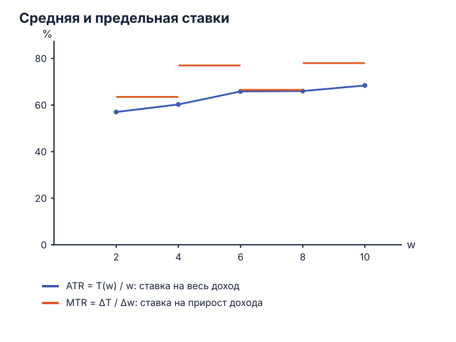](../assets/oct-2026/tax-rates.svg)
<figcaption markdown>Средняя ставка относится к доходу, предельная — к интервалу его прироста.</figcaption>
</figure>

## Задача 13. Сравнение девяти налогов { #task-13 }

Нужно оценить НДС, налог на прибыль, акциз на табак, имущество юридических лиц, землю, доходы физических лиц, имущество физических лиц, фиксированную подушную подать и налог на бездетных.

Пять критериев задают разные вопросы:

| Критерий | Что оценивается |
| :--- | :--- |
| Равенство обязательств | Как различают плательщиков в одинаковом и разном положении; какие выгоды или экономические возможности учитывают |
| Экономическая нейтральность | Как налог меняет потребление, труд, инвестиции и другие решения; исправляет ли существующее искажение |
| Организационная простота | Затраты на учёт, расчёт, уплату и контроль |
| Гибкость | Как поступления реагируют на доходы, расходы и другие изменения экономики |
| Прозрачность | Понимает ли плательщик базу, ставку, сумму обязательства и способ их изменения |

Горизонтальное равенство относится к сопоставимым плательщикам: при одинаковом значимом положении к ним применяют одинаковое правило. Вертикальное описывает различия между людьми с разными возможностями. Принцип платёжеспособности связывает нагрузку с этими возможностями, принцип выгоды — с преимуществами, которые человек получает от государства.

У налога могут быть разные результаты по разным критериям. Для сравнения ниже указаны механизмы, которые нужно оценить при конкретной ставке, базе и льготах.

### Распределение нагрузки и решения плательщиков { #tax-comparison-equity }

| Налог | Равенство обязательств | Экономическая нейтральность |
| :--- | :--- | :--- |
| НДС | При одинаковой ставке связывает обязательство с облагаемым потреблением. Если менее обеспеченные тратят на него большую долю дохода и несут ценовой клин, нагрузка относительно дохода выше | Широкая единая база уменьшает различия между облагаемыми товарами; льготы и разные ставки меняют относительные цены. Нагрузка может влиять на труд и потребление |
| Налог на прибыль | Исходит из прибыли фирмы. Распределение между группами населения зависит также от владения капиталом и переноса нагрузки на цены и оплату труда | Стимулы определяют правила вычета расходов, амортизации и учёта убытков. Налог на экономическую ренту и налог на нормальную отдачу капитала дают разные реакции |
| Акциз на табак | Доля нагрузки зависит от покупок, дохода и переноса налога в цену. Связь с внешним ущербом задаёт отдельный критерий оценки | Целенаправленно меняет цену и количество. При корректировке внешнего ущерба может повышать общественную эффективность |
| Имущество юридических лиц | Связывает платёж с облагаемыми активами; одинаковый объём активов может сочетаться с разной текущей доходностью | Обложение воспроизводимых активов может менять инвестиции и состав имущества. Результат зависит от того, какие активы входят в базу |
| Земельный | Учитывает владение и стоимость участка; текущий денежный доход владельца может отличаться от стоимости земли | В модели налога на чистую земельную ренту с фиксированным предложением количество предлагаемой земли сохраняется. Строения и улучшения требуют отдельного рассмотрения |
| Подоходный | Доход, шкала и вычеты позволяют различать возможности плательщиков. Выбор справедливой шкалы требует принятого критерия | Предельная ставка меняет отдачу дополнительного труда, а также стимулы к форме получения дохода |
| Имущество физических лиц | Стоимость собственности отражает часть богатства; доход и возможность текущего платежа учитываются отдельно | Налоговая база и льготы могут менять владение, улучшение имущества и использование жилья |
| Фиксированная подушная подать | Одинаковая сумма занимает большую долю меньшего дохода: $ATR=F/Y$ снижается с ростом $Y$ | При платеже, независимом от выбора, остаётся эффект дохода, а эффект замещения отсутствует в базовой модели |
| Налог на бездетных | Различает обязательства по семейному положению. Оценка зависит от учёта дохода, иждивенцев и обстоятельств семьи | Если семейный статус меняет обязательство, налог может влиять на соответствующие решения и оформление статуса |

### Учёт, реакция поступлений и понятность { #tax-comparison-administration }

| Налог | Организационная простота | Гибкость | Прозрачность |
| :--- | :--- | :--- | :--- |
| НДС | Требует учёта продаж, облагаемой базы и входящих вычетов; сложность зависит от числа исключений и цепочек | Облагаемые продажи реагируют на потребление и цены, поэтому поступления меняются вместе с базой | Ставка и сумма могут быть показаны в документах; экономическую долю сторон рынка определяют отдельным расчётом |
| Налог на прибыль | Нужно согласовать доходы, расходы, убытки и период признания; возможны разные способы распределить прибыль | Прибыль заметно меняется в ходе экономического цикла | Формула понятна при ясных правилах расходов и убытков; сложная база затрудняет оценку обязательства |
| Акциз на табак | Специфический акциз требует учёта облагаемых физических единиц и контроля продукции | Поступления зависят от объёма, ставки и состава покупок; реакция количества на цену и на доход различается | Поштучная ставка удобна для расчёта, а включение суммы в розничную цену влияет на видимость платежа |
| Имущество юридических лиц | Нужны реестр активов, оценка и правила определения базы | При неизменных активах поступления обычно реагируют медленнее налога на текущую прибыль | Понятность зависит от способа оценки, периода и льгот |
| Земельный | Требуются учёт участков и оценка базы; её обновление создаёт дополнительные затраты | Количество земли относительно устойчиво, стоимость и оценка базы могут меняться | Плательщику нужны доступные данные об участке, базе и ставке |
| Подоходный | Удержание у источника облегчает сбор типичных выплат; вычеты и разные источники дохода усложняют расчёт | Поступления реагируют на занятость, зарплаты и другие облагаемые доходы | Расчёт доступен при понятной шкале и документах об удержаниях |
| Имущество физических лиц | Нужны реестр, оценка имущества и учёт льгот | Реакция зависит от стоимости активов и частоты обновления базы | Уведомление позволяет показать объект, оценку и сумму; понятность оценки остаётся существенной |
| Фиксированная подушная подать | Простая сумма, но нужны учёт плательщиков и организация взыскания | При неизменных сумме и числе плательщиков доход бюджета фиксирован | Сумма обязательства видна заранее |
| Налог на бездетных | Требуется учёт семейного статуса, исключений и периода применения | Поступления меняются с числом плательщиков и параметрами правила | Понятность зависит от определения облагаемого статуса и льгот |

Например, простота подушного платежа сочетается с тяжёлой относительной нагрузкой на людей с низким доходом. Корректирующий акциз меняет поведение именно ради устранения ущерба. Выбор веса каждого критерия определяет итоговую оценку системы.

## Задача 14. Анна и Морис: выгоды и платёжеспособность { #task-14 }

Анна получает доход 100, платит налог 30 и получает общественные блага стоимостью 40. Морис получает доход 50, платит налог 20 и получает такие же блага на 40. Требуется оценить принцип распределения платежей по этим данным.

| Плательщик | Доход $Y$ | Налог $T$ | Получаемая выгода | $ATR=T/Y$ |
| :--- | ---: | ---: | ---: | ---: |
| Анна | 100 | 30 | 40 | 30% |
| Морис | 50 | 20 | 40 | 40% |

По **принципу получаемой выгоды** одинаковые преимущества означают одинаковые платежи при общем правиле связи выгоды и налога. Здесь выгода равна 40 для обоих, а платежи 30 и 20 различаются. Следовательно, распределение расходится с этим принципом.

По отношению к доходу нагрузка **регрессивна в данной паре**: Морис с меньшим доходом платит 40%, Анна — 30%. В то же время Анна платит больше в абсолютной сумме: $30>20$.

Оценка по платёжеспособности зависит от принятого правила. Требование большей абсолютной выплаты для более высокого дохода здесь выполнено. Требование одинаковой доли или прогрессивной доли — нарушено. Для сравнения жертв полезностью нужны сами функции полезности и выбранное определение жертвы. Эти критерии подробнее рассмотрены в следующей задаче.

## Задача 15. Равенство жертв и критерий Роулза { #task-15 }

Доходы до налога равны 10 у $A$ и 8 у $B$. Полезность располагаемого дохода $R$ задана функциями:

$$U_A=\frac12R_A,\qquad U_B=R_B.$$

Государство должно собрать 6:

$$T_A+T_B=6,\qquad R_A=10-T_A,\qquad R_B=8-T_B.$$

Рассматриваем платежи $T_A,T_B\ge0$, поэтому $0\le T_A\le6$. В этой задаче полезности заданы как количественно сопоставимые величины: это позволяет сравнивать потери и выбирать минимальную полезность.

### Равная абсолютная жертва { #equal-absolute-sacrifice }

До налога $U_{A0}=5$, $U_{B0}=8$. После налога:

$$U_A=5-\frac12T_A,\qquad U_B=8-T_B.$$

Абсолютные потери равны $\Delta U_A=T_A/2$ и $\Delta U_B=T_B$. Приравниваем их:

$$\frac12T_A=T_B,\qquad T_A+T_B=6.$$

Отсюда $T_A=4$, $T_B=2$. Проверка даёт располагаемые доходы 6 и 6, полезности 3 и 6. Оба теряют по 2 единицы полезности:

$$5-3=8-6=2.$$

Различие исходных функций означает, что один и тот же доллар налога уменьшает полезность $A$ на 0,5, а $B$ — на 1. Поэтому для одинаковой абсолютной потери сумма платежа $A$ вдвое больше.

### Равная относительная жертва { #equal-relative-sacrifice }

Теперь сравнивается доля утраченной исходной полезности:

$$\frac{\Delta U_A}{U_{A0}}
=\frac{\Delta U_B}{U_{B0}},
\qquad
\frac{T_A/2}{5}=\frac{T_B}{8}.$$

Это даёт $T_A/10=T_B/8$. Вместе с суммой 6:

$$T_A=\frac{10}{3},\qquad T_B=\frac{8}{3}.$$

Каждый теряет треть исходной полезности. Итоговые полезности равны $10/3$ и $16/3$. Различие с первым решением возникает потому, что одинаковая доля и одинаковая абсолютная величина — два разных способа измерять жертву.

### Максимум минимальной полезности { #rawls-maximin }

Критерий Роулза выбирает платежи, при которых положение менее благополучного после налога максимально:

$$W(T_A)=\min\left(5-\frac12T_A,\;8-(6-T_A)\right)
=\min\left(5-\frac12T_A,\;2+T_A\right).$$

Первая функция убывает по $T_A$: увеличение платежа $A$ уменьшает его полезность. Вторая растёт: тот же шаг уменьшает платёж $B$ и увеличивает его полезность.

Они пересекаются при:

$$5-\frac12T_A=2+T_A,\qquad
3=\frac32T_A,\qquad T_A=2.$$

Тогда $T_B=4$, обе полезности равны 4. Максимум можно проверить на всём допустимом интервале:

$$W(T_A)=
\begin{cases}
2+T_A,&0\le T_A\le2,\\
5-\frac12T_A,&2\le T_A\le6.
\end{cases}$$

Слева от 2 минимальная полезность растёт, справа убывает. Поэтому **$T_A=2,T_B=4,W=4$ — глобальный максимум**. На концах $T_A=0$ и $T_A=6$ минимальная полезность равна 2.

<figure class="lecture-figure" markdown>
[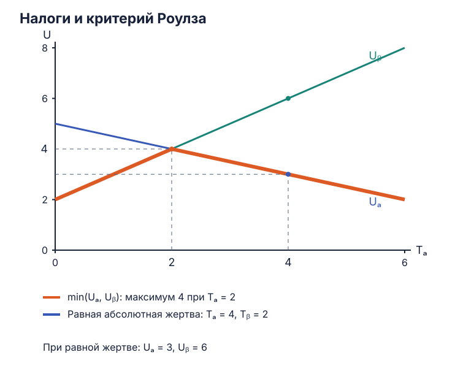](../assets/oct-2026/tax-sacrifice.svg)
<figcaption markdown>Пересечение при $T_A=2$ максимизирует меньшую полезность; равная абсолютная жертва даёт $T_A=4$.</figcaption>
</figure>

| Критерий | $T_A$ | $T_B$ | Полезности после налога | Минимум |
| :--- | ---: | ---: | :--- | ---: |
| Равная абсолютная жертва | 4 | 2 | 3 и 6 | 3 |
| Равная относительная жертва | $10/3$ | $8/3$ | $10/3$ и $16/3$ | $10/3$ |
| Роулз, maximin | 2 | 4 | 4 и 4 | 4 |

## Задача 16. Финансирование дорог и мостов { #task-16 }

Область выбирает между повышением платы за водительские права, налогом на транспортные средства, налогом на запчасти и шины и повышением налогов на табак и алкоголь. Нужно сравнить связь платежа с выгодой от дорог, возможность корректировать внешние эффекты и изменение поведения.

| Вариант | Связь с выгодой от дорог | Возможная корректирующая функция | Что влияет на искажение |
| :--- | :--- | :--- | :--- |
| Плата за водительские права | Связана с доступом к вождению, но один платёж охватывает людей с разным будущим пробегом | При оплате административной процедуры покрывает её затраты; связь с дорожным ущербом требует другого правила | Повышение платы может влиять на решение получить права; для уже принявшего это решение платёж ближе к фиксированному |
| Налог на транспортные средства | Владение связано с возможностью пользоваться дорогами; пробег и фактическая выгода у владельцев различаются | База, связанная с нагрузкой на дороги или внешним ущербом, может приблизить платёж к причиняемым затратам | Меняет выбор владения и характеристик автомобиля; важны ставки, база и альтернативы |
| Налог на запчасти и шины | Покупки частично отражают эксплуатацию и износ, поэтому могут быть приближением к использованию дорог | Возможность коррекции зависит от того, как облагаемый расход связан с ущербом | Удорожает обслуживание, может менять сроки ремонта и покупки; связь с безопасной эксплуатацией требует оценки |
| Налоги на табак и алкоголь | Платёж определяется покупками этих товаров, а выгода от дороги — её использованием | Может корректировать внешний ущерб соответствующих товаров при согласованной базе и ставке | Меняет потребление облагаемых товаров; воздействие на дорожный рынок и на их собственные рынки рассматривается отдельно |

По **принципу выгоды** транспортный налог и платежи, связанные с эксплуатацией, ближе к дорожной услуге. Однако точность различается: две машины могут использовать дорогу с разной интенсивностью, а замена шин зависит ещё и от условий эксплуатации. Для точной связи с использованием понадобились бы данные о пробеге, маршрутах и нагрузке.

Налог Пигу связывает платёж с **предельным внешним ущербом**. Если дорожное использование причиняет другим людям затраты, соответствующая плата может одновременно отражать использование инфраструктуры и корректировать ущерб. Акциз на другой товар решает корректирующую задачу на собственном рынке; направление выручки на дороги само по себе эту связь не создаёт.

Наименьшее избыточное бремя определяется реакцией поведения при сборе необходимой суммы. Фиксированный платёж после уже принятого решения о вождении может мало влиять на текущий пробег; плата за вход в деятельность меняет решение начать водить. Для товара с малой реакцией количества потери от сокращения сделок могут быть меньше. Сравнение четырёх вариантов поэтому требует суммы поступлений, эластичностей и оценки ущерба. Эти параметры зададут выбор между выгодой, эффективностью и распределением нагрузки.

## Расчёт на конкурентном рынке: налог 5 долларов { #numerical-tax }

В отдельной задаче из рукописного материала заданы:

$$Q_D=300-2P_D,\qquad Q_S=3P_S-200.$$

Вводится специфический налог $t=5$ долларов за каждую проданную единицу. Нужно найти исходное и новое равновесия, доход бюджета и потери покупателей, продавцов и общества.

### Исходное равновесие { #numerical-before }

До налога обе стороны имеют одну цену $P_0$:

$$300-2P_0=3P_0-200,\qquad 5P_0=500.$$

Получаем $P_0=100$ и $Q_0=100$. Подстановка в обе функции даёт $300-200=100$ и $300-200=100$.

Обратные кривые пригодятся для площадей:

$$P_D(Q)=150-\frac12Q,\qquad
P_S(Q)=\frac{200}{3}+\frac13Q.$$

Спрос пересекает ось цены при 150, предложение — при $200/3$. Излишки представляют площади треугольников до $Q_0$:

$$CS_0=\frac12(150-100)\cdot100=2500,$$

$$PS_0=\frac12\left(100-\frac{200}{3}\right)\cdot100
=\frac{5000}{3}.$$

### Две цены после налога { #numerical-after }

Продавец получает на 5 меньше полной цены покупателя:

$$P_S=P_D-5.$$

Поэтому новое равновесие определяется уравнением:

$$300-2P_D=3(P_D-5)-200,$$

$$300-2P_D=3P_D-215,\qquad 5P_D=515.$$

Получаем:

$$P_D=103,\qquad P_S=98,\qquad Q_t=94.$$

Проверки: $300-2\cdot103=94$, $3\cdot98-200=94$, $103-98=5$.

Если юридически платит покупатель, можно сразу использовать цену продавца: $P_D=P_S+5$. Тогда $300-2(P_S+5)=3P_S-200$, откуда $P_S=98$ и те же $P_D=103,Q_t=94$. Таким образом, оба способа перечисления налога дают один клин и одно равновесие.

<figure class="lecture-figure" markdown>
[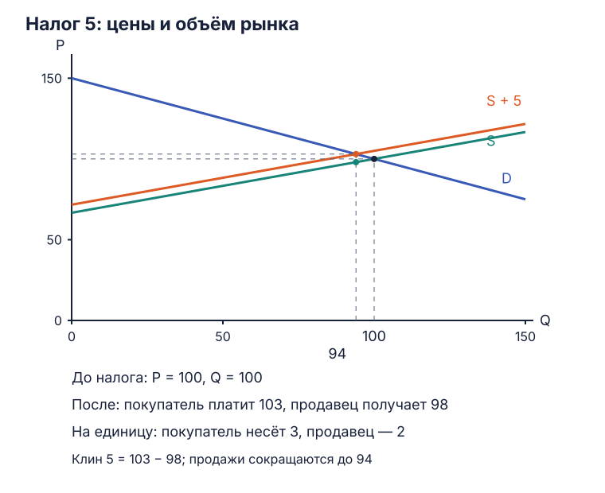](../assets/oct-2026/tax-numerical-equilibrium.svg)
<figcaption markdown>Исходная точка — $(Q,P)=(100,100)$; после налога количество 94, цена покупателя 103, цена продавца 98.</figcaption>
</figure>

### Поступления и распределение клина { #numerical-burden }

На каждой из 94 сохранившихся сделок бюджет получает 5:

$$T=5\cdot94=470.$$

Покупатель платит на $103-100=3$ больше, продавец получает на $100-98=2$ меньше. Доли клина равны 60% и 40%:

$$\frac35=60\%,\qquad\frac25=40\%.$$

Денежное бремя на сохранившихся сделках составляет $3\cdot94=282$ у покупателей и $2\cdot94=188$ у продавцов. Вместе $282+188=470=T$.

### Излишки и исчезнувшие сделки { #numerical-surplus }

После налога излишек покупателя равен площади под спросом над 103 до количества 94:

$$CS_t=\frac12(150-103)\cdot94=2209.$$

Потеря покупателей:

$$\Delta CS=2500-2209=291.$$

Новый излишек продавца измеряется от его чистой цены 98:

$$PS_t=\frac12\left(98-\frac{200}{3}\right)\cdot94
=\frac{4418}{3}.$$

Потеря продавцов:

$$\Delta PS=\frac{5000-4418}{3}=194.$$

Потери излишков включают и бремя на совершённых сделках, и выигрыш от сокращённого объёма. Количество уменьшилось на $100-94=6$. Со стороны покупателей исчезнувший выигрыш равен $\tfrac12\cdot3\cdot6=9$, со стороны продавцов — $\tfrac12\cdot2\cdot6=6$:

$$\Delta CS=282+9=291,\qquad
\Delta PS=188+6=194.$$

Общая чистая потеря:

$$DWL=9+6=\frac12\cdot5\cdot6=15.$$

Все суммы сходятся:

$$291+194=485=470+15=T+DWL.$$

<figure class="lecture-figure" markdown>
[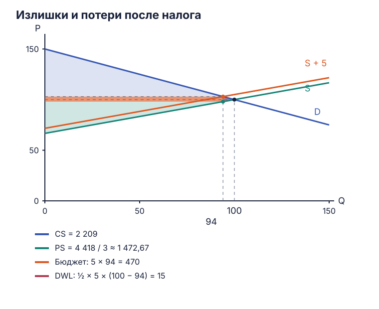](../assets/oct-2026/tax-numerical-surplus.svg)
<figcaption markdown>Прямоугольник $5\times94$ даёт бюджетные поступления, два треугольника дают потери 9 и 6.</figcaption>
</figure>

Треугольники излишков имеют положительные основания и высоты: $Q_t=94$, $150-103=47$ и $98-200/3=94/3$. Они измеряются на участке реально совершённых сделок. Выручка продавца в этой модели равна $TR=98\cdot94=9212$, а налоговый доход бюджета — $T=470$.

## Задача 17. Налог на труд { #task-17 }

Налог перечисляет работник. По таблице нужно определить характер шкалы, равновесие до налога, зарплаты и занятость после его введения, поступления бюджета и изменение результата при эластичном предложении труда.

| Зарплата за час $w$, $ | Спрос на труд $L_D$, чел. | Предложение $L_S$, чел. | Налог за час $t$, $ |
| ---: | ---: | ---: | ---: |
| 10 | 14 | 22 | 3,33 |
| 8 | 18 | 22 | 2,67 |
| 6 | 22 | 22 | 2,00 |
| 4 | 26 | 22 | 1,33 |
| 2 | 30 | 22 | 0,67 |

### Шкала и исходная занятость { #labor-before }

Отношения $t/w$ близки к одной трети:

| Зарплата | $ATR=t/w$ | $MTR$ от предыдущего меньшего дохода |
| ---: | ---: | ---: |
| 2 | 33,50% | — |
| 4 | 33,25% | 33% |
| 6 | 33,33% | 33,5% |
| 8 | 33,375% | 33,5% |
| 10 | 33,30% | 33% |

Различия возникают из округления денежного налога до центов. Таблица задаёт **пропорциональный налог со ставкой $\tau\approx1/3$**: при увеличении брутто-зарплаты налог за час меняется вместе с ней.

Спрос из таблицы можно записать как $L_D=34-2w$, предложение — как $L_S=22$. Исходное равновесие:

$$34-2w_0=22,\qquad w_0=6,\qquad L_0=22.$$

### Брутто, нетто и бюджет { #labor-after }

На рынке труда работодатель покупает труд, а работник продаёт его. Обозначим затраты работодателя через $w_D$, чистую зарплату работника — через $w_S$. Налоговое правило:

$$w_S=(1-\tau)w_D\approx\frac23w_D.$$

Количество предложения фиксировано на 22, поэтому спрос работодателей по-прежнему задаёт $w_D=6$. На этой зарплате налог равен 2, чистая выплата составляет $w_S=6-2=4$.

Итак, **занятость остаётся 22, работодатель платит 6 за час, работник получает 4**. Всё ценовое бремя приходится на работников, чьё предложение фиксировано. Бюджет за час работы всех 22 человек получает:

$$T=2\cdot22=44.$$

Проверка сумм: расходы работодателей $6\cdot22=132$, чистые выплаты работникам $4\cdot22=88$, налог $44$; $88+44=132$. В данной частичной модели количество труда сохраняется и избыточное бремя от сокращения занятости равно нулю.

<figure class="lecture-figure" markdown>
[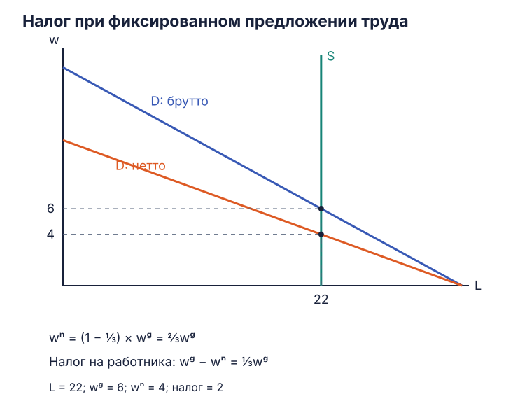](../assets/oct-2026/labor-tax-fixed.svg)
<figcaption markdown>При фиксированном предложении спрос задаёт $w_D=6$, а налог уменьшает $w_S$ до 4.</figcaption>
</figure>

### Эластичное предложение труда { #labor-elastic }

При восходящем предложении количество труда зависит от чистой зарплаты. Налог уменьшает отдачу работника, поэтому при прежних расходах работодателя доступного труда становится меньше. Новое равновесие сочетает меньшую занятость с большей брутто-зарплатой работодателя и меньшей чистой зарплатой работника относительно исходных 6.

Ставка остаётся $\tau\approx1/3$, поэтому клин имеет вид $w_D-w_S=\tau w_D$. Его денежная величина после изменения брутто-зарплаты тоже меняется. Поступления бюджета составляют:

$$T=\tau w_DL_t.$$

<figure class="lecture-figure" markdown>
[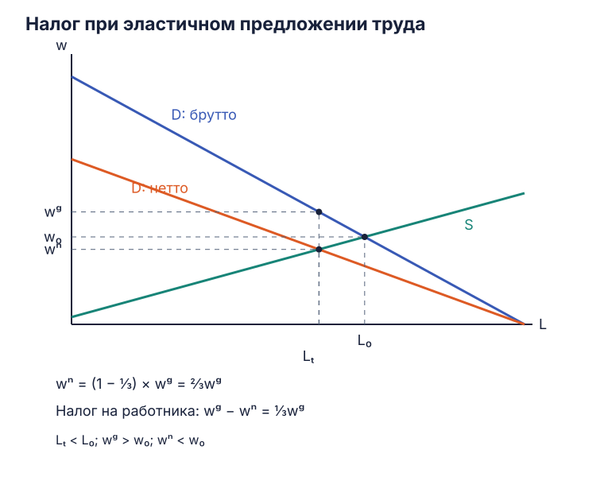](../assets/oct-2026/labor-tax-elastic.svg)
<figcaption markdown>При эластичном предложении обе стороны делят клин $w_S=\tfrac23w_D$, количество труда сокращается.</figcaption>
</figure>

График иллюстрирует изменённую форму предложения. Для численного ответа нужна новая функция $L_S(w_S)$. Сокращение взаимовыгодных сделок создаёт избыточное бремя в модели эффективного исходного рынка; его величину находят по площади между спросом и предложением на исчезнувшем участке занятости.

## Задача 18. Акцизы на водку и шоколад { #task-18 }

Нужно объяснить, как повышение акциза влияет на производителей двух товаров. Учебное сравнение принимает, что спрос на водку менее эластичен, чем спрос на шоколад, при сопоставимом предложении. Тогда покупатели первого товара слабее сокращают покупки, и большая доля клина приходится на рост их цены. При более эластичном спросе продавцы сильнее теряют в чистой цене и объёме.

<figure class="lecture-figure" markdown>
[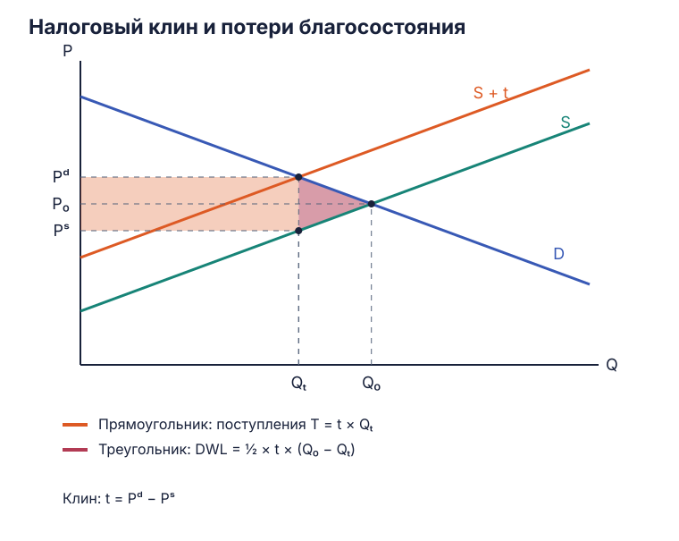](../assets/eos-materials/tax-incidence-dwl.svg)
<figcaption markdown>Вертикальное расстояние между двумя ценами равно налогу. Ширина прямоугольника — продажи после налога; правый треугольник относится к исчезнувшим сделкам.</figcaption>
</figure>

Для вычислимой иллюстрации возьмём одинаковое предложение и одинаковую исходную точку:

$$S(Q)=20+Q,\qquad P_0=80,\quad Q_0=60.$$

Зададим обратный спрос на первом рынке как $D_v(Q)=200-2Q$, на втором — $D_c(Q)=110-\tfrac12Q$. Эти функции — параметры сравнения на рисунке. В исходной точке:

$$|\varepsilon_{D_v}|=\frac{80}{2\cdot60}=\frac23,\qquad
|\varepsilon_{D_c}|=\frac{80}{(1/2)\cdot60}=\frac83,\qquad
\varepsilon_S=\frac{80}{60}=\frac43.$$

При одинаковом налоге $t=20$ новые количества получаются из разницы спроса и предложения:

$$200-2Q=20+Q+20
\quad\Rightarrow\quad Q_v=\frac{160}{3},$$

$$110-\frac12Q=20+Q+20
\quad\Rightarrow\quad Q_c=\frac{140}{3}.$$

| Показатель | Менее эластичный спрос, «водка» | Более эластичный спрос, «шоколад» |
| :--- | ---: | ---: |
| Количество после налога | $160/3\approx53{,}33$ | $140/3\approx46{,}67$ |
| Цена покупателя | $280/3\approx93{,}33$ | $260/3\approx86{,}67$ |
| Чистая цена продавца | $220/3\approx73{,}33$ | $200/3\approx66{,}67$ |
| Доля клина покупателя | $2/3$ | $1/3$ |
| Доля клина продавца | $1/3$ | $2/3$ |
| $DWL=\frac12t(Q_0-Q_t)$ | $200/3\approx66{,}67$ | $400/3\approx133{,}33$ |

<figure class="lecture-figure" markdown>
[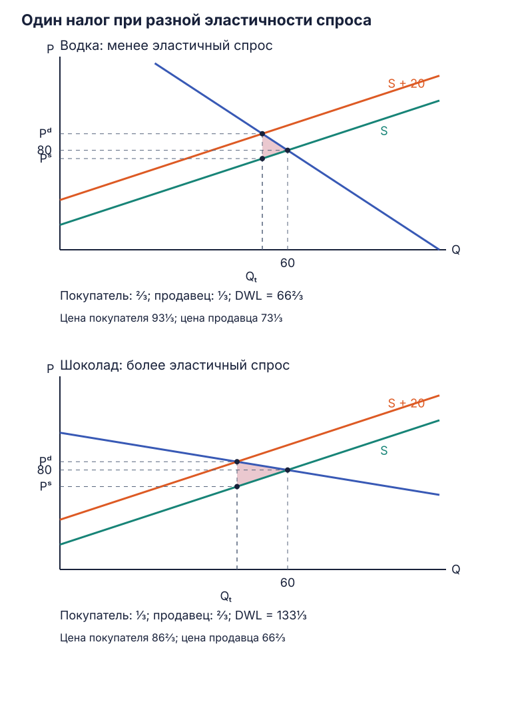](../assets/eos-materials/tax-incidence-vodka-chocolate.svg)
<figcaption markdown>Одинаковая исходная точка и налог позволяют сравнить реакцию двух заданных кривых спроса.</figcaption>
</figure>

У производителей уменьшается и чистая цена, и проданное количество. При данном предложении излишек производителя равен $\tfrac12Q^2$. До налога он составляет 1800 на каждом рынке; после — $12800/9\approx1422{,}22$ на первом и $9800/9\approx1088{,}89$ на втором. Потери равны примерно **377,78 и 711,11** соответственно.

Таким образом, при заданных функциях производители второго товара теряют больше. Для реальных отраслей аналогичный вывод потребовал бы оценки спроса, предложения и периода адаптации; названия товаров здесь обозначают принятые кривые учебной модели.

## Задача 19. Льгота на медицинские расходы { #task-19 }

Требуется показать, как полное освобождение медицинских расходов от налогов влияет на спрос на услуги. Для построения нужно определить устройство льготы: вычет расходов из облагаемого дохода, кредит, уменьшающий сумму налога, и отмена налога на саму услугу задают разные правила.

### Полностью используемый вычет из дохода { #medical-deduction }

Пусть пациент может вычесть **всю стоимость** услуги из облагаемого дохода и использовать этот вычет целиком. При предельной ставке $\tau$, $0\le\tau<1$, оплаченная услуга с ценой поставщика $P_S$ уменьшает налог на $\tau P_S$. Итоговые расходы пациента:

$$P_{\text{из кармана}}=P_S-\tau P_S=(1-\tau)P_S.$$

Полное включение расхода в вычет означает уменьшение налогооблагаемой базы на весь расход. Денежная экономия при этом равна доле $\tau$ от него.

Пусть исходная обратная кривая спроса $D(Q)$ показывает готовность пациента платить из собственных средств. В координатах **цены поставщика** после льготы пациент готов оплатить:

$$P_S=\frac{D(Q)}{1-\tau}.$$

Эффективная кривая спроса поднимается. При возрастающем предложении новое пересечение даёт больше услуг и более высокую цену поставщика. Пациент платит из кармана $(1-\tau)P_S$; поскольку новое количество выше, его значение готовности платить $D(Q)$ ниже исходной равновесной цены.

<figure class="lecture-figure" markdown>
[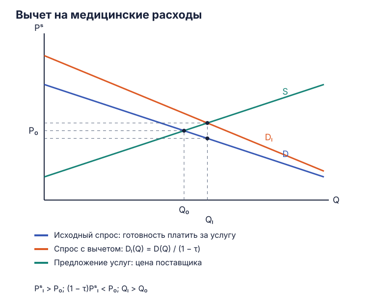](../assets/oct-2026/medical-tax-deduction.svg)
<figcaption markdown>Вычет создаёт льготный клин: пациент платит $(1-\tau)P_S$, поставщик получает $P_S$.</figcaption>
</figure>

Часть льготы получает пациент через снижение своих расходов, часть поставщик — через рост цены. Их соотношение зависит от реакций спроса и предложения. Если предложение в рассматриваемом периоде почти фиксировано, увеличение платежеспособного спроса сильнее повышает цену; если поставщики способны расширить объём, больше льготы выражается в увеличении доступных услуг.

Бюджетные расходы на такой полностью используемый вычет в простой модели равны:

$$C_{\text{бюджета}}=\tau P_SQ_{\text{льгота}}.$$

Для численных цен, количества и расходов нужны функции спроса и предложения. Ограничения вычета и фактическая возможность использовать его определяют размер льготы для конкретной группы пациентов.

### Кредит и отмена налога на услугу { #medical-credit-vat }

Налоговый кредит уменьшает рассчитанный налог. Если он возмещает долю $\kappa$ расходов и используется полностью, пациент платит $(1-\kappa)P_S$. Это правило похоже по форме, но доля $\kappa$ задаётся самим кредитом, а у вычета она зависит от ставки налога на доход.

Отмена налога на услугу устраняет существующий товарный клин между ценой покупателя и чистой ценой продавца. Тогда расчёт начинается с рынка, на котором этот налог уже взимался, и сравнивает его с равновесием после отмены. В каждом варианте график нужно подписывать ценой, которой пользуется соответствующая сторона.

## Задача 20. Когда акциз регрессивен { #task-20 }

По условию бедные тратят на сигареты и алкоголь большую долю дохода. Требуется оценить акциз в трёх режимах: конкурентный рынок с неэластичным предложением, монополия с линейным спросом и монополия со спросом постоянной эластичности.

Для распределения по доходным группам нужны два звена. Сначала находят, насколько акциз меняет потребительскую цену и доход производителя. Затем сопоставляют покупки и владение производителями у людей с разными доходами.

### Конкурентный рынок и неэластичное предложение { #regressive-competition }

При совершенно неэластичном предложении количество фиксировано: $Q_t=Q_0$. Спрос при этом количестве задаёт прежнюю цену покупателя $P_D=P_0$, а продавец получает $P_S=P_0-t$. Весь клин приходится на продавца; текущая цена покупателя сохраняется.

Поэтому в этом предельном случае налоговая нагрузка передаётся через доход производителей и их владельцев. Для доходной оценки нужно знать, каким группам принадлежит этот доход. Одна доля расходов покупателей на товар здесь описывает потребление, но размер их ценовой потери равен нулю.

При малой, но положительной эластичности предложения часть клина перейдёт в цену покупателя. Её величина зависит от соотношения $\varepsilon_S$ и $|\varepsilon_D|$; затем потребительскую часть сравнивают относительно доходов.

### Монополия с линейным спросом { #regressive-linear-monopoly }

Рассмотрим стандартную модель: обратный спрос $P_D=a-bQ$, $b>0$, постоянные предельные издержки $m$ и налог $t$ за единицу. Монополист выбирает выпуск по равенству предельной выручки и издержек с налогом:

$$MR=a-2bQ=m+t.$$

Пока $a>m+t$ и выпуск положителен:

$$Q_t=\frac{a-m-t}{2b},\qquad
P_D=\frac{a+m+t}{2}.$$

До налога $P_0=(a+m)/2$. Рост потребительской цены составляет:

$$P_D-P_0=\frac{t}{2}.$$

Чистая цена продавца $P_S=P_D-t$ падает на $t/2$, выпуск сокращается на $t/(2b)$. Следовательно, в этой модели в потребительскую цену переносится половина специфического акциза.

При одинаковом товаре и цене у групп рост расходов на прежний объём относительно дохода равен $(t/2)q_i/Y_i$. Если бедные имеют большую исходную долю расходов $P_0q_i/Y_i$, эта потребительская нагрузка для них выше. Общая оценка также включает изменившиеся покупки и потери доходов владельцев фирмы.

### Монополия с постоянной эластичностью спроса { #regressive-constant-elasticity }

Теперь зададим $Q=AP_D^{-\varepsilon}$, где $A>0$, $\varepsilon>1$, а предельные издержки по-прежнему постоянны и равны $m>0$. Предельная выручка монополиста:

$$MR=P_D\left(1-\frac1\varepsilon\right).$$

Из $MR=m+t$ получаем:

$$P_D=\frac{\varepsilon}{\varepsilon-1}(m+t),\qquad
P_0=\frac{\varepsilon}{\varepsilon-1}m.$$

Передача в цену равна:

$$P_D-P_0=\frac{\varepsilon}{\varepsilon-1}t>t.$$

Потребительская цена повышается больше денежного налога за единицу. Чистая цена продавца тоже растёт: $P_S-P_0=t/(\varepsilon-1)$. Одновременно количество падает. Прибыль в этой модели пропорциональна $(m+t)^{1-\varepsilon}$, поэтому повышение $t$ уменьшает совокупную прибыль при $\varepsilon>1$.

Такая передача усиливает ценовую нагрузку покупателей относительно линейного случая. Если доля покупки в доходе выше у бедных, потребительская составляющая имеет регрессивный характер. Для суммарного распределения к ней добавляют изменение доходов производителей с учётом собственности.

Полученные коэффициенты зависят от формы спроса и постоянных предельных издержек. При других издержках или кривизне спроса цена реагирует иначе. Поэтому монопольный рынок рассчитывают через $MR=MC+t$, а распределение по группам — через их покупки и доходы.

## Задача 21. Четыре крайних случая { #task-21 }

На продавца конкурентного рынка вводят специфический налог $t$. Нужно построить результат при совершенно неэластичном и совершенно эластичном спросе, а затем при тех же двух формах предложения. Другая кривая в каждом случае обычная наклонная, торговля после налога сохраняется.

| Случай | Цена покупателя | Чистая цена продавца | Количество | Бремя и $DWL$ |
| :--- | :--- | :--- | :--- | :--- |
| Вертикальный спрос | $P_0+t$ | $P_0$ | $Q_t=Q_0$ | Весь клин у покупателя, $DWL=0$ |
| Горизонтальный спрос | $P_0$ | $P_0-t$ | Сокращается при возрастающем предложении | Весь клин у продавца, $DWL>0$ |
| Вертикальное предложение | $P_0$ | $P_0-t$ | $Q_t=Q_0$ | Весь клин у продавца, $DWL=0$ |
| Горизонтальное предложение | $P_0+t$ | $P_0$ | Сокращается при убывающем спросе | Весь клин у покупателя, $DWL>0$ |

  <figure class="lecture-figure" markdown>

[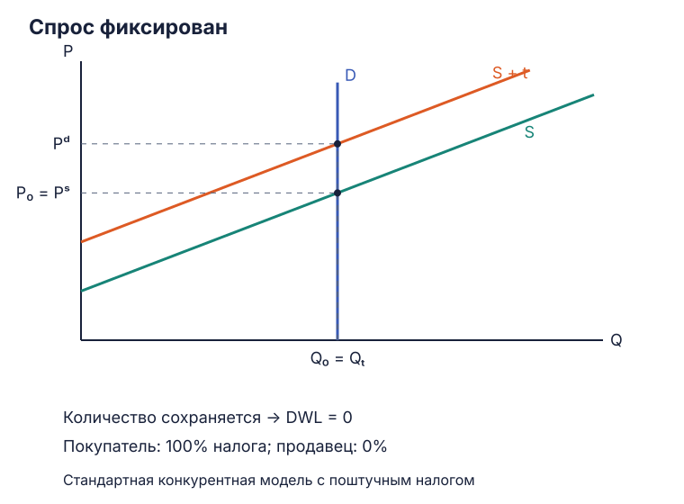](../assets/oct-2026/tax-extreme-demand-fixed.svg)

<figcaption markdown>Вертикальная $D$ задаёт прежнее количество.</figcaption>
  </figure>
  <figure class="lecture-figure" markdown>

[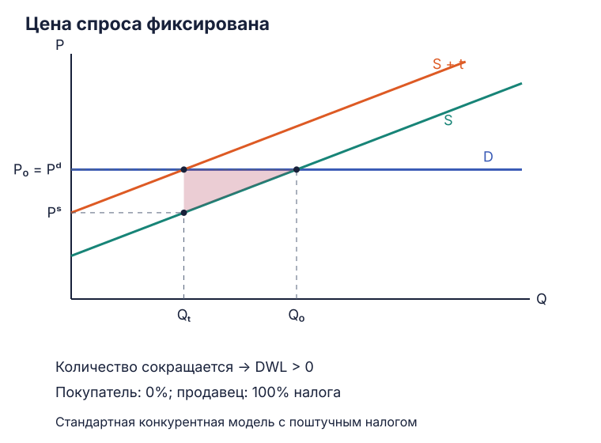](../assets/oct-2026/tax-extreme-demand-flat.svg)

<figcaption markdown>Горизонтальная $D$ задаёт прежнюю цену покупателя.</figcaption>
  </figure>
  <figure class="lecture-figure" markdown>

[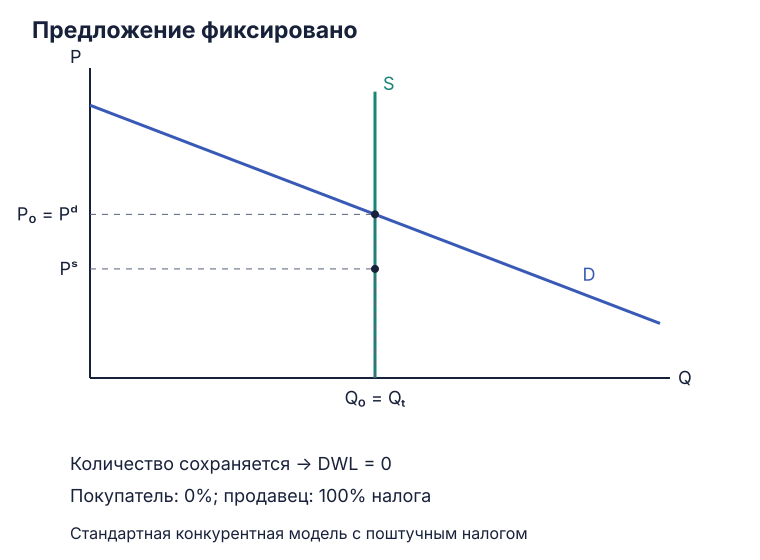](../assets/oct-2026/tax-extreme-supply-fixed.svg)

<figcaption markdown>Вертикальная $S$ задаёт прежнее количество.</figcaption>
  </figure>
  <figure class="lecture-figure" markdown>

[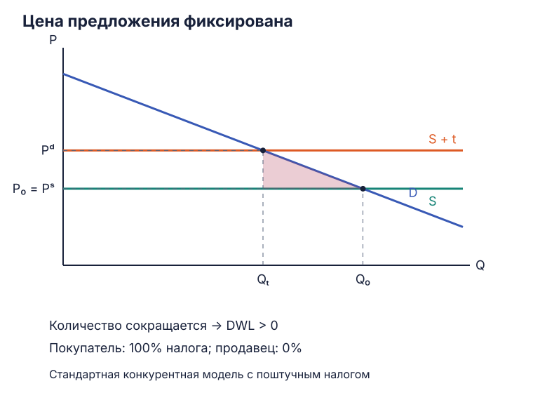](../assets/oct-2026/tax-extreme-supply-flat.svg)

<figcaption markdown>Горизонтальная $S$ задаёт прежнюю чистую цену продавца.</figcaption>
  </figure>

При вертикальной кривой одна сторона удерживает количество. По кривой другой стороны находится прежняя цена; оставшаяся цена сдвигается на $t$. При горизонтальной кривой одна цена фиксирована, а изменение другой сокращает количество по наклонной кривой.

На каждом рисунке верхняя точка клина относится к $P_D$, нижняя — к $P_S$. Высота одинакова и равна $t$. Избыточное бремя зависит от исчезнувших взаимовыгодных сделок, поэтому при фиксированном количестве его площадь равна нулю. В горизонтальных случаях величина потерь определяется реакцией другой кривой.

## Задача 22. Восемь способов финансировать здравоохранение { #task-22 }

Нужно сравнить преимущества, недостатки и избыточное бремя восьми вариантов. Для сопоставления требуется одинаковая сумма финансирования и выбранный период: разовый доход и постоянные поступления выполняют разные задачи.

### НДС и акцизы { #health-financing-consumption }

**а) Повысить НДС в целом.** Широкая база позволяет распределить сбор по большому объёму облагаемых покупок. Налог меняет цену потребления относительно располагаемых доходов и других вариантов использования ресурсов; результат зависит от ставки, вычетов и льгот. Относительная нагрузка на доходные группы зависит от доли облагаемого потребления и того, какая часть клина попадает в потребительскую цену. Для оценки $DWL$ нужны реакции рынков.

**б) Повысить НДС на алкоголь, табак и другие «вредные» товары.** Узкая база сосредоточивает сбор на выбранных покупках. Налог на стоимость меняет относительные цены и зависит от цен товара. Для корректирующей цели нужно сопоставить эту базу с внешним ущербом: стоимость и причиняемый ущерб могут изменяться по-разному. Реакция потребителей включает сокращение и замещение между товарами.

**в) Повысить акцизы на эти товары.** Специфическая ставка позволяет связать платёж с физической единицей продукта. При внешнем ущербе и ставке, отражающей его предельную величину, налог может приблизить выпуск к общественно эффективному. Тогда уменьшение существующих потерь входит в результат наряду с доходом бюджета. Для выбора ставки нужны данные об ущербе, эластичностях, администрировании и возможном уходе торговли из облагаемого сектора.

В модели корректирующего налога условие эффективного объёма имеет вид:

$$MB(Q)=MC_{\text{частные}}(Q)+MEC(Q),$$

где $MEC$ — предельный внешний ущерб. Налог $t=MEC(Q_{\text{эфф}})$ может дать участникам соответствующий ценовой сигнал. Повышение налога сверх этого уровня меняет результат, поэтому конкретную оптимальную ставку рассчитывают по ущербу и кривым.

### Труд, прибыль и фиксированный сбор { #health-financing-income }

**г) Повысить сборы на медицинское страхование или социальный налог.** База, связанная с трудом, даёт регулярные поступления при формальной занятости. Клин между затратами работодателя и чистой оплатой работника меняет зарплаты и при эластичном предложении — занятость. Распределение зависит от спроса и предложения труда; дополнительно оценивают переход между формами занятости и стоимость администрирования. Связь платежа со страховым правом относится к устройству программы финансирования.

**д) Повысить налог на прибыль.** Источником становится прибыль организаций. Поступления зависят от делового цикла, базы и правил признания расходов. При оценке поведения учитывают инвестиции, распределение прибыли и возможности перенести её между облагаемыми формами. Доходные группы затрагиваются через владельцев фирм и возможное изменение цен и оплаты труда. Для оценки эффективности существенны различия между налогообложением нормальной отдачи и экономической ренты.

**е) Ввести фиксированный сбор «на здоровье» со всех граждан.** В базовой модели сумма $F$ сохраняется при разных решениях о труде и потреблении. Поэтому эффект замещения и избыточное бремя этого эталонного платежа равны нулю. Вместе с тем $ATR=F/Y$ выше у людей с низким доходом. Политика льгот, возможность уплаты и расходы взыскания влияют на фактически собираемую сумму и распределение нагрузки.

### Платные услуги и продажа активов { #health-financing-services-assets }

**ж) Расширить софинансирование за счёт платных услуг.** Учреждение получает доход от конкретного использования помощи. Платёж меняет спрос, поэтому оценка включает доступность, своевременность обращения и возможность отказа от нужной услуги. Если услуга уже была избыточно потребляема, изменение цены может уменьшать это искажение; если плата ограничивает полезную помощь, возникающая потеря зависит от её общественной ценности. Для выбора схемы нужны условия освобождения от платежа, информация о спросе и затраты самого учреждения.

**з) Продать часть государственных пакетов акций.** Продажа приносит разовую сумму в обмен на актив и связанные с ним будущие доходы. Нужно сопоставить цену продажи с будущими дивидендами, расходами и целями владения. Эффекты также зависят от того, как меняются управление и рыночная структура. Этот вариант может финансировать разовую программу, но длительное финансирование требует оценки всех будущих потоков.

Фиксированный платёж даёт нулевое избыточное бремя в своей простой модели и регрессивную относительную нагрузку. Корректирующий акциз способен уменьшать исходные потери при известном внешнем ущербе. Эти результаты отвечают на разные части задания. Выбор источника финансирования требует ещё суммы и устойчивости поступлений, распределения нагрузки, затрат сбора и доступности помощи после изменения платежей.

## Исходные материалы { #sources }

- [Слайды «Налоги и не только»](../materials/eos/tax-seminar-slides.pptx).
- [«Налоги: теория и задача»](../materials/eos/tax-theory-and-task.pdf) — рукописные схемы и числовая задача.
- [Архив семинарских задач](public-sector-economics-practice-archive.md#taxes).

[Теория налогового бремени](public-sector-economics-lecture-tax-incidence.md){ .md-button }
[Шпаргалка](public-sector-economics-tax-incidence-cheatsheet.md){ .md-button }
[Карта курса](public-sector-economics.md){ .md-button }
