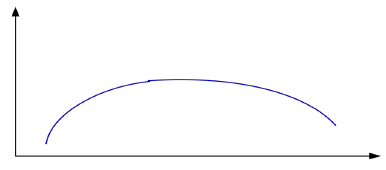
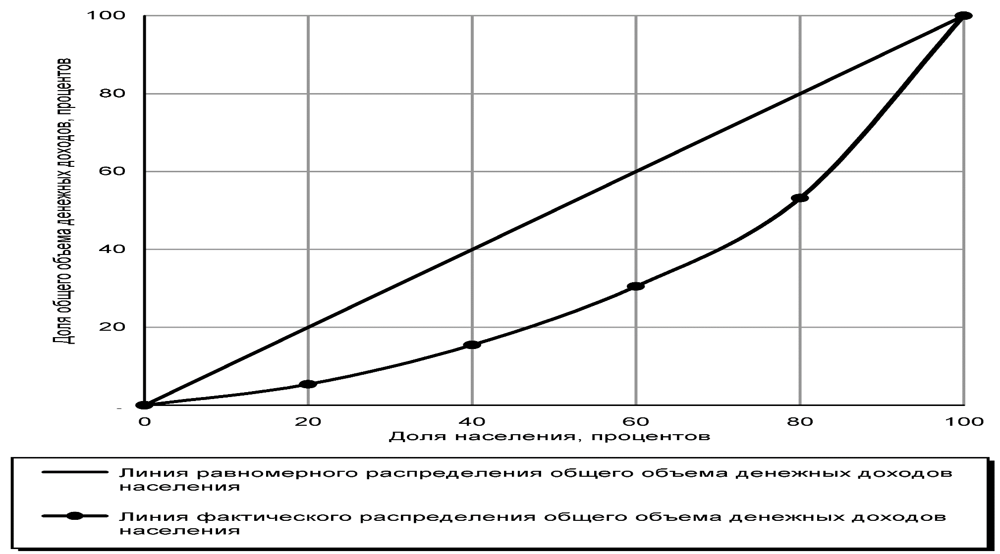
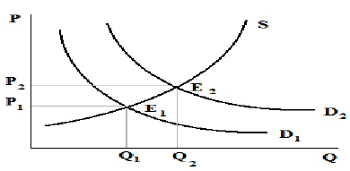
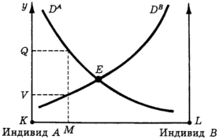

Экономика общественного сектора

# Общественные расходы, страхование и благосостояние

Как оценить перераспределение, почему врач может влиять на спрос и какие стимулы создаёт способ оплаты клиники. Основа — файл «EOS (теории, графики, проч.)»; модели Линдаля и Гровса — Кларка дополнены по презентации А. М. Калинина.

[Теории и графики — исходный DOCX](../materials/eos/theory-and-graphs.docx){ .md-button }
[Презентация Калинина — PDF](../materials/eos/lecture-2.pdf){ .md-button }

## Размер общественного сектора и роль государства

**Закон Вагнера:** по мере роста дохода на душу населения общественные расходы могут расти быстрее дохода, поэтому доля общественного сектора увеличивается. Это гипотеза о долгосрочной связи развития и государственных расходов, а не правило, которое обязана выполнять любая страна в каждый год.

У государства в конспекте четыре задачи: определять и защищать права собственности, исправлять провалы рынка, сглаживать макроэкономические колебания и перераспределять доходы. Последняя задача требует отдельного критерия справедливости: из того, что рынок работает эффективно, не следует, что распределение устраивает общество.

При этом государство тоже сталкивается с ограничениями. Оно не знает всех издержек и предпочтений, а участники принятия решений могут преследовать собственные интересы. Бюджет расходуется общественный, тогда как выгоды чиновника, подрядчика и получателя услуги могут не совпадать. Эти стимулы разобраны в [конспекте по общественному выбору](public-sector-economics-public-choice.md).

## Неравенство и перераспределение

### Кузнец и Лоренц: что показывают две кривые

**Кривая Кузнеца** изображает гипотезу о перевёрнутой U-образной связи: на ранних стадиях экономического развития неравенство растёт, затем снижается. По горизонтали здесь следует читать уровень развития или доход на душу населения, по вертикали — неравенство. Сам рисунок не доказывает, что рост автоматически устранит неравенство.

<figure class="lecture-figure lecture-figure--compact" markdown>

<figcaption>Кривая Кузнеца из исходной таблицы. Подписи осей пояснены в тексте.</figcaption>
</figure>

**Кривая Лоренца** описывает распределение доходов в конкретной совокупности. Людей располагают от самых бедных к самым богатым. По горизонтали откладывают накопленную долю населения, по вертикали — накопленную долю его дохода. Диагональ означает равенство: например, 40% людей получают 40% доходов. Чем дальше кривая лежит ниже диагонали, тем сильнее неравенство.

<figure class="lecture-figure lecture-figure--compact" markdown>

<figcaption>Иллюстрация из конспекта; это учебный рисунок, а не данные о доходах конкретной страны.</figcaption>
</figure>

### Парето, Калдор — Хикс и «дырявое ведро»

**Парето-улучшение** требует, чтобы хотя бы одному человеку стало лучше и никому не стало хуже. Многие реальные реформы под это условие не подходят: у них есть и выигравшие, и проигравшие.

**Критерий Калдора — Хикса** проверяет возможность компенсации. Если выигравшие могут возместить потери проигравших и сохранить выигрыш, изменение проходит критерий. Компенсация здесь потенциальная. Без фактических выплат часть людей может остаться в худшем положении; называть такой исход Парето-улучшением нельзя.

**«Дырявое ведро» Оукена** — образ потерь при перераспределении. На сбор и передачу средств требуются ресурсы, а налоги и выплаты могут менять стимулы работать и зарабатывать. Изъятый у одной группы рубль не обязательно превращается в рубль дополнительного благосостояния другой. Модель ставит вопрос о допустимых потерях ради равенства, но не задаёт универсального размера этих потерь.

## Внешние эффекты: Коуз и налог Пигу

При внешнем эффекте решение одного участника затрагивает других, а этот вред или польза не полностью отражаются в цене. В конспекте перечислены четыре способа учитывать такой эффект:

| Способ | Как меняется решение |
| :--- | :--- |
| Интеграция | Участники объединяют деятельность и начинают учитывать общие выгоды и издержки |
| Налог Пигу | Причинитель внешнего вреда сталкивается с дополнительной ценой своей деятельности |
| Определение прав собственности | Становится понятно, кто на что имеет право и о чём можно договариваться |
| Количественное ограничение | Регулятор непосредственно ограничивает объём деятельности, например выбросов |

Для отрицательной экстерналии ориентир корректирующего налога — **предельный внешний ущерб в общественно эффективной точке**. Чтобы выбрать ставку, нужно оценить ущерб; название налога само по себе не решает эту информационную задачу.

**Теорема Коуза** в учебной формулировке: при чётко определённых правах и нулевых трансакционных издержках стороны могут договориться об эффективном использовании ресурса. Это не обещание, что рынок справится с любыми внешними эффектами в реальности. Поиск участников, переговоры, проверка информации и исполнение соглашения стоят денег; при большом числе затронутых лиц договориться особенно трудно. Первоначальное распределение прав влияет на то, кто платит и кто получает компенсацию.

## Страхование и поведение пациентов и врачей

### Какие риски можно объединить

Страхование работает за счёт объединения рисков: взносы многих участников покрывают убытки тех, у кого произошло страховое событие. Для расчёта тарифа нужна вероятность события, которую можно оценить, и величина возможного ущерба. Если расходы заведомо возникнут с вероятностью 1, это уже не неопределённый индивидуальный риск в обычной страховой модели.

В идеализированной схеме риски независимы. В реальности достаточно учитывать степень их зависимости: сильно связанные события, например массовая эпидемия, затрудняют объединение рисков, поскольку расходы возникают одновременно у многих участников.

В исходной таблице также записано `D ≠ 0`, но обозначение `D` не раскрыто. Для ответа по существу нужны различимые вероятности, размеры убытков и спрос на защиту; неопределённую букву не стоит заучивать как отдельное условие.

| Проблема | Когда возникает | Что меняется |
| :--- | :--- | :--- |
| Неблагоприятный отбор | До заключения договора, когда участник лучше страховщика знает свой риск | Люди с высоким риском охотнее покупают полис; состав застрахованных оказывается дороже ожидаемого |
| Моральный риск | После появления страховой защиты | Меняются профилактика, обращаемость или объём потребляемой помощи, потому что участник не несёт всех расходов лично |

Отсутствие отбора и морального риска — предпосылки упрощённой модели. Реальные страховые договоры и организация медицинской помощи должны учитывать обе проблемы.

### Спрос, спровоцированный предложением

Пациент не всегда может самостоятельно оценить необходимость обследования или лечения и опирается на рекомендации врача. Если доход поставщика зависит от количества услуг, у него может появиться стимул рекомендовать дополнительную помощь сверх той, которую информированный пациент выбрал бы сам.

<figure class="lecture-figure lecture-figure--compact" markdown>

<figcaption>В исходной схеме спрос сдвигается из D₁ в D₂, а равновесие — из E₁ в E₂. Само увеличение объёма помощи ещё не доказывает индуцированный спрос: оно может отражать и ранее неудовлетворённую потребность.</figcaption>
</figure>

## Контракты: кто несёт риск затрат

В таблице источника смешаны названия схем оплаты и условия конкретных договоров. Для сравнения полезно смотреть на единицу оплаты, возможность пересмотра суммы и ответственность за превышение расходов.

| Тип контракта из конспекта | Как платят | Стимул и ограничение |
| :--- | :--- | :--- |
| С фиксированной ценой | Заранее согласуют цену определённого результата или объёма работ | Поставщик заинтересован сдерживать затраты, но нужны требования к качеству; удобен при предсказуемом результате |
| «Издержки плюс прибыль» | Возмещают допустимые фактические затраты и добавляют согласованное вознаграждение | Риск роста затрат в большей степени у заказчика; экономить поставщику выгодно меньше |
| «Издержки в расчёте на услугу» | Выплата зависит от фактического числа услуг | Появляется стимул наращивать оплачиваемый объём |
| Блочный контракт | За период выделяют согласованную сумму при оговорённых обязательствах | Расходы покупателя предсказуемы, но возможны ограничения объёма и очереди |
| «Издержки плюс объём» | Согласуют бюджет и базовый объём, а отклонения оплачивают по дополнительным условиям | Результат зависит от тарифа за дополнительную услугу и границ пересмотра бюджета |
| С разделением затрат | Заказчик и поставщик несут согласованные доли затрат | Поставщик оплачивает часть перерасхода; стимул экономить зависит от его доли |

В исходнике для последнего контракта указано разделение поровну. Это частный вариант: **50/50 не является обязательным свойством** любого договора с разделением затрат. Аналогично «фиксированная цена» и «блочный контракт» могут пересекаться, но у них надо уточнять, что именно фиксируется: цена результата, объём или общий бюджет.

Аренда, контрактация и субсидии позволяют привлекать частных поставщиков без продажи государственного имущества. Поэтому их лучше отличать от приватизации в узком смысле — смены собственника. Финансовые последствия продажи разобраны в [конспекте по доходам государства](public-sector-economics-lecture-tax-system.md#property).

## Человеческий капитал и оценка программ

В теории человеческого капитала Гэри Беккера образование рассматривается как инвестиция: затраты возникают сейчас, а часть выгод — в будущих доходах и возможностях трудоустройства.

В исходной схеме `A` и `D` обозначают издержки высшего образования, `B` — последующие выгоды. При сравнении вариантов учитывают плату за обучение и другие дополнительные расходы, а также **упущенный заработок за время учёбы**. Будущие выгоды нужно сопоставлять с расходами на одном временном горизонте; простого сравнения первой зарплаты недостаточно.

Для общественной программы выбор метода оценки зависит от того, в каких единицах можно выразить результат.

| Метод | Как измеряют результат | Пример единицы сравнения |
| :--- | :--- | :--- |
| Анализ издержек и выгод | Затраты и выгоды переводят в деньги | Денежная оценка выгод минус затраты |
| Анализ издержек и результативности | Результат выражают в натуральных единицах | Расходы на один дополнительный выявленный случай или предотвращённое событие |
| Анализ издержек и полезности | Результат учитывает продолжительность и качество жизни | Расходы на дополнительный QALY |
| Анализ издержек и взвешенной результативности | Несколько результатов объединяют с заданными весами | Сводный показатель, чувствительный к выбору весов |

**QALY** — год жизни с поправкой на её качество. В исходной таблице анализ полезности описан слишком коротко; для медицинских программ его распространённая форма — оценка затрат на дополнительный QALY. [Методическое руководство NICE](https://www.nice.org.uk/process/pmg36/chapter/economic-evaluation-2/).

Если новая программа дороже и эффективнее альтернативы, сравнивают дополнительные затраты и дополнительный результат: `ICER = (C₂ − C₁) / (E₂ − E₁)`. Нельзя выбирать программу только по минимальной общей сумме расходов: более дешёвая программа может давать существенно меньший эффект. Программы следует сравнивать для сопоставимых получателей, горизонтов и видов затрат.

## Общественное благо: Линдаль и Гровс — Кларк { #public-goods }

### Равновесие Линдаля

Все потребляют один и тот же объём общественного блага, но могут платить разные индивидуальные цены. **Равновесие Линдаля** достигается, когда при этих ценах каждый выбирает одинаковый объём, а платежи вместе покрывают его производство.

<figure class="lecture-figure lecture-figure--compact" markdown>

<figcaption>Схема из DOCX. Точка E обозначает согласование спроса участников при распределении расходов.</figcaption>
</figure>

Трудность в информации: участнику выгодно занизить свою готовность платить, если благом он всё равно сможет пользоваться. Это одна из форм проблемы безбилетника.

### Плата за влияние на коллективное решение

В примере со слайдов 54–57 установка фонаря стоит `100`. Выгода жителя `i` равна `vᵢ`, заранее назначенная ему доля расходов — `cᵢ`, а чистая выгода — `nᵢ = vᵢ − cᵢ`. Если сумма чистых выгод положительна, проект создаёт положительный совокупный результат. Это ещё не гарантирует, что при заданных долях расходов выиграет каждый.

**Механизм Гровса — Кларка** назначает дополнительный платёж участнику, чьё сообщение меняет выбранный исход. Такой участник называется центральным, или решающим. Платёж равен потере, которую его влияние создаёт для остальных.

Пусть `S₋ⱼ = Σ nᵢ` по всем, кроме участника `j`.

| Что произошло | Дополнительный платёж `Hⱼ` |
| :--- | :--- |
| Без `j` проект выбирали, с ним отказались: `S₋ⱼ > 0`, но `S₋ⱼ + nⱼ < 0` | `Hⱼ = S₋ⱼ` — упущенная чистая выгода остальных |
| Без `j` проект отклоняли, с ним выбрали: `S₋ⱼ < 0`, но `S₋ⱼ + nⱼ > 0` | `Hⱼ = −S₋ⱼ` — чистые потери остальных от реализации |
| Решение не изменилось | `Hⱼ = 0` |

При равенстве сумм нулю нужно заранее задать правило выбора. В рамках модели с квазилинейными предпочтениями правдивое сообщение становится выгодной стратегией. Дополнительные платежи — не доход, который можно произвольно вернуть тем же участникам: такое возвращение способно изменить стимулы.

У механизма есть ограничения. Он не обещает сбалансированного бюджета и не гарантирует, что каждый человек выиграет при произвольно назначенной доле расходов. Поэтому эффективный выбор проекта, справедливое распределение платежей и Парето-улучшение для всех — разные проверки.

## Где разобраны остальные темы исходной таблицы

| Темы | Страница |
| :--- | :--- |
| Кондорсе, Мэй, Эрроу, медианный избиратель, политическая конкуренция, поиск ренты | [Общественный выбор и бюрократия](public-sector-economics-public-choice.md) |
| Налоговое бремя, монополия, Рамсей, налоги на труд | [Налоги, доходы и бюджетный федерализм](public-sector-economics-lecture-tax-system.md) |
| Расчётные задания и разборы | [Задачи](public-sector-economics-practice-archive.md) |

[Все материалы курса](public-sector-economics-materials.md){ .md-button }
